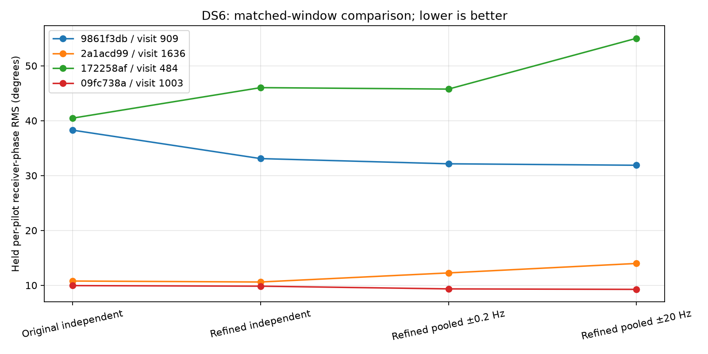

# DS6: full-dwell phase prototype and residual-CFO refinement

**Sub-kilometre accuracy remains unproven.** A bounded real-IQ experiment
shows that forcing a slow differential phase model is not consistently better.
A training-only common-CFO refinement fixes a synthetic estimator bias, but its
real-data benefit is mixed. Neither change is promoted to production.

## Experiment and support

One two-mode dwell from each of the ten previously replayed DS6 scans was
selected by a fixed hash of its session and visit, without consulting its
phase results. All ten selections and unavailable outcomes are retained.
Each contributes six 7 ms windows across 112 ms of dwell time. The original
fit/qualification/evaluation blocks remain disjoint. Three random whole
windows train the pooled double-difference phase intercept and rate; qualified
remaining windows evaluate it. Only four dwells have sufficient qualified
training and held support. This is a development experiment, not confirmation
on the remaining 33 DS6 scans.

The model has a common receiver phase and common residual frequency for each
window, plus a double-difference intercept and linear rate shared across the
dwell. On held windows, only the common receiver nuisance parameters are fit
using fitting samples. The double-difference parameters are frozen, and
evaluation samples do not fit anything. Bounds of ±0.2 Hz and ±20 Hz are
separate experimental arms, not calibrated geometric limits or selected winners.
The narrower bound was motivated by the preceding nominal-baseline scenario.

## Matched real-data results

Values are RMS per-pilot receiver-phase prediction errors in degrees, using
identical qualified training/held windows across the two extraction versions.
They differ from the previous window-mean double-difference repeatability
metric and are not geographic errors. Complex coefficients are normalized
before circular fitting; this prototype weights pilot phases equally.

| Scan suffix / visit | Original independent | Refined independent | Refined pooled ±0.2 Hz | Refined pooled ±20 Hz |
|---|---:|---:|---:|---:|
| 9861f3db / 909 | 38.280 | 33.096 | 32.146 | 31.880 |
| 2a1acd99 / 1636 | 10.780 | 10.603 | 12.259 | 13.983 |
| 172258af / 484 | 40.463 | 46.026 | 45.761 | 55.022 |
| 09fc738a / 1003 | 9.946 | 9.844 | 9.347 | 9.259 |



The refinement loses qualification on one originally qualified held window
in visit 484. The comparison above removes that window from **both** arms;
unmatched native results remain in their respective results files. There are
no replacements for the six unevaluable dwells. All four constrained pooled
fits reach ±0.2 Hz, so the smooth rate is substantially imposed by the bound.
The broader fits range from roughly -4.10 to +0.77 Hz on these dwells.

## Synthetic bias and correction

With 75 Hz common residual receiver rotation and injected 0.13 Hz differential
rotation, the original per-pilot constant-coefficient regression led the pooled
model to estimate **0.145309 Hz**, with **0.253936 degrees** held per-pilot RMS.
This failed the preselected synthetic limits of 0.005 Hz rate error and
0.1 degree held RMS. These failures were investigated rather than relaxing
the assertions.

The correction estimates the mean of the two source residual receiver rates
from fitting samples, updates the common RX1 CFO template seed, and repeats
the original timing/regression/qualification procedure. It does not subtract
the source-specific differential rate. The result recovers **0.1300078 Hz**
with **0.000349 degrees** held RMS. This identifies finite residual rotation
during a pilot as an estimator-model error in this synthetic case; it does not
establish that this error dominates real data.

Six tests pass: nonzero positive/negative differential phase rates, a larger
unconstrained rate, evaluation isolation, common-offset invariance, and a
raw-IQ-to-dwell slow-phase injection. The raw-IQ test also perturbs evaluation
samples and verifies unchanged refinement seeds, timing and qualification.
The synthetic IQ uses the extractor's templates, so this is an estimator
consistency test, not an independent physical propagation oracle. The earlier
continuous-RF oracle remains a separate test of the original extractor.

## Consequence for the positioning goal

Do not yet use the slow pooled rate as a satellite constraint. Next, estimate
per-pilot coefficient uncertainty and test whether weak or mixed pilots explain
the unstable dwell; retain donor/rolled-pilot controls. A weighted robust model
must be trained without evaluation leakage, preserve injected source phase,
and improve held prediction before it informs a CFO-plus-phase geographic
search. Actual sub-kilometre recovery still requires candidate identity/wrap
marginalization, unknown hardware/baseline treatment, and randomized whole-scan
position validation. No coordinate estimate was produced in this experiment.

## Reproduction

With the repository `src` on `PYTHONPATH`, the pinned scientific Python runtime
used previously, and one BLAS thread:

```
python experiment.py
python experiment.py --refine
python summarize.py
python -m pytest test_experiment.py -q
```

Raw replay uses the read-only `AdaptiveHopIqStore` and verifies each selected
capture against the DS6 manifest and replay plan. Per-pilot complex phasors,
physical sample-mask centroids, qualification outputs and assignments are
saved for further analysis. Original IQ and production products are untouched.
