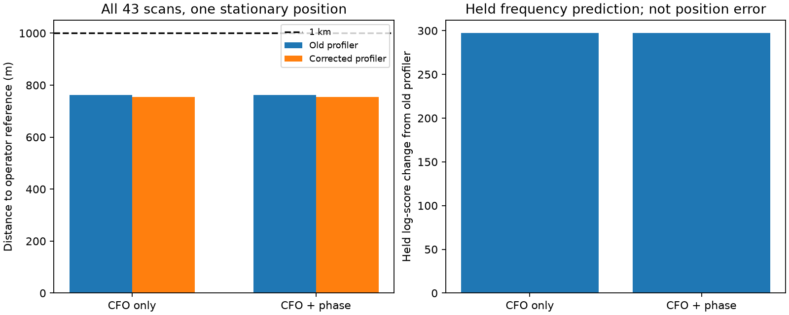

# Corrected full-cohort offset refit with phase

The corrected full-cohort estimate is **754.99 m** from the operator reference
with phase included. The matched frequency-only estimate is **754.98 m**.
The pooled result remains below 1 km, but phase still provides no meaningful
location improvement; the numerical position change is only 1.22 cm.

| Model | Reference distance | Held frequency log score | Optimizer status |
|---|---:|---:|---|
| Corrected CFO only | 754.978 m | -325650.20095 | Converged, interior |
| Corrected CFO + phase | 754.990 m | -325650.20096 | Converged, interior |

Both runs take 15 evaluations, finishing in approximately 306 and 326 seconds.
Held prediction improves by about 297 log units relative to the old profiler,
while the matched phase-minus-CFO held change is -0.0000093 log units. These
figures support correcting offset computation, not crediting phase for
sub-kilometre recovery. The objective of useful phase-assisted accuracy
remains unresolved. Numerical centimetre shifts are not physical precision.

This experiment revalidates the full 43-scan stationary-site estimate using
the bracket-checked stationary frequency-offset solver. The preceding pooled
approximately 762 m result used an unconverged 12-step profiler. The corrected
solver is applied to both frequency-only and frequency-plus-phase models.

## Efficient derivatives without changing the likelihood

At each objective evaluation, every candidate offset is fitted using training
observations, with stationarity and positive-curvature checks. To calculate
the position and clock derivatives, those offsets are held at their converged
values: the envelope theorem removes their first-order derivative contribution
to the profiled training likelihood. Offsets are fitted again at the next
optimizer location; they are not frozen throughout the fit.

One-sided differences initially failed the independent gradient test because
large unprofiled clock curvature caused truncation bias. The accepted runner
uses symmetric 1e-5 differences, with second-order one-sided differences at
clock bounds. A real-data test compares this gradient against independent
central differences that refit offsets at every perturbed point. The test
also compares the complete joint likelihood value, and a separate quadratic
test checks clock-boundary handling. No full-cohort fit used the rejected
one-sided derivative.

Scan-local frequency derivatives are summed sparsely; phase is added as a
joint-minus-frequency likelihood correction for the three recordings with
validated phase factors. There are five disjoint source pairs, sharing an
uncertain 42-vector baseline prior across those scans. Every frequency
observation is counted once. The other 40 scans contribute frequency evidence
only. This is not phase extraction from all 43 recordings.

## Selection and limits

Both arms use the same previous CFO training-selected starting point, frozen
candidate sets, corrected causal element policy and bounds. The bounded
optimizer allows 25 iterations and 40 function evaluations; completed-run
status is distinct from optimizer convergence. The operator reference never
enters fitting or the derivative checks. The summarizer reads it only after
both fits finish. It is operator supplied, not surveyed ground truth.

The model assumes a stationary site and independent scan clocks and track
offsets. Receiver-error correlation, orbit uncertainty, unknown RF baseline
and finite candidate/mode searches remain limitations. This is a local fit
from one inherited basin, not an independent global location solution.
The earlier complementary subset estimates have not been refitted here.

`audit.py` compares exact and interpolated propagation for all frequency
contributions at both final coordinates and clocks. It refits offsets for
each calculation. It does not independently repropagate the phase factors
or prove full-catalogue candidate completeness at the new coordinates.
The completed audit covers all 43 scans at both solutions. Maximum prediction
deviation is 0.020374 Hz; summed exact-minus-interpolated training evidence
changes by about +0.0470 log units and held evidence by +0.0320. These changes
are small for the broad numerical check, but larger than the tiny matched
phase held-score difference. Four tests pass: independent real-data gradient
comparison, bound handling, completed-fit provenance and full propagation
audit coverage. This does not validate physical centimetre differences.

The remaining scientific task is to obtain useful phase discrimination,
not merely retain a negligible phase factor in a sub-kilometre CFO solution.
Only three of the 43 recordings currently supply these validated phase
factors. A bounded expansion should prioritize training-selected cases with
ambiguous frequency associations and measurable geometric phase differences,
then evaluate held observations without tuning against the roof reference.

Reproduce with `run.py --fit all --arm cfo_only` and the corresponding
`--arm phase`, followed by `summarize.py` and `audit.py`. The saved protocols
refuse replacement. No new recording, calibration or production change is
part of this experiment.
