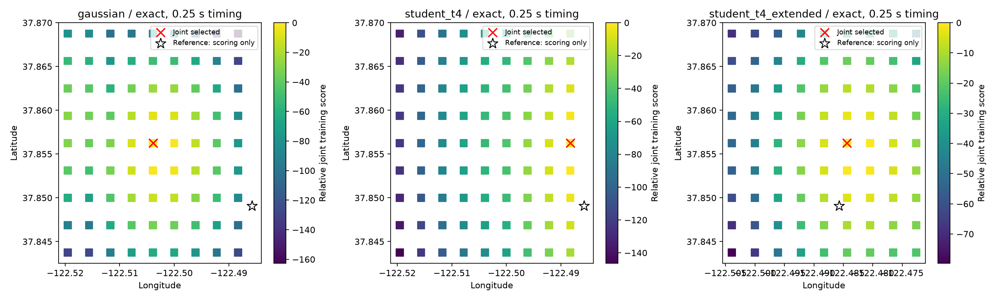

# DS6 exact propagation, timing refinement and robust CFO

**The final extended robust search selects an interior point 809 m from the
operator coordinate on one development scan. CFO-only and CFO-plus-phase select
the same point. This does not establish a phase benefit or DS6-wide sub-kilometre
accuracy; the full goal remains active.**

The preceding goal turn was progress: it resolved exact phase-to-position-track
joins and produced a 1.783 km all-track result. This turn checks numerical orbit
approximation, finer shared timing, and a residual-model failure found from
training data. All experiments use the same 60 tracks, 2,869 observations and
whole-visit partitions from `scan-fw-4c56320fb5ca6994`.

## Exact propagation and timing

The preceding training-selected point centers a local 9-by-9 grid. At its
center and four corners, training CFO selects the union of the top eight
catalogue candidates per track and timing offset. The retained candidates are
then propagated **exactly at each CFO and phase observation epoch**, eliminating
one-second interpolation from the local scoring step. Candidate selection
still uses the interpolated preliminary model and remains approximate.

There are 41 shared time offsets from -5 to +5 seconds at quarter-second
spacing. The integer-time arm scores the same candidates and geographic points
using the 11 integer offsets. Both arms marginalize time jointly across tracks.
The minimum individual top-eight posterior mass at the Gaussian anchor checks
is 99.629%; their union retains 9–17 candidates per track (728 track/candidate
entries). These checks do not certify the full-catalogue posterior everywhere.

Exact propagation and quarter-second timing leave the Gaussian result at
**37.856250, -122.503906**, or **1,783 m** error, with shared MAP time -1 second.
The remaining error is therefore not explained by the tested interpolation
or integer-time discretization alone.

## Why test a robust residual model?

At the preceding training-selected location and shared time, exact propagation
shows a median per-track training RMS of **132.12 Hz** and held RMS of
**136.68 Hz** after a constant offset. Six tracks exceed 300 Hz training RMS.
The largest has **1,908 Hz training RMS** and approximately **1,857 Hz held RMS**,
far above the assumed 100 Hz Gaussian scale. This diagnostic uses training
residuals to motivate the model change; held residuals are reported afterward.

The additional arm uses a fixed **Student-t distribution with four degrees of
freedom and 100 Hz scale**. A constant offset is profiled by 12 IRLS iterations
on training observations only and frozen for held scoring. Every track remains
in the inference; there is no truth-directed deletion or weight tuning. The
candidate shortlists are recomputed using the robust training score, not borrowed
from the Gaussian arm. Their minimum individual top-eight anchor masses are
98.766% for the original local grid and 98.831% for the extended grid.

This also changes nuisance-offset treatment: Gaussian offsets are integrated,
whereas Student offsets are profiled and plugged into held prediction. Absolute
score improvements across these models are not presented as a calibrated model
Bayes factor. Receiver correlation and acquisition conditioning still make the
combined track score a composite likelihood.

## Results and boundary follow-up

| Residual model | Timing grid | Selected latitude, longitude | Error | On grid boundary? |
|---|---|---|---:|---|
| Gaussian | 1 s | 37.856250, -122.503906 | 1,783 m | No |
| Gaussian | 0.25 s | 37.856250, -122.503906 | 1,783 m | No |
| Student-t4 | 1 s | 37.856250, -122.496094 | 1,210 m | No |
| Student-t4 | 0.25 s | 37.856250, -122.488281 | 830 m | **Yes** |
| Student-t4, extended grid | 1 s | 37.856250, -122.496094 | 1,210 m | No |
| **Student-t4, extended grid** | **0.25 s** | **37.856250, -122.484375** | **809 m** | **No** |

Every row has identical CFO-only and CFO-plus-phase winners. The initial robust
quarter-second winner touched the east boundary, so a second equal-sized grid
was centered on that training-selected point. The coordinate reference did not
choose the extension direction or the winner. The final shared MAP timing is
-0.75 seconds. An interior local winner is not a global convergence certificate.

The attached roof coordinate is loaded only by `summarize.py`, after search
results are frozen. It is operator supplied, not surveyed ground truth. This
scan has been used repeatedly in development; the 809 m result is not an
independent held-scan accuracy claim. The remaining DS6 recordings have not
been validated with this model.

## Phase and remaining goal

The nominal ±80 mm east-west baseline, free constant pair phase and kappa=1
factor are unchanged. They preserve the earlier conservative phase experiment,
but add too little location discrimination to change a winner here. No RF
phase-center calibration or antenna phase-response correction is established.

The next phase-specific work should examine how much geometric information is
removed by a separate free pair offset, and whether a shared, physically
constrained receiver response across multiple independently qualified pairs
can preserve useful absolute double differences. Any alternative concentration
or calibration model must be fitted on training evidence and evaluated on
held data; the phase term must not be enlarged simply to force the known
coordinate. Random whole-scan DS6 validation and a measured phase contribution
remain required before declaring the objective complete.

## Verification and artifacts

Eight checks pass: identical search-point coverage, selection by training
score, timing-grid membership and unique complete shortlists for each of the
three runs, plus robust-offset resistance to a large outlier and held-data
isolation. The coverage checks are artifact consistency tests, not accuracy
proofs. The underlying propagation and phase-offset integration use the existing
public kernels and previously tested mathematics.

`protocol.json`, `shortlists.json`, `results.json` and `track-diagnostics.json`
describe the Gaussian run; `robust/` and `robust-extended/` preserve the
additional arms. `summary.json` contains post-selection coordinate errors.
All intermediate outcomes, including the boundary winner, remain available.

Reproduce with repository `src` on `PYTHONPATH`, the pinned scientific runtime,
and one BLAS thread: `python run.py`, `python run.py --robust`,
`python run.py --robust --extend`, `python summarize.py`, and
`python -m pytest test_results.py -q`. The search reads existing numerical
track/phase artifacts and the verified causal TLE archive. It does not modify
raw recordings, production products or DS6 membership.
