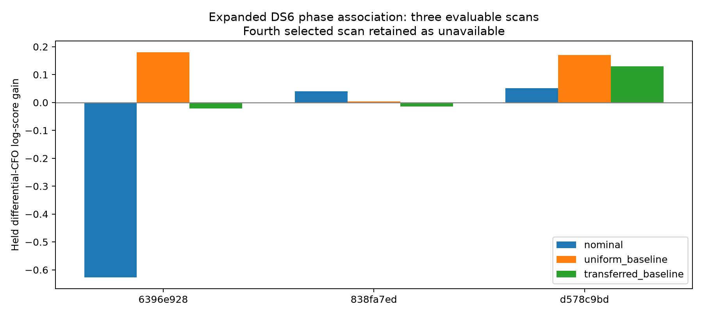

# DS6 expanded phase-association test

Marginalizing the same 42-baseline grid gives small positive held-CFO prediction
gains in all three evaluable expansion scans. The total gain is only 0.354 log
units. Transferring baseline weights learned on the earlier two scans remains
mixed. Neither result establishes correct satellite labels or improved
geographic position; phase-assisted sub-kilometre accuracy remains unverified.

| Scan | Rate | Nominal baseline gain | Uniform baseline-mixture gain | Transferred-baseline gain |
|---|---:|---:|---:|---:|
| `scan-fw-aa9770c66396e928` | 2.5 MS/s | -0.62677 | +0.18037 | -0.02131 |
| `scan-fw-e76c229e9dc498b3` | 5 MS/s | Unavailable | Unavailable | Unavailable |
| `scan-fw-b5604c3d838fa7ed` | 7.5 MS/s | +0.04066 | +0.00352 | -0.01378 |
| `scan-fw-c559f436d578c9bd` | 10 MS/s | +0.05100 | +0.17043 | +0.13031 |
| Sum of three evaluable scans | | -0.53511 | +0.35432 | +0.09521 |

Gains are held differential-CFO log predictive densities relative to a matched
CFO-only model. They are not position errors, measured identification accuracy,
or evidence that a favorable single hypothesis is true. The 5 MS/s case retains
the frozen expansion cohort's unavailability: no source pair meets its minimum
two training and two held visits. It is not replaced.



## Frozen extraction and training evidence

The source is the preceding four-scan expansion, whose scans and visits were
selected before their phase replay. Its exact positioning-track joins, original
whole-visit partitions and qualified windows remain unchanged. The five source
pairs provide 150 matched CFO visits: 43, 73 and 34 by evaluable scan.

Only the two training phase visits per pair supply phase likelihoods. Fitting
pilot phasors use the existing κ=16 marginal model, integrating common receiver
phase and residual frequency independently per window. All qualified windows
in those visits are pooled with within-dwell DD slope integrated over ±0.2 Hz.
The reference epoch is their mean midpoint. The unknown constant response
between visits is integrated with the circular correlation of the two visit
likelihoods. Each visit has a fixed 10% uniform-contamination component.
Held phase values do not enter this association update.

These are previously developed modelling choices, not calibrated error bars.
In particular, pilot independence, fixed κ, the within-dwell slope bound and
constant inter-visit response can all fail physically. The extracted phase
likelihood is used as evidence, not as an exact phase measurement.

## Three baseline priors, matched CFO target

The nominal arm integrates the two directions of an 8 cm east-west baseline.
The uniform arm integrates 42 vectors: lengths 4, 8 and 12 cm with twelve
horizontal azimuths and two vertical endpoints at each length. This is a coarse
sensitivity prior, not measured hardware geometry or continuous 3D coverage.

The transferred prior is the exact baseline posterior from the earlier two
scans' training evidence. Its bytes are frozen before the new association run.
Each new scan can update that prior using its own training observations; no
other new scan's held observations choose its baseline. The new-scan scores
are computed separately, rather than fitting one baseline jointly to all of
their held data. An informative transferred prior is not automatically a
calibration: it slightly worsens two of the three new predictions.

All arms use the same Student-t4 differential-CFO model with a fixed 100 Hz
scale and a training-profiled constant offset per pair. This explicit scale
choice differs from the learned per-pair scales in the donor experiment;
only matched within-scan gains in this report are compared. Sensitivity to
the CFO error model remains unresolved. Absolute and differenced CFO are
not combined as independent measurements.

## Full catalogue accounting

Every training-visible causal labelled-Starlink pair is retained; there is no
candidate shortlist. A source must be above the horizon at at least one
training CFO epoch. The three scans evaluate 16,046,318 pair/time hypotheses
for each baseline at integer timing offsets from -5 to +5 seconds. Each source
retains its own observation epoch, with the existing same-visit join and
one-pilot-period centroid-separation check. Catalogue priors apply before
visibility restriction. Baseline and timing are integrated jointly within a
scan, with baseline shared across its disjoint source pairs.

The observer remains the earlier CFO-derived point with assumed zero altitude.
No operator coordinate is read by preparation or fitting, and no geographic
search is performed here. Runtime was 79.1 seconds, excluding the short cached
phase preparation. The run reads saved numerical measurements and causal orbit
data; no IQ reread, new RF collection or production change occurs.

## Consequence for the DS6 goal

The expanded cohort provides more consistent but weak predictive evidence for
retaining baseline uncertainty. The nominal RF baseline is still unsupported
by the pose metadata, and the transferred weights do not generalize reliably.
The 0.354-unit aggregate gain is too small to justify a location-accuracy claim
or stronger phase weighting by itself.

The next required test is a bounded geographic comparison of CFO-only and
phase-assisted likelihoods using these same inputs and full candidate coverage,
with location reference reserved for scoring. Prediction gains must not
substitute for an actual, verified sub-kilometre result across DS6.

## Reproduction and checks

Two tests pass: predictive marginalization against direct weighted sums; and
complete frozen cohort membership, transferred-prior bytes, training-only phase
visits, artifact bindings, normalized phase/baseline probabilities and candidate
accounting. The FFT, phase integration and nominal-model checks remain in their
source reports. `SHA256SUMS` seals all artifacts except bytecode caches.

With the scientific Python environment and repository `src` on `PYTHONPATH`:

```sh
python reports/2026_09_27_ds6_expanded_association/prepare.py
python reports/2026_09_27_ds6_expanded_association/run.py
python reports/2026_09_27_ds6_expanded_association/summarize.py
python -m pytest reports/2026_09_27_ds6_expanded_association/test_expanded.py -q
```
