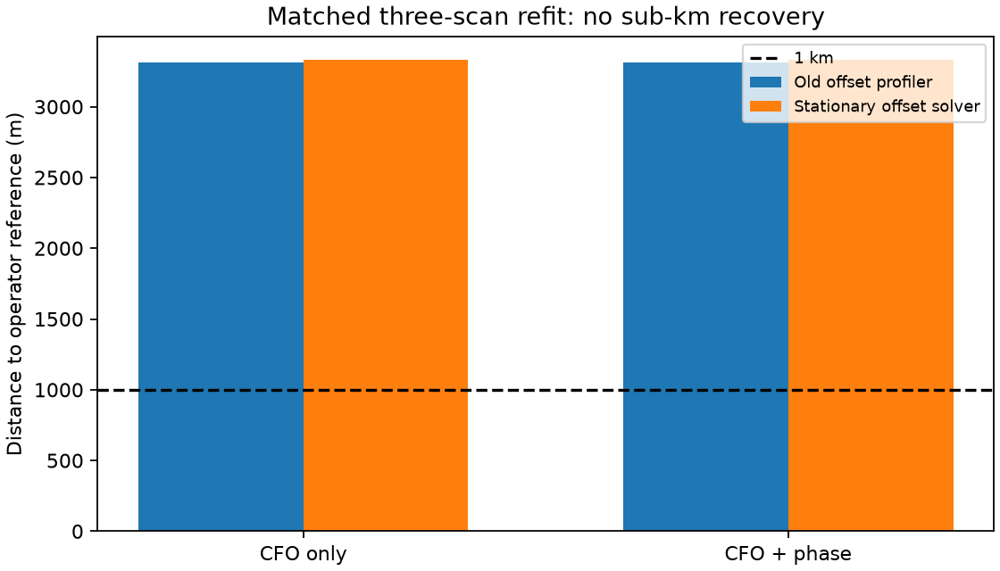
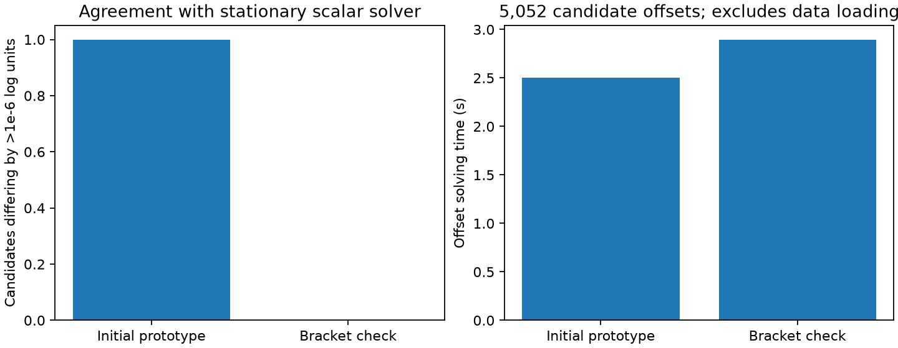

# Batched stationary offsets for DS6 phase comparisons

The corrected three-scan refit still does not recover sub-kilometre location:
frequency-only error is **3,328.83 m**, and frequency plus phase is
**3,329.29 m**. Both models converge inside bounds and choose the same local
basin from the two original starts. Their 0.78 m numerical separation is not
evidence of physically meaningful phase precision or improvement. The old
solver gave about 3,312 m on this cohort; correcting its numerical error does
not guarantee a geographic gain.

The revised batched solver matches the stationary scalar reference on all
5,052 tested real-data candidate offsets from 2,526 tracks across 43 scans.
Maximum absolute training-score difference is 3.42e-13 log units; maximum
absolute final loss derivative is 9.91e-12 per Hz. Eleven candidate fits
needed the scalar fallback. Offset solving took 2.90 seconds, excluding
data loading and orbit propagation; the full validation took 45.8 seconds.

The initial prototype failed the likelihood-equivalence gate despite passing
stationarity: one candidate converged to a worse local mode, losing 2.1762
log units. Its source and full results remain in `rejected-v1/`. The affected
track is `cd72383c08ca7e4eddf7b540b7241da36251636185d3c59178ee0238fbd112c4`
in `scan-fw-0960ee5a52eff93e`. The tolerance was not relaxed.

## Solver

Nine training-residual quantiles initialize vectorized centered IRLS. These
iterations are initialization, not a convergence claim. Damped Newton steps
then require small derivatives and positive loss curvature. The solver checks
derivative sign brackets across the original starts, converged roots, local
neighborhoods and the full penalized data interval. An uncovered bracket or
an unresolved competitive start invokes the stationary scalar reference.
The weak offset penalty enters optimization and scoring in both solvers.

This finite search does not prove global scalar optimality. Agreement is
demonstrated for the audited candidates and synthetic cases, not every
candidate at every future position. Runtime acceptance checks stationarity;
the separate numerical comparison checks whether a higher-likelihood mode
was missed. Further candidate and mode checks remain necessary after fitting.

The scalar reference comparison uses exactly the same two original
training-ranked candidates per track at the previously frozen pooled CFO
position. Held observations never choose an offset or mode. The tests cover
multimodal offsets with large translations, held-data isolation, all 43 scan
results and scalar likelihood agreement. The two validation tests pass.

## Matched location refit

`refit.py` replaces the offset profiler in both arms of the earlier continuous
three-scan experiment. The 174 tracks, 8,101 observations, five disjoint phase
pairs, candidate proposals, baseline prior, two starts, bounds and optimizer
settings stay fixed. Phase remains a joint candidate-pair factor, and each
frequency observation is counted once. Operator coordinates are loaded only
by the later result summarizer. This is a local three-scan refit, not a
corrected estimate for the full 43-scan cohort.

Held-frequency prediction differs by only +0.00294 log units between the new
phase and CFO arms. Exact propagation at the selected solutions differs from
interpolation by less than 0.01886 Hz. Each matched arm completes in under
six minutes. The refit protocol and training-only selection checks pass.
At each selected position, a separate exact-propagation audit checks every
one of the 2,286 shortlisted candidate offsets against the scalar solver.
Both audits have zero mismatches and maximum loss difference below 4.55e-13.
All four tests pass, including the two refit provenance and scalar checks.
The full-cohort approximately 762 m result has not been revalidated with this
solver; neither that older pooled number nor this corrected three-scan result
demonstrates useful phase-assisted sub-kilometre accuracy.

Reproduce the solver comparison with `validate.py`, `summarize.py` and
`pytest test_solver.py`. Run `refit.py --arm cfo_only` and `refit.py --arm phase`,
then `summarize_refit.py` for the location comparison. These are research
report runners; no production implementation or recording is changed.
