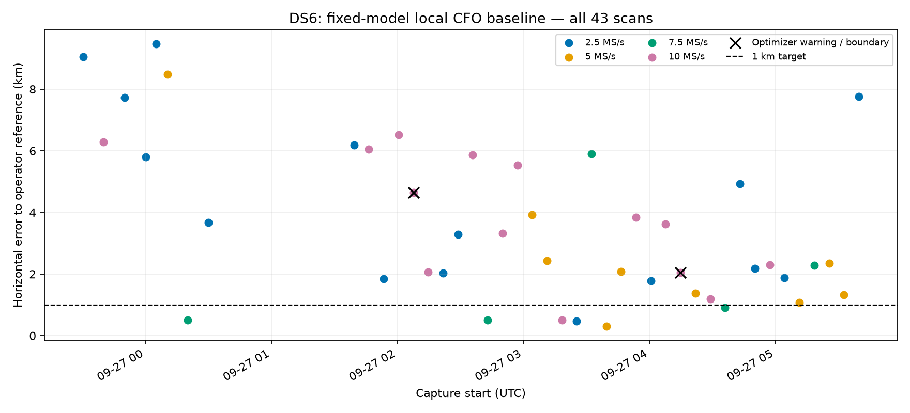

# Fixed CFO baseline across all DS6 scans

This experiment has completed the entire frozen list of **43 DS6 captures**,
with no unavailable or pending scans. **Six of 43 estimates are below 1 km**;
mean error is **3.612 km**, median **2.425 km**, and maximum **9.461 km**.
Two selected fits report optimizer warnings; none hits the search boundary.
All results, including those warnings, enter these statistics. The sub-kilometre
goal is not achieved. `summary.json` lists every member and `metrics.json`
records the aggregate statistics.

The estimator is fixed before this sweep: Student-t4 errors at 100 Hz scale,
training-profiled per-track offsets, a catalogue mixture, continuous position,
and one timing offset per scan. No receiver drift, track drift, learned noise
scale, channel exclusion, or reference-based model selection is applied.
Every observation keeps the exported seeded random whole-visit partition.
Tracks without at least two training observations and one held observation are
counted explicitly; unavailable scans remain in the inventory.

Candidate proposals use the full eligible causal catalogue at five geographic
anchors: the donor center and four corners 12 km east/north away. The union of
the top eight candidates at each quarter-second timing point is retained.
Reported retained probability is an anchor diagnostic, not a proof of candidate
completeness at every location. The position search has a +/-12 km box and
timing +/-5 s bounds, with three starts. Training scores alone select winners.
Exact orbital propagation audits each frozen estimate.

This is a local conditional baseline, not a blind global localization result.
The common initial center comes from a previous DS6 scan's inferred position,
not the operator coordinate. The donor scan itself is included and is therefore
a development case. Only the separate summarizer loads the operator coordinate.
Boundary hits, nonconvergence, poor shortlist mass, and missing scans must remain
visible when assessing accuracy; none can be converted into a success by
discarding it.

`batch.py` processes only already-exported, not-yet-fitted scans in inventory
order, bounded to at most twelve scans and three worker processes per invocation.
The processing order is not a validation split. Check live process handles
before starting another batch so scans are not run twice concurrently.

Three tests pass: shortlist mass accounting; input/dependency binding,
training-only winner selection and exact-propagation errors; and full 43-scan
membership with terminal results. The companion numerical dataset's two tests
also pass, establishing complete capture membership, whole-visit grouping, and
reproduction of the prior four development inputs. No new RF or production
changes are part of this experiment.

The companion `2026_09_27_ds6_catalogue_audit` tested the three weakest early
shortlists against exact full-catalogue predictions at their winners. It found
no omitted best candidate and less than 0.024 total training-score change in
each case. This is local evidence against pruning as the main failure there,
not a proof of global search completeness. Fragment continuity and joint
frequency-response models remain research questions, not validated fixes.
