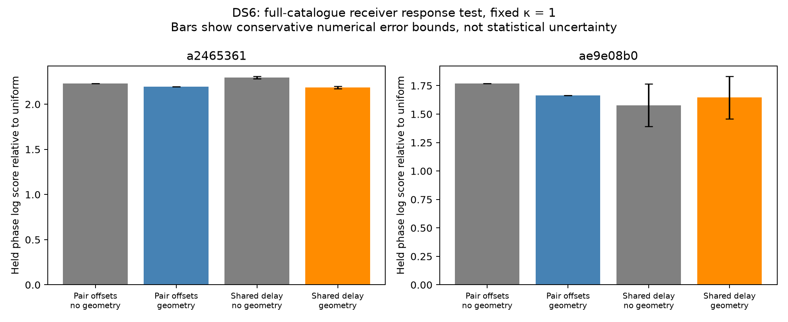

# DS6 exhaustive shared receiver-delay test

A shared delay does not demonstrate better held-out phase prediction than
independent pair offsets in either of the two tested scans. Differences are
small and within conservative delay-quadrature bounds. This does not establish
stable cross-channel calibration or phase-assisted sub-kilometre positioning.

The experiment extends the earlier development-scan receiver-delay test to
two additional real DS6 scans, now summing all training-visible satellite
pairs rather than using truncated candidate banks. It is a conditional
development diagnostic at a fixed CFO-derived observer, not a position search.

| Scan suffix | Pair-offset held phase | Shared-delay held phase | Shared delay minus pair offsets | Shared-delay geometry minus no-geometry |
|---|---:|---:|---:|---:|
| `a2465361` (5 MS/s) | 2.19491 | 2.18594 | -0.00898 | -0.11114 |
| `ae9e08b0` (7.5 MS/s) | 1.66408 | 1.64548 | -0.01860 | +0.06819 |

Scores are natural-log predictive densities relative to uniform phase, not
position errors. Conservative absolute numerical error bounds on each
shared-delay held-phase score are 0.01245 and 0.18700 respectively. A difference
between two delay scores can have twice that bound. The first scan's geometry
penalty survives this bound; the second scan's small advantage does not.
These bounds are deliberately conservative, not observed quadrature errors.



Shared delay improves held differential-CFO log prediction relative to pair
offsets by 0.00715 and 0.04962. Corresponding numerical bounds for the delay
scores are 0.00555 and 0.07846. These small prediction changes do not prove a
geographic improvement. In particular, no reference-coordinate scoring or
location fitting is performed here.

## Observable and assumptions

Each observation is the inter-receiver phase for source B minus that for A.
A phase offset common to both sources already cancels in this double
difference. The remaining response model is

`DD = geometric DD + 2π × (frequency B − frequency A) × receiver delay`.

One delay is shared across the two channels in each scan and integrated
uniformly over ±10 microseconds. Source-frequency separation comes from the
same visit's RX0 GLRT seeds in physical Hz, preserving source ordering. This
is a conditional prediction using observed frequency features, including those
from held visits; it is not a joint likelihood for independently measured phase
and frequency. No empirical calibration guarantees that one delay is valid
across channels or retunes. Multipath and frequency-dependent receiver response
can violate the model.

The comparator integrates an independent uniform constant phase offset per
source pair. Both models use fixed von Mises concentration κ=1 per dwell,
matching the earlier response experiment. This broad noise model is not a
measurement of phase precision; these scores must not be compared directly
with the concentration-marginalized scores in the preceding coverage audit.
Each arm also has a matched zero-geometric-phase control.

## Candidate coverage and validation

The original two training and two held-out phase visits per group, 140 paired
CFO visits, training-only Student-t4 CFO offsets and frozen differential scales
are retained. Each source keeps its own CFO support-centre epoch. The full
11,116-entry causal labelled-Starlink catalogues are propagated at integer
scan offsets from -5 to +5 s. A source is eligible when above the horizon at
at least one training epoch. All 10,858,467 eligible pair/time hypotheses are
scored, with the uniform catalogue prior applied before gating.

Baseline sign, timing and delay are shared across groups within each scan;
identities are marginalized separately for disjoint source pairs. The nominal
baseline is 80 mm east-west. The observer is the earlier CFO-derived estimate,
with fixed zero altitude. The operator coordinate is never read. The run took
369.45 seconds, used existing numerical evidence, and collected no new RF.

Delay integration uses 101 trapezoidal nodes. For a component likelihood
L(d)=exp(sum cos(theta_i-w_i*d)), set A=sum|w_i| and B=sum w_i². Then
|L''| ≤ (A²+B)L. The composite trapezoid kernel is bounded by h²/8, giving
relative integral error at most h²(A²+B)/8. The bound is preserved by positive
candidate mixtures. Converting this to log error and adding numerator and
denominator bounds produces the reported conservative score bounds. This
avoids claiming resolution of score changes smaller than the integration
guarantee. A finer grid was not run or claimed to converge.

Three tests pass: delay likelihood against a direct cosine sum with held-data
isolation; analytic pair-offset integration against dense quadrature; and
complete candidate accounting plus exact cancellation of geometry-zero phase
factors from CFO prediction. Source and protocol hashes accompany results.

## Consequence for the DS6 goal

Shared delay is not adopted as a calibration. The near tie under κ=1 cannot
establish the far tighter phase stability needed for sub-kilometre positioning.
The next useful test is direct transfer of independently estimated receiver
response between visits, with held pilot samples measuring transfer error and
explicit checks for channel/retune dependence. That requires retaining the
individual source intercepts and their time references: saved double differences
alone discard the common receiver phase needed for that test. Orbital phase
must stay in the model rather than be absorbed by a fitted slow trend.

## Reproduction

With the scientific Python environment and repository `src` on `PYTHONPATH`:

```sh
python reports/2026_09_27_ds6_full_delay/run.py --points 101
python reports/2026_09_27_ds6_full_delay/summarize.py
python -m pytest reports/2026_09_27_ds6_full_delay/test_delay.py -q
```

`SHA256SUMS` seals the report, figure, protocols, results, code and tests.
Other ongoing worktree experiments are not modified or incorporated here.
