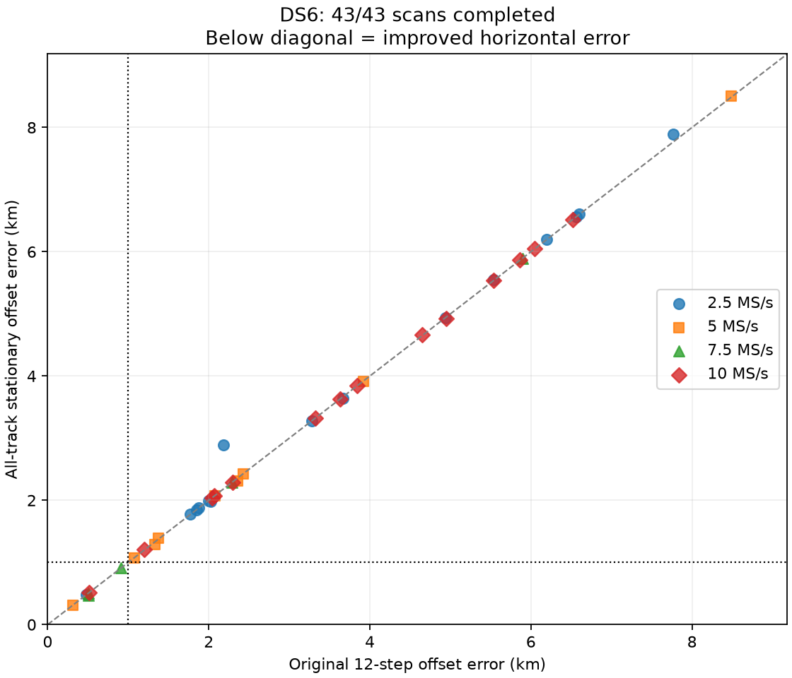

# All-track stationary offset refits

All 43 scans are complete. The numerical correction does not solve independent
sub-kilometre accuracy: 6/43 remain below 1 km, unchanged from the original
corrected-element baseline. Twenty-one errors improve and twenty-two worsen.

| Metric | Original 12-step offsets | Stationary offsets on all tracks |
|---|---:|---:|
| Sub-kilometre scans | 6/43 | 6/43 |
| Mean horizontal error | 3.317 km | 3.333 km |
| Median horizontal error | 2.355 km | 2.425 km |
| Maximum horizontal error | 8.482 km | 8.502 km |
| Selected optimizer warnings | 2 | 0 |

The largest change is `a077447f07d9f81f`, from 2.179 to 2.887 km. Most points
remain close to the diagonal in `errors.png`. Total held predictive log score
increases by 319.06 despite slightly worse geographic summary metrics.

This experiment replaces the fixed 12-iteration offset profiler on every track
and every inherited candidate in a scan, including the weak offset penalty in
optimization. It uses the corrected causal orbit-element policy. It is an
all-track replacement rather than the earlier selected-track diagnostic.

The source-bound protocol includes all 43 DS6 scans. The same four frozen
development scans run first; remaining scans run in bounded batches of at most
12 with three workers. `summary.json` reports all 43 complete and zero pending,
and binds every final result by hash. All 129 starts report convergence; none
of the 43 winners touches the search bounds.

The scalar search retains nine training-residual quantile initializations,
centered IRLS, derivative brackets, positive-curvature root checks and
training-loss selection. Vectorizing the initializations accelerates it without
changing the search rule. A seeded 50-case synthetic benchmark gives 0.106 s
for the scalar implementation and 0.030 s for the vectorized implementation,
with identical offsets in that run. A separate real-data audit reproduces
scalar scores exactly on all 566 candidates in the earlier 44-track cohort:
1.432 s scalar versus 0.479 s vectorized. Timing is environment-specific.

Stationary offsets allow envelope derivatives of the profiled likelihood.
Candidate responsibilities weight the derivative of each training likelihood;
only geometric predictions use central finite differences. The optimizer
therefore avoids repeated scalar fits for each parameter perturbation. An
independent full-profile finite-difference gradient is checked at every
selected winner. The held observations never contribute to that gradient.

Each scan starts at the same baseline horizontal location with timing set to
the baseline winner, -2 s and +2 s. Training likelihood alone selects the
winner; local bounds remain +/-12 km and +/-5 s. Ground truth is read only in
the subsequent summarizer. Exact propagation checks supplement interpolated
optimization. All solver stationarity failures raise explicit errors.
The largest winning offset derivative is below 8e-13 per Hz; the largest
envelope versus full-profile gradient discrepancy is below 0.0001; the maximum
exact-orbit interpolation difference is below 0.021 Hz. Seven tests passed,
covering synthetic and real scalar equivalence, held-data isolation, synthetic
envelope gradients, four development fits, and complete all-43 provenance,
selection, finite-difference and propagation audits.

The candidate shortlists are inherited from the corrected-element, 12-step
baseline and may omit hypotheses favored by the new offset solver. Finite
scalar brackets also do not prove global optimality, and envelope derivatives
are local to the selected mode; mode transitions can be nonsmooth. Therefore
these outputs remain conditional research fits pending candidate/mode
completeness checks. No production estimator, recorded contract, golden fixture
or RF collection changes in this experiment.

The earlier 761.85 m joint result uses the old offset model and is historical;
it is not a verified result of this all-track replacement. The broader
sub-kilometre objective remains active until full-scope evidence supports it.
