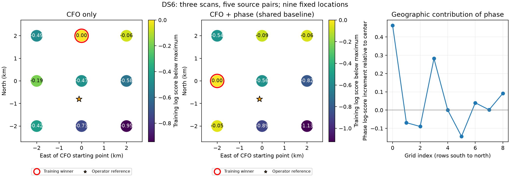

# DS6 geographic contribution of phase

Phase changes the selected grid point, but does not recover a sub-kilometre
location. Both models select the boundary of the frozen search region.

| Model | Selected offset from CFO center | Distance to operator reference | Held CFO log score |
|---|---|---:|---:|
| CFO only | 0 km east, 2 km north | 2.803 km | -374.376 |
| CFO plus phase | 2 km west, 0 km north | 2.042 km | -373.647 |

The phase arm improves held CFO prediction by 0.730 log units at the models'
respective training-selected points. At the common center its gain is 0.567.
Neither quantity is a position-accuracy measurement. The training surfaces
are weak: the entire grid spans only 0.95 log units for CFO and 1.13 for phase.

Omitting the 2.5, 7.5 or 10 MS/s scan yields reference distances of 2.803,
2.042 and 3.513 km respectively. In each omission, both models choose the
same grid point. The phase-induced change with all three scans is therefore
not stable under these omissions. The original CFO center is about 0.81 km
from the reference, but neither model selects it; it would be incorrect to
retain it based on reference proximity and call that phase-assisted recovery.

This bounded experiment compares CFO-only and CFO-plus-phase location scores
at nine locations fixed before execution. It uses three evaluable recordings
from the four-scan expansion cohort, with five source pairs and 150 paired
CFO visits. The selected 5 MS/s recording remains explicitly unavailable:
it lacked the required training/held visit coverage and was not replaced.

## Method

The grid is centered on the earlier CFO-derived location, with east and north
offsets of -2, 0 and +2 km. Neither fitting nor winner selection loads the
operator reference. `summarize.py` selects winners using training likelihood,
then loads that reference to score distances. The reference is operator
supplied, with no surveyed uncertainty or altitude.

Both arms use the same causal labelled-Starlink catalogue, every
training-visible candidate pair, exact propagation at each source's own
observation epochs, integer scan timing offsets from -5 to +5 seconds, and
a Student-t4 differential-CFO likelihood with fixed 100 Hz scale. Differential
constant frequency offsets are profiled using training visits only. Held
visits use those fitted offsets. CFO uses the pipeline's 11.2 GHz reference;
phase geometry uses the actual source RF frequency.

The phase arm adds the existing marginalized pilot likelihood from two
training visits per pair. Unknown constant pair response is integrated out
through circular correlation. A 10% contamination mixture per visit prevents
one phase observation from excluding a candidate outright. No held phase
is used. Phase is not assumed continuous through receiver retunes.

One uncertain physical baseline is shared across all three scans, with equal
prior weights on the frozen 42 baseline vectors (4, 8 and 12 cm; horizontal
directions and vertical endpoints). Each scan has its own marginalized
timing offset. This differs from the preceding fixed-observer report, which
predicted each new scan separately. The present likelihood is conditional on
that finite baseline prior; the nominal 8 cm mount separation is not a
measured RF phase-center baseline.

Within each scan, group likelihoods share timing; across scans, their
timing-integrated likelihoods share baseline. Candidate identities are
marginalized separately by group. Held CFO prediction is the joint
training-plus-held evidence divided by training evidence. It is not a held
position measurement. Leave-one-scan-out grid selections provide a sensitivity
check, not independent accuracy validation.

## Reproduction and limits

`protocol.json` freezes input hashes, candidate timing, baseline vectors and
the nine grid points. Run `run.py --point N` for each index 0 through 8, then
`summarize.py`. Existing completed points are reused only with the matching
protocol digest. Source phase inputs, plans and causal catalogue digests are
checked by the runners and underlying readers. No new RF is collected.

The tests compare shared-baseline/independent-clock integration with explicit
enumeration, reproduce all earlier center-point group factors within 1e-9,
and check complete grid membership, provenance and the unavailable recording.
All three tests passed, as did the two upstream expanded-association tests.

This is a coarse local screen, not a continuous position solution, calibrated
uncertainty region, or blind global search. A boundary winner is unresolved.
No result from this grid alone establishes phase-assisted sub-kilometre
accuracy across DS6.

The CFO arm here uses source-pair frequency differences only. That cancels
common receiver frequency offsets, but also discards the common component
of the two geometric Doppler curves and every track outside the selected
pairs. It therefore does not reproduce the stronger all-track CFO location
estimator. The next integration should retain that all-track information
and add phase as a joint candidate-pair factor; counting the same track's
CFO again through a separate differential likelihood would double-count
observations. An improvement on this sparse screen would not by itself
demonstrate an improvement on the all-track estimator.
