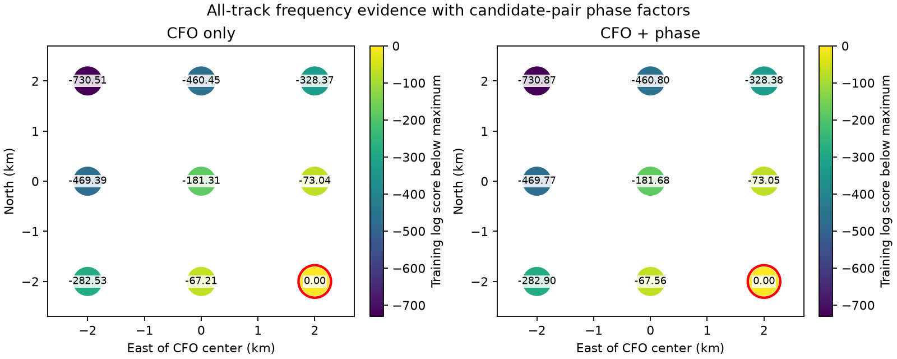

# DS6 joint all-track frequency and pair-phase prototype

Adding phase to all-track frequency evidence did not change the selected
location in this nine-point screen. Both arms chose the southeast boundary,
2.437 km from the operator reference. The sub-kilometre goal remains unmet.

| Timing spacing | CFO-only location error | CFO + phase location error | Phase held-frequency gain |
|---|---:|---:|---:|
| 1 second | 2.437 km | 2.437 km | 0.000 log units |
| 0.25 second | 2.437 km | 2.437 km | +0.00094 log units |

## What changed

The preceding geographic experiment used only source-pair frequency
differences. This prototype retains all 174 eligible tracks and 8,101 CFO
observations from the same three evaluable expansion scans. It uses the same
frozen whole-visit training partitions and pilot likelihoods. The fourth
selected scan remains unavailable for phase and is not replaced.

For an unpaired track, candidate likelihoods are summed independently.
For each of five disjoint phase pairs, the independent product is replaced
by the sum over candidate pairs of

`L_CFO(left candidate) × L_CFO(right candidate) × L_phase(candidate pair, baseline)`.

Each frequency observation therefore appears exactly once. No extra
differential-CFO likelihood is multiplied into the model. Setting the phase
factor to one exactly recovers the CFO-only evidence; tests verify this and
compare nontrivial factors with explicit enumeration.

The shared 42-vector baseline prior, unknown phase-response marginalization,
10% contamination, actual RF phase geometry and scan-specific timing follow
the preceding report. CFO offsets are fitted only on training visits with
Student-t4 scale 100 Hz. Held frequency prediction keeps those offsets fixed.
Both RX track likelihoods are treated as conditionally independent; correlated
errors between receivers remain a limitation, so evidence strength is not a
calibrated uncertainty estimate.

## Candidate and timing limitations

Execution uses copied, frozen training-selected candidate proposals from the
existing all-track CFO experiment. Proposals union top-eight candidates over
five geographic anchors and quarter-second timing hypotheses. Exact source
hashes and copied candidate indices are in `protocol.json`; execution uses
published phase plans and their digest-verified causal catalogues, without
importing the unpublished all-track runner. Input observation times, frequency
values, visit partitions and snapshot digests were checked against the
all-track plans before copying proposals.

These are approximate candidate sums. Minimum top-eight mass at the original
anchors was 0.8630, 0.9999958 and 0.9999919 for the 2.5, 7.5 and 10 MS/s scans.
The union can retain more mass, but these numbers do not certify coverage at
the new locations or under phase weighting. Full-catalogue coverage must be
audited before interpreting a small phase effect as robust.

All nine positions were inherited from the preceding frozen grid. Timing
integration was initially on integer seconds; a follow-up changed only timing
spacing to 0.25 seconds. The selected point stayed fixed, but frequency
evidence and held prediction changed substantially. Quarter-second spacing
is not demonstrated converged. At the selected point the phase contribution
to training evidence is about 2.592 log units, while its geographic variation
across the entire grid is only about 0.386 log units. The frequency evidence
varies by hundreds of log units across those locations. Phase contributes
little geographic discrimination in this model.

Both winners are boundary points. The search does not locate a continuous
optimum. The operator coordinate is read only after training selection by
`summarize.py`; it is not a surveyed reference and has no stated uncertainty.

## Reproduction and next test

Run `run.py` and `run.py --quarter`, then `summarize.py` and
`summarize.py --quarter`. The initial proposal freeze is already recorded;
do not regenerate it to replace this experiment. Three tests cover exact
pair-factor arithmetic without duplicate CFO evidence, frozen input and
training-phase membership, and the timing-only audit.

The next positioning test should use continuous scan timing and a resolved
local geographic optimum, then audit full-catalogue candidate mass around
that optimum. Only afterward can a phase-assisted shift be meaningfully
compared with the all-track CFO position. This result provides the joint
likelihood implementation needed for that test, not evidence of successful
sub-kilometre recovery.
