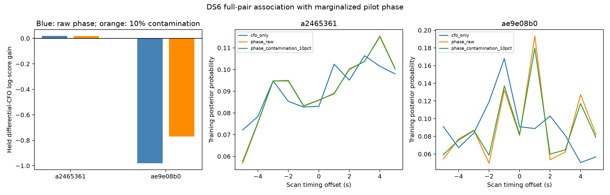

# DS6 association using marginalized pilot-phase likelihoods

The new phase likelihood has been integrated into the full satellite-pair
association calculation. It does not consistently improve held-out CFO
prediction: the 5 MS/s scan improves by 0.019 log units, while the 7.5 MS/s
scan worsens by 0.981. A 10% unreliable-phase component reduces the second
loss to 0.770. These results do not establish better satellite identification
or sub-kilometre geographic accuracy, and the update is not adopted.

| Scan | CFO-only held log score | Phase likelihood | Phase with 10% contamination | Gains versus CFO only |
|---|---:|---:|---:|---:|
| `scan-fw-c78fb2dba2465361` | -79.655857 | -79.636950 | -79.637304 | +0.018907 / +0.018553 |
| `scan-fw-c7e37f65ae9e08b0` | -339.599746 | -340.580561 | -340.370171 | -0.980815 / -0.770425 |

These are predictive log densities of held source-frequency differences, not
position errors or evidence that a particular satellite label is correct.



## Phase likelihood construction

Only the two original training visits per source pair supply phase evidence.
All originally qualified windows in those visits use their saved fitting-pilot
phasors. The prior report's κ=16 source-DD likelihood integrates the unknown
common receiver phase and residual frequency independently per window. Within
each training visit, window likelihoods are pooled with a DD slope uniformly
integrated over ±0.2 Hz. The visit reference is the mean qualified-window
midpoint, matching the original phase observation epoch.

The result is a normalized likelihood for the visit's source DD, evaluated on
720 circular phase nodes. This preparation uses every qualified window in the
outer training visits; it does not reuse the preceding diagnostic's random
within-visit training/held split. The outer held visits contribute no phase
values to this association update. κ and other modelling choices arose from
earlier development analyses, so this is not a fresh blind validation.

An independent, uniformly unknown constant response offset is retained for
each source pair across its two training visits. Let L1 and L2 be their
likelihoods relative to uniform phase. For orbital DD predictions g1 and g2,
the phase factor is

`C(g2-g1) = mean_theta L1(theta) L2(theta + g2-g1)`.

This exactly integrates the unknown constant response on the discrete phase
grid. A periodic FFT computes the correlation; interpolation evaluates it at
the predicted phase change. Tests check its sign and normalization against a
direct sum. No measured geometric phase is subtracted as calibration.

The contamination arm replaces each visit likelihood by `0.9 L + 0.1`.
Consequently its pair factor is `0.9² C + 1 - 0.9²`. This is a declared
sensitivity model, not a measured outlier probability. The raw correlation is
clipped at zero to remove negative FFT roundoff, with a 1e-300 floor only
before logarithms; the contamination arm has a positive 0.19 factor floor.

## Full candidate accounting

Both scans retain the full causal labelled-Starlink catalogue and all
training-visible Cartesian source pairs. A source qualifies when above the
horizon at at least one training CFO epoch. The experiment scores 10,858,467
pair/time hypotheses across integer scan offsets from -5 to +5 seconds,
without candidate shortlists. Runtime was 33.3 seconds.

The original 140 paired CFO visits, whole-visit partitions, frozen differential
noise scales, Student-t4 likelihood and training-profiled differential offsets
are unchanged. Each source keeps its own support-centre epoch. The catalogue
prior is uniform before visibility gating. Baseline sign and scan timing are
shared across groups within each scan and integrated; source identities and
constant response offsets remain separate for disjoint source pairs.

The observer is the earlier CFO-derived point, with fixed zero altitude and
nominal 80 mm east-west baseline. No operator location is read and no geographic
search is performed. Training phase reweights the candidate hypotheses; the
held CFO observations evaluate the resulting predictive mixture. CFO-only
scores reproduce the earlier exhaustive audit to numerical precision.

## What the result means

The earlier within-dwell prediction gain does not automatically transfer to
orbital association between visits. Both extraction uncertainty and unknown
constant pair response are now included, yet the second scan's prediction
still worsens. The phase likelihood's fixed κ, independent-pilot assumption,
within-dwell slope prior and stable inter-visit response remain hypotheses,
not calibrated hardware facts. RF phase-centre geometry and source identity
also remain uncertain.

The positive result on one scan is too small and inconsistent to justify a
location claim. Next steps must investigate inter-visit response and physical
geometry, or validate more informative phase observations, before repeating a
geographic search with stronger phase weight. The full DS6 sub-kilometre goal
remains open; unsuccessful cases are retained.

## Reproduction and checks

With the scientific Python environment and repository `src` on `PYTHONPATH`:

```sh
python reports/2026_09_27_ds6_likelihood_association/prepare.py
python reports/2026_09_27_ds6_likelihood_association/run.py
python reports/2026_09_27_ds6_likelihood_association/summarize.py
python -m pytest reports/2026_09_27_ds6_likelihood_association/test_association.py -q
```

Three tests pass: FFT correlation versus direct offset integration; uniform
phase and contamination identities; and exact training-only visit membership,
full candidate counts, artifact bindings and CFO-only score reproduction.
No IQ reread, new RF collection or production change occurs. Inputs, protocols,
results, tests and figure are sealed in `SHA256SUMS` (excluding bytecode caches).
