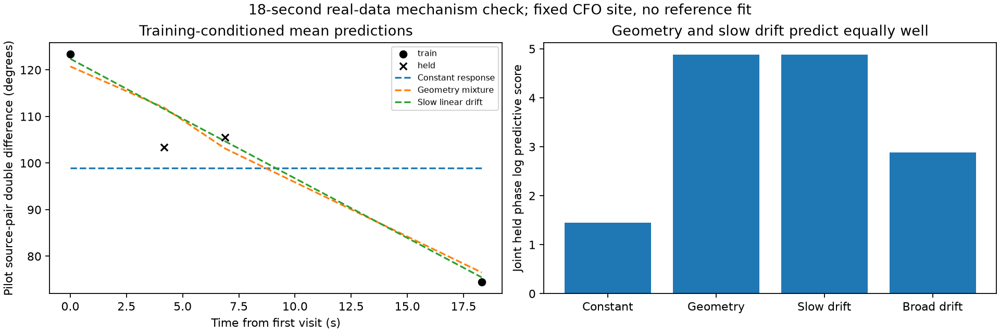

# Is the 18-second DS6 phase trend geometric?

Satellite geometry predicts the two held visits better than a constant-phase
response, but **a slow linear-response model predicts them equally well**.
The observed trend is consistent with geometry; this experiment does not
identify it uniquely as geometry or establish a geographic accuracy gain.

| Training-fitted model | Joint held phase log predictive score |
|---|---:|
| Constant response | 1.45190 |
| Geometry, 42 uncertain baselines | 4.87871 |
| Linear drift, uniform rate +/-0.02 Hz | 4.88538 |
| Linear drift, uniform rate +/-0.2 Hz | 2.88024 |

Geometry gains 3.42681 log units against the constant model, but loses
0.00667 against slow linear drift: effectively indistinguishable here. The
broad drift prior allows multiple wrapped endpoint solutions and produces
much less concentrated intermediate predictions. Its weaker score must not
be used to claim geometry beats all reasonable response models.

## Data and frozen calculation

The source is the newly replayed pair in
`scan-fw-39ac2b14d1bb5f0f`, channel 2, at 10 MS/s. Training visits 592 and 727
span approximately 18.3 seconds; visits 623 and 643 remain held. The calculation
uses cached qualified pilot phasors, not new recordings. Training visits use
their within-window fit phasors; held visits use disjoint evaluation phasors.
This differs from the preceding descriptive plot, which used evaluation
phase estimates for every visit, so its training marker values are different.

Per-window common phase and differential frequency are marginalized with the
existing kappa-16 model and a 751-node +/-375 Hz frequency grid. Qualified
windows are combined within each visit with a +/-0.2 Hz local slope prior.
Each visit yields a 720-node circular likelihood. A 10% contamination mixture
is applied consistently to all four competing models. These are conditional
likelihoods; their precision has not been calibrated as physical coverage.

The receiver location and scan clock come from the corrected training-only
pooled CFO estimate. The two source identities are training-MAP candidates,
each having effectively unit mass within the frozen shortlist at that point.
Corrected causal orbital elements are propagated at each observation's own
epoch. The phase model uses actual RF frequency, the source-B minus source-A
direction difference, and the inherited 42 directed baseline vectors.
The model does not read the operator coordinate.

Every model integrates an unknown constant circular response using only the
two training visits. The geometry model also integrates the baseline prior;
drift controls integrate their stated rate priors. Held phase does not choose
the response, baseline, slope, site, clock or satellite identities. Joint held
scores integrate the shared training-conditioned nuisance parameters rather
than fitting them again to held observations. Scores are relative to the same
uniform circular density and should be compared between models on these data.

The linear drift hypotheses are diagnostic controls, not a proposal to remove
the measured linear trend. Subtracting such a fitted trend would also remove
almost the same geometric information that we want to retain.

## Why the models are hard to distinguish

Over this short span, much of the predicted geometric phase resembles a line.
The training-weighted geometric departure from a line through the endpoints
has 4.51-degree RMS at the held epochs, while the held visit likelihoods have
conditional circular standard deviations of 5.93 and 5.67 degrees. Those
numbers are descriptive model quantities, not independent significance tests.
The held predictive comparison directly shows the lack of discrimination.

The highest training baseline weight is on the nominal 8 cm eastward vector,
but its probability is only about 46%. This single-pair result is not RF
baseline calibration, a measured receiver mapping, or proof of satellite IDs.
The broad baseline mixture and contamination floor remain part of the model.

Doubling the linear-rate grid from 1,601 to 3,201 nodes changes either held
score by less than 2.2e-6 log units, much less than the geometry/drift gap.
Two tests pass: circular evidence against explicit summation with held-data
isolation, and exact saved membership/provenance/partition checks. Baseline
grid and noise-model sensitivity are separate unresolved questions.

## Consequence for the positioning goal

The new phase trend provides useful evidence of change, but not a unique
geometric constraint. The next selection should target eligible source pairs
with predicted nonlinear geometric evolution that is distinguishable from
response drift, while retaining independent held visits. More jointly
observed sources can also test whether response changes are shared. A smooth
phase trace alone is insufficient to claim phase-assisted sub-kilometre
positioning, and no new position was fitted in this experiment.

Reproduce with `run.py` in a fresh output directory, then `summarize.py` and
`pytest test_geometry.py`, using the saved report dependencies and causal TLE
archive. The frozen protocol refuses replacement. This is an exploratory
mechanism comparison following inspection of the earlier descriptive trace,
not a previously untouched blind validation cohort.
