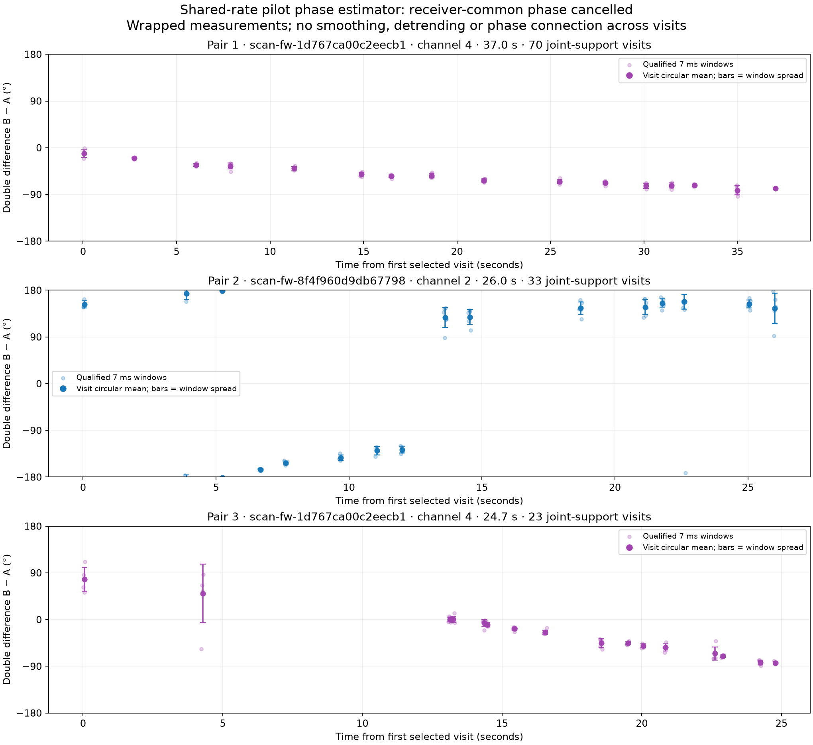
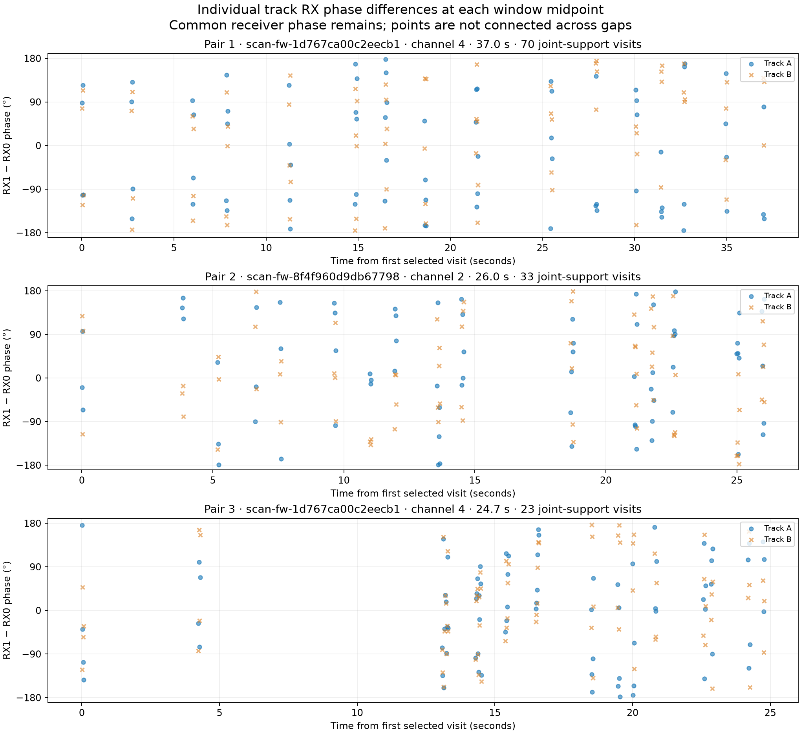

# Long DS6 tracks: measured pilot phase versus time

This report visualizes the **shared-rate known-pilot estimator**, which improved
held-pilot prediction in all three evaluable scans of the earlier
[expansion validation](../2026_09_27_ds6_phase_expansion/README.md).
It fits one residual RX phase rate per window while retaining independent
source phase intercepts. It does not fit a common phase to both satellites.
This is the best-supported extraction method in that comparison, not a claim
of calibrated geometric phase recovery.

Three pairs (six source tracks) were selected from the published additional
pair census before extraction: require at least 20 joint visits, rank by full
time span, and retain the three longest. Sixteen visit-order quantiles including
both endpoints are replayed per pair. The resulting 48 visits span 24.7–37.0
seconds in two 10 MS/s recordings. Strong metadata support does not guarantee
clean recovered phase. No replacement or phase-based cherry-picking is used.

All 48 sampled visits yielded phase. **221 of 288 windows qualified; none of
48 shifted-RX controls qualified**, and no clipping was observed.

| Pair | Span | Joint-support visits | Replayed / usable visits | Qualified windows | Median within-visit R | Independent → shared held-frame RMS |
|---|---:|---:|---:|---:|---:|---:|
| 1, channel 4 | 37.0 s | 70 | 16 / 16 | 73 / 96 | 0.9981 | 7.29° → 7.17° |
| 2, channel 2 | 26.0 s | 33 | 16 / 16 | 72 / 96 | 0.9902 | 32.93° → 30.41° |
| 3, channel 4 | 24.7 s | 23 | 16 / 16 | 76 / 96 | 0.9968 | 20.28° → 18.01° |

Pair 1 shows a gradual decline with tight within-visit repeatability. Pair 3
also declines, with a noisier early visit. Pair 2 crosses the wrapped boundary
and is less consistent across visits; wrapping alone does not explain every
change. Its high median R does not imply smooth cross-visit evolution. The
shared estimator improves held-frame RMS in each pair, but this descriptive
selection is not an independent replication of the earlier validation protocol.
Geometric attribution has not been tested for these new traces.

For each source, the complex pilot coefficients form `z = RX1 * conj(RX0)`.
The RX frequency seed is shared between sources using the visit's GLRT
differential estimate. Residual phase rate is fitted to fitting-only pilot
phasors inside each 7 ms window; evaluation phasors are corrected to the window
midpoint using that rate. Separate source phases remain free.

The main plot shows `wrap(arg(z_B) - arg(z_A))`. This source-pair double
difference cancels a phase term common to both sources in both receivers.
It retains source-dependent phase responses and the difference of geometric
RX path differences. It is not the absolute path difference of one satellite.

Small faint dots are qualified window measurements. Large dots are equal-window
circular means for each visit, with bars showing circular standard deviation
across that visit's windows. Those bars are dispersion, not standard errors or
calibrated physical confidence intervals. All phases stay wrapped to +/-180°.
There is no smoothing, detrending, fitted satellite curve, cross-visit
unwrapping or assumed phase continuity. Channels 2 and 4 use blue and purple.
The time origin is separate for each pair.

The companion plot shows each track's `RX1 − RX0` phase at every qualified
window midpoint. It includes the common receiver phase. Different windows
sample that phase at different times; circularly averaging it over a dwell
could cancel a rapidly rotating signal, so no single-source dwell average is
shown. Blue and orange denote track A and B in this companion plot.
GLRT CFO and residual corrections remove within-window rotation for estimation;
they do not establish calibrated phase continuity across visits or retunes.

Each pair follows fixed RX0 positioning-track identifiers with uniquely joined
RX1 candidates at each visit. These are track associations, not confirmed
satellite identities. Full identifiers and visit recipes are in the plans and
summary. Each examined visit retains its result even if extraction fails.

Six windows at 0, 21, 42, 63, 84 and 105 ms use the unchanged joint pilot fit,
quality gates and disjoint fitting/quality/evaluation masks. Both sources must
qualify in both receivers. A 173-microsecond shifted-RX control is run per visit.
The original whole-visit train/held labels remain in the replay but both are
displayed here: this is a descriptive visualization, not a new held-association
experiment or geographic validation.

`summary.json` records support, extraction yield, within-visit coherence,
control results and matched shared/independent held-frame RMS. `visits.csv`
and `windows.csv` contain plotted numbers. Plans, individual phasors and replay
outcomes are retained for audit. `replay.py` is the validated expansion runner
with only its per-scan visit cap increased from eight to 32.

Reproduction: the existing protocol is frozen; do not run `prepare.py` over it.
Run `replay.py --scan 0` and `--scan 1` using the original read-only stores and
scientific Python environment, then `plot.py`. Matching complete replays are
reused. `python3 test_report.py` verifies deterministic metadata selection,
source hashes, all 48 replay visits and plotted coverage. Plot generation also
checks that the difference of independently reconstructed source phases equals
the saved shared-rate estimator for every qualified window.

No new RF collection, physical calibration or location fit is performed.
