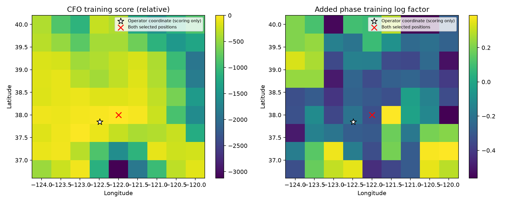

# DS6: orbit-backed phase and location comparison

**Adding phase did not change either selected location. Sub-kilometre accuracy
is not achieved.** This development experiment connects two real recurring
track pairs to catalogue orbits and geographic hypotheses, instead of treating
smooth phase as satellite geometry.

## Real input and selection

Both pairs come from DS6 recording `scan-fw-4c56320fb5ca6994` (02:42 UTC).
The preceding ten-scan phase report already studied this scan; it is not an
unseen confirmation cohort. The first pair begins at visit 1568 and spans
6.037 seconds. The second begins at visit 1976 and spans 23.826 seconds.
Each has six usable visits with three training and three held visits, using
the previously frozen random whole-visit assignment. Each visit contributes
one circular mean of qualified evaluation-window double differences.

The first run uses the shorter recurring pair. The longer pair was then tested
as the next explicit development comparison; both outcomes are retained.
Acquisition candidate/track memberships come from the digest-bound prior plan.
Satellite catalogue IDs inferred here remain hypotheses, not verified identities.

## Model and search

The public archive reader selects and digest-verifies a causal TLE snapshot
collected before capture start minus 505 seconds. The public propagation kernel
produces **11,116 valid catalogue candidates**, at each observed phase epoch
and a shared orbit-time offset from -5 to +5 seconds in one-second steps.

The same 81 geographic points are scored by both arms: a 9-by-9 grid covering
latitude 36.8–40.0 and longitude -124.0–-120.0. This is a coarse regional
development search, not a sub-kilometre search or global optimum proof.
The coordinate authority is loaded only by the subsequent scoring/plot script.

For each point and timing offset, each source retains the six best candidates
under **training CFO only**. CFO comes from RX0 GLRT seeds; one constant offset
per source is integrated with a zero-mean 1 MHz Gaussian prior and a fixed
100 Hz measurement scale. Candidate selection and geographic ranking do not
use held CFO or phase. The two source candidates share one timing offset.
Candidate pairs are marginalized rather than replacing an association with a
single phase-picked identity. Top-six truncation makes this evidence approximate.

Phase prediction uses the channel-center RF approximation and a nominal
80 mm east-west baseline. Both signs have equal prior probability and are
marginalized. This is an **uncalibrated fixture scenario**, not measured RF
phase-center geometry. One constant phase offset per recurring pair is
integrated uniformly on the circle, preserving candidate-dependent variation.
Each dwell has fixed concentration kappa=1; precision does not increase merely
because it contains more windows. CFO and phase share acquisition conditioning,
so their product is an exploratory likelihood, not independently calibrated.

The scoring retains receiver-offset and orbit-time ambiguity, but does not yet
model transmitter/receiver drift, frequency-dependent antenna phase, exact
GLRT probe epochs, unknown baseline orientation/length, all CFO aliases, or
full catalogue posterior tails. These limitations matter for metre-scale claims.

## Results

| Pair starting visit | Span | CFO-only location | CFO + phase location | Error to operator coordinate |
|---|---:|---|---|---:|
| 1568 | 6.04 s | 39.6, -120.5 | 39.6, -120.5 | 259.95 km |
| 1976 | 23.83 s | 38.0, -122.0 | 38.0, -122.0 | 45.79 km |

The reported errors score only the selected coarse-grid points. They neither
bound continuous-location error nor replace the earlier all-track CFO baseline.
This intentionally small pair-only model loses much of the information used
by that stronger baseline.

The added training phase factor varies by only **0.08225 log units** across
the short-pair grid, and **0.95101 log units** across the longer-pair grid.
The longer span provides greater discrimination in this experiment, but neither
factor changes the selected node. The preferred candidate/timing hypotheses
at the selected locations also remain unchanged: 52302/63761 at +4 seconds
for the short pair, and 69497/51774 at -1 second for the longer pair. These
IDs are not association truth.

At the selected nodes, joint held log-predictive scores rise by about 1.917
and 0.439 respectively when adding phase. The arms score different observation
sets: the joint arm includes phase, with density relative to uniform phase.
**These differences are not held CFO prediction gains or location improvements.**
They show why a positive phase evidence score alone is insufficient.

## Verification and next step

Three tests pass: analytic CFO-offset integration agrees with a dense Gaussian
calculation, phase evidence is invariant to a common unknown offset, and a
single phase observation with an unconstrained offset has zero directional
information. Source recording, plan, phase and causal catalogue digests are
recorded in each protocol; grid scores and hypotheses are fully retained.

The preceding goal turn was progress through uncertainty diagnostics. This
turn adds actual orbit/position inference and negative location results, so
the next action changes: build a multi-track likelihood with a shared scan-time
offset and an independently qualified phase factor, starting from the stronger
all-track CFO search. Refining the selected pair-only points to a smaller grid
would not resolve their association/clock ambiguity. Any subsequent location
claim must be validated on random whole-scan DS6 holdouts, with the attached
coordinate reserved for final error scoring.

Reproduce with repository `src` on `PYTHONPATH` and the existing scientific
runtime: `python run.py`, `python run.py --first-visit 1976`, followed by
`python plot_score.py` and `python plot_score.py --first-visit 1976`.
`python -m pytest test_run.py -q` runs the focused mathematical checks.
Only existing recording-analysis artifacts and the local causal TLE archive
are read; original IQ and production products are unchanged.
