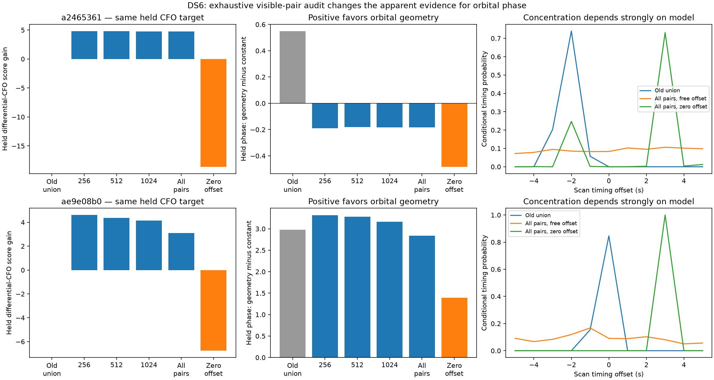
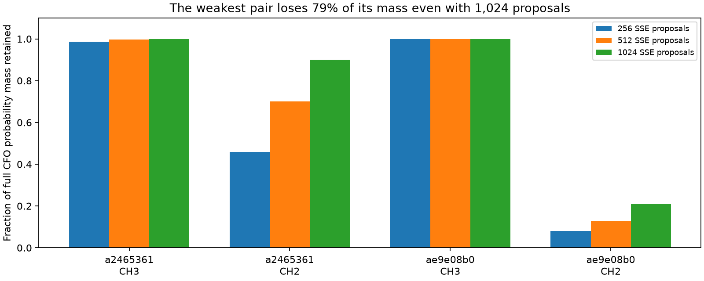

# DS6: exhaustive source-pair coverage audit

The restricted satellite candidate banks overstated association certainty.
Enumerating all training-visible pairs removes the apparent held-out orbital
phase advantage in the 5 MS/s scan. The 7.5 MS/s scan still favors orbital
phase over a constant phase model, but using phase worsens its held-out
differential-CFO prediction. These results do not establish a phase-assisted
position improvement or sub-kilometre accuracy on DS6.

This report audits the candidate coverage underlying the
[differential-CFO experiment](../2026_09_27_ds6_differential_cfo/README.md).
It uses recorded data from two scans, four recurring source-track pairs,
140 paired CFO visits, and four phase observations per pair (two training,
two held out). It is a conditional development experiment, not a new blind
validation or a geographic search.

## Results

All values below are natural-log predictive scores or differences; positive
differences favor the first named model. They are not position errors.

| Scan | Rate | Full-pair orbital phase minus constant phase | Phase gain in held-out differential CFO | Zero-offset CFO change versus free offset |
|---|---:|---:|---:|---:|
| `scan-fw-c78fb2dba2465361` | 5 MS/s | -0.1832 | +0.0312 | -23.3497 |
| `scan-fw-c7e37f65ae9e08b0` | 7.5 MS/s | +2.8401 | -0.3675 | -9.8686 |

The old restricted banks gave orbital-phase advantages of +0.5497 and
+2.9801 on the same integer timing grid. Broadening candidate coverage changes
the first conclusion and leaves mixed evidence in the second.



The 1,024-proposal banks retain 99.94%, 89.99%, approximately 100%, and
20.90% of the full training-CFO mass for the four groups. The weakest group
(7.5 MS/s, CH2) has an entropy-equivalent 17,570 pairs at its CFO MAP timing,
with only 0.074% probability on its most probable pair. The latter statistics
are conditional on timing; retention integrates the scan CFO timing posterior.
A small change between successive shortlist sizes did not prove coverage.



## Method and safeguards

The observer is fixed at the earlier CFO-derived estimate
(37.85625, -122.484375), with zero assumed altitude. The operator location is
not read or used by this experiment. Each scan uses its digest-verified causal
catalogue of 11,116 labelled Starlink entries. Each source must be above the
local horizon at at least one training observation; this is not an assertion
that a candidate is visible throughout the track or correctly identified.

We first rank every visible Cartesian source pair by training-only squared
error after removing a constant differential offset. Prefixes of 256, 512,
and 1,024 proposals are rescored under the frozen Student-t4 model. Phase
and held-out measurements do not select proposals. The subsequent exhaustive
run scores every eligible pair under that robust model, eliminating the
squared-error shortlist approximation. It evaluates 10,858,467 pair/time
hypotheses across integer scan offsets from -5 to +5 seconds in about 32 s.
This is exhaustive only within the stated catalogue, visibility, observer,
timing grid and likelihood assumptions.

The two source CFO observations retain their own support-centre epochs.
Their separation can approach 0.935 ms: a common constant receiver offset
cancels, but a time-varying receiver error need not cancel exactly.
Whole-visit training/held-out partitions and differential noise scales remain
frozen from the preceding experiment. The free-offset arm uses the existing
12-step training-only robust constant fit and weak 1 MHz offset penalty;
it profiles that offset rather than marginalizing its uncertainty.

The phase model uses nominal 80 mm east-west separation and actual RF
frequency. A common baseline sign and scan timing are integrated across
the groups within each scan. Each source pair has an unknown constant phase
offset and a concentration integrated over 129 log-spaced values from 0.1
to 10,000. A checked resultant-length lookup accelerates that integral:
the largest midpoint errors against direct quadrature are 3.88e-7 and
8.56e-7 log units for two and four observations. This numerical check does
not validate the physical baseline or noise assumptions. The catalogue prior
is uniform before gating; selected banks are not given a renormalized prior.

The zero-offset sensitivity arm asks whether retaining absolute differential
frequency helps, assuming negligible transmitter and branch offsets after
receiver cancellation. It concentrates the timing posterior but worsens
held-out CFO prediction in both scans. That assumption is not established
by the hardware metadata and is not adopted.

## Implication for positioning

No new geographic estimate is produced here. The preceding restricted-bank
position search ended at a boundary about 14.1 km from the operator coordinate;
this audit does not repair or supersede that failed location result. A positive
orbital-phase prediction score alone does not establish useful position
information, especially with only two training phase dwells per pair.

The next position model needs broad candidate support and a testable shared
receiver-frequency model while preserving source-specific offsets. Absolute
and differenced CFO must not be counted as independent observations. Position
improvement must then be measured on whole-scan holdouts with the operator
coordinate reserved for scoring. Unknown RF phase centres, provisional RX
mapping, timing-grid resolution and structured CFO residuals remain limitations.

## Reproduction and verification

From the repository root, using the scientific Python environment and `src`
on `PYTHONPATH`:

```sh
python reports/2026_09_27_ds6_pair_proposals/run.py
python reports/2026_09_27_ds6_pair_proposals/full.py
python reports/2026_09_27_ds6_pair_proposals/full.py --offset zero
python reports/2026_09_27_ds6_pair_proposals/summarize.py
python -m pytest reports/2026_09_27_ds6_pair_proposals/test_pairs.py -q
```

Five tests passed: profiled-pair algebra, circular-integral accuracy, equivalence
to the original concentration integration, normalized zero-offset density and
held-out isolation, and complete artifact/candidate accounting. Protocols and
results record source hashes. `SHA256SUMS` seals report files; cached Python
bytecode is excluded. No new RF was collected or source IQ modified.
