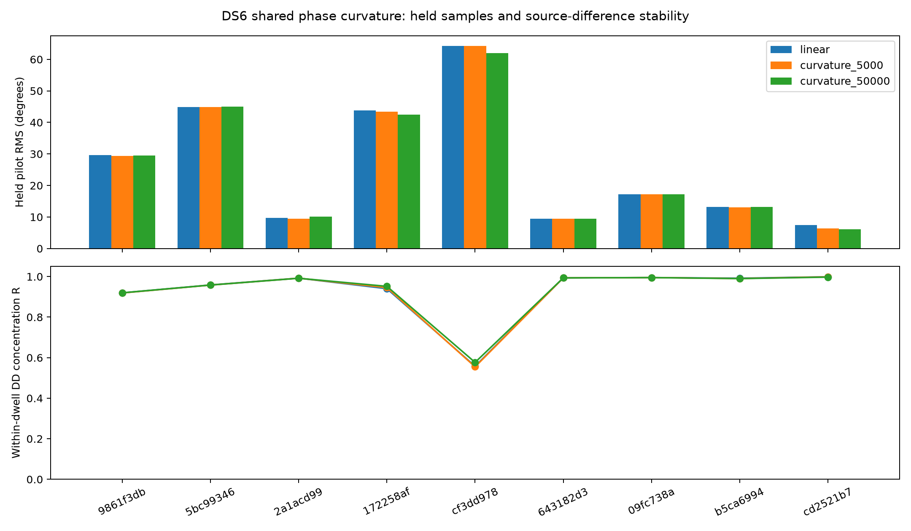
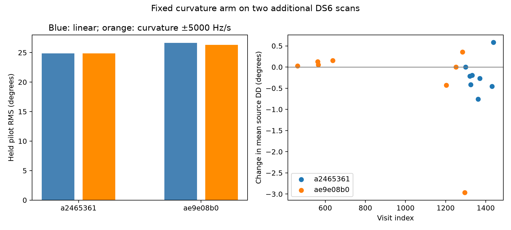

# DS6 shared phase-curvature prototype

Adding a shared quadratic phase term produces small held-pilot improvements,
but does not establish a more accurate geometric phase or location. On two
additional previously selected DS6 scans, held RMS improves by only 0.017° and
0.368°. The tighter curvature bound is reached in 55 of 75 windows. The
prototype is not promoted to the positioning pipeline.

## Controlled model

Within each 7 ms window, fit

`phase(source,t) = source_intercept + 2π f t + π q t²`.

The residual frequency f and frequency slope q are common to both sources.
Each source retains its own independent intercept, so the model does not force
their geometric phase difference to zero. Time is relative to the window
midpoint, using actual pilot support centroids. This is a local model, not a
phase-continuity assumption between windows or across retunes.

The development comparison uses q=0 and bounds of ±5,000 and ±50,000 Hz/s.
Frequency remains within ±375 Hz. A 151-by-21 grid (one slope for the linear
arm) profiles circular intercepts, followed by bounded refinement from the
three best grid points. Equal-weight normalized pilot phasors are used.
Only fitting samples estimate parameters; disjoint evaluation samples score
prediction and estimate the held source difference.

## Development dwells

Ten preselected cached DS6 dwells retain all original qualification decisions.
Nine contain qualified windows; the zero-window case remains unavailable.
There are 32 qualified windows in total. The tighter curvature arm improves
held-pilot RMS in eight of nine evaluable dwells, usually by fractions of a
degree. The wider arm is mixed and does not consistently improve within-dwell
source-difference concentration. No best arm is selected separately by dwell.



This comparison uses all qualified windows in each dwell, unlike the previous
phase-transfer audit's subset of whole held windows. Their pooled RMS numbers
therefore should not be compared as matched estimates.

## Fixed tighter arm on two additional scans

The ±5,000 Hz/s arm was frozen before replaying the two scans below. These
scans have been used in earlier scientific investigations; this is not an
untouched blind validation. Both arms use exactly the original qualified
windows, timing choices, pilot samples and source ordering.

| Scan | Qualified windows | Linear held pilot RMS | Curved held pilot RMS | Bound hits | Median absolute dwell DD change |
|---|---:|---:|---:|---:|---:|
| `scan-fw-c78fb2dba2465361` | 46 | 24.854° | 24.837° | 32 | 0.340° |
| `scan-fw-c7e37f65ae9e08b0` | 29 | 26.655° | 26.287° | 23 | 0.143° |

RMS pools individual held pilot errors, rather than averaging group RMS values.
The independently implemented linear arm reproduces existing common-rate
source double differences within 0.0001 radians and reproduces the pooled
pilot RMS to numerical precision. The figure's phase changes compare estimators;
they are not known corrections toward true geometric phase.



The frequent bound hits make the fitted curvature magnitude dependent on the
chosen constraint. The small predictive gains do not validate the bound as a
physical oscillator model. A wider bound on these two scans has not been
tested here. These results also do not rule out higher-order or stochastic
receiver phase dynamics; they specifically fail to justify promoting this
simple bounded quadratic correction.

## Implication for the sub-kilometre goal

Small extraction-model changes move dwell phase by tenths of a degree without
establishing which estimate is closer to geometry. The preceding local
sensitivity audit required substantially tighter precision for its sparse,
unknown-offset designs. Its theoretical precision requirements are not directly
comparable to individual-pilot RMS, but the estimator dependence here must be
resolved before assigning strong location weight to phase.

The next useful work can use the saved individual pilot phasors to test common
receiver dynamics and quantify uncertainty without repeated raw reads. A model
must preserve free source phases, distinguish detection from phase precision,
and improve geographic held-out results alongside the CFO-only baseline.
No new position estimate or sub-kilometre claim is made by this report.

## Integrity and reproduction

The validation replay read 16 previously selected dwells through the public
read-only IQ adapter. Capture manifests and sample counters were verified;
the adapter checks compressed and uncompressed chunk hashes. Replay completed
in approximately 4.3 seconds. No source IQ or production service was changed.
The new `*-frames.json` files retain individual normalized phasors, centroids,
source labels, fit/evaluation partitions and the original extraction metadata
for every qualified validation window. Source hashes bind protocols and results.

Three tests pass: recovery of known synthetic shared curvature while preserving
arbitrary source phase difference and predicting held samples; zero-curvature
equivalence and invariance of the source difference to common phase rotation;
and exact qualified-window membership, artifact bindings and agreement with
the earlier linear extractor on real data.

From the repository root with the scientific Python environment and `src` on
`PYTHONPATH`:

```sh
python reports/2026_09_27_ds6_phase_curvature/run.py
python reports/2026_09_27_ds6_phase_curvature/validate.py
python reports/2026_09_27_ds6_phase_curvature/summarize.py
python -m pytest reports/2026_09_27_ds6_phase_curvature/test_curvature.py -q
```

Only `validate.py` requires the existing raw corpus. Other scripts and tests
use saved numerical artifacts. `SHA256SUMS` seals report files and excludes
Python bytecode caches.
