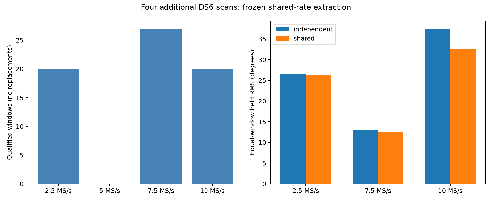

# DS6 phase evidence expansion: four additional scans

The frozen shared-rate extractor improves held-pilot prediction in all three
evaluable additional scans, passing this expansion's predeclared extraction
gate. Equal-scan mean squared error falls by 16.5%. The replay adds 67 qualified
windows across 20 dwells and five disjoint source-track pairs. It supplies
broader evidence for subsequent association testing; it does not establish
phase-assisted sub-kilometre location accuracy.

| Scan | Rate | Source pairs | Qualified/examined windows | Independent → shared held RMS |
|---|---:|---:|---:|---:|
| `scan-fw-aa9770c66396e928` | 2.5 MS/s | 1 | 20 / 24 | 26.456° → 26.166° |
| `scan-fw-e76c229e9dc498b3` | 5 MS/s | 0 eligible | 0 / 0 | Unavailable |
| `scan-fw-b5604c3d838fa7ed` | 7.5 MS/s | 2 | 27 / 48 | 13.039° → 12.486° |
| `scan-fw-c559f436d578c9bd` | 10 MS/s | 2 | 20 / 48 | 37.477° → 32.534° |

RMS is calculated from equal-weight window mean squared errors, as frozen in
the protocol. Pooled individual-pilot RMS is also saved in `summary.json` but
is not the primary metric. All 20 selected dwells have at least two qualified
windows. None of 20 shifted-RX controls qualifies, and no inspected samples
hit the clipping limits.



## Selection before phase extraction

The scan inventory is the approved immutable DS6 list. A fixed hash seed selects
one scan at each rate from recordings outside both the original ten-scan phase
replay and the preceding four-scan common-rate cohort. Eligibility uses the
inventory's historical completed analysis/tracking flags. No scan is replaced
because its pairing or extraction outcome is unavailable or unfavorable.

The existing metadata planner is reused unchanged except for its output
directory. Its original visit-partition seed is retained. Candidate IDs must
join uniquely to positioning tracks; simultaneous source pairs must have joint
RX support and meet the existing frequency/epoch separation checks. Up to two
disjoint pairs per scan are chosen by metadata support, with two hash-selected
training and two held visits per pair. Phase values do not choose scans, pairs
or visits. Plans retain all numerical positioning tracks, candidate IDs,
source epochs, whole-visit masks and causal orbit-snapshot digests.

The 5 MS/s scan has five metadata source-pair groups, but none meets the frozen
two-training/two-held minimum. Its largest group has four visits split three
training and one held; another has one training and two held. Therefore its
unavailability is a partition/support limitation, not evidence of no joint
signal. Its manifest, plan and explicit empty completed replay remain in the
report. The selection rules were not relaxed after seeing this result.

## Extraction and controls

Each selected dwell examines six 7 ms windows starting at 0, 21, 42, 63, 84
and 105 ms. The existing joint known-pilot regression, fitting-only timing
selection, donor/control qualification and disjoint fit/quality/evaluation
sample masks are unchanged. Both sources must qualify in both receivers.

The matched comparison uses normalized unit phasors. The independent arm fits
each source's receiver phase rate separately. The shared arm fits one common
receiver rate while preserving separate source intercepts. Held phasors choose
neither rate nor intercept. Thus the shared fit does not force source phase
difference to zero. The 173 microsecond RX1-roll control is applied to the first
window of every selected dwell; 0/20 controls qualify.

The frozen decision requires at least three evaluable scans, improvement in
at least three, and lower equal-scan mean squared error. This cohort meets it:
0.230950 → 0.192829 rad², with three wins and one unavailable scan. This does
not retroactively change the earlier four-scan cohort's failed availability
gate, and is not a production deployment or a scientific accuracy claim.
It supports retaining shared-rate extraction for further phase research.

## Next integration toward the geographic goal

The new plans and individual pilot phasors allow the marginalized phase
likelihood and full-candidate association tests to extend beyond the two scans
used in recent baseline sensitivity experiments. The five new source pairs
provide different times, channels and sample rates for checking receiver
response and RF-baseline uncertainty.

Extraction gains alone do not establish orbit-consistent phase or better
location. Association must preserve failed cases and candidate uncertainty,
then compare matched CFO-only and phase-assisted geographic estimates with
operator location reserved for scoring. The authority still does not specify
a measured directed RF phase-centre baseline. DS6-wide sub-kilometre accuracy
remains unverified.

## Artifacts and verification

The bounded replay read 20 existing dwells, below the frozen maximum of 32.
No RF was collected. The public read-only capture adapter verified input
manifests, sample counters and compressed/uncompressed data integrity. Replay
times were approximately 3.3, 24.5 and 30.1 seconds for the evaluable scans;
metadata preparation is separate. No QNAP paths or production services changed.

For each of four scans, `*-plan.json` saves exact track joins and metadata,
`*-replay.json` saves qualifications, phase estimates and controls, and
`*-frames.json` retains individual source phasors and their time references
for every qualified window. Unavailable cases use explicit completed empty
artifacts rather than disappearing from the inventory.

Two offline tests pass: deterministic four-rate selection with no replacements;
and completed replay membership, source bindings, exact window/frame counts,
disjoint track factors and preserved whole-visit partitions. Existing extractor
tests remain in the source reports. `SHA256SUMS` seals this report's artifacts.

Using the scientific Python environment and repository `src` on `PYTHONPATH`:

```sh
# The protocol is already frozen; do not re-freeze or replace its selections.
python reports/2026_09_27_ds6_phase_expansion/workflow.py prepare
python reports/2026_09_27_ds6_phase_expansion/replay.py --scan 0
python reports/2026_09_27_ds6_phase_expansion/replay.py --scan 1
python reports/2026_09_27_ds6_phase_expansion/replay.py --scan 2
python reports/2026_09_27_ds6_phase_expansion/replay.py --scan 3
python reports/2026_09_27_ds6_phase_expansion/summarize.py
python -m pytest reports/2026_09_27_ds6_phase_expansion/test_expansion.py -q
```

Completed matching plans/replays are reused; partial replay files require
inspection instead of an automatic restart. Prior non-phase investigations may
have used these recordings, so this is additional phase evidence from the same
capture night, not a claim of untouched geographic validation.
