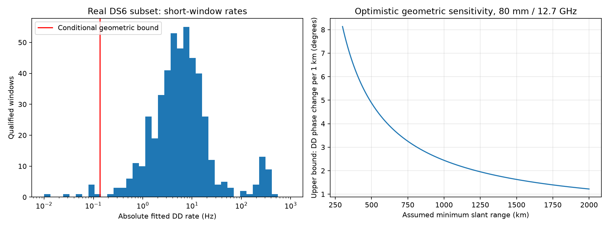

# DS6 phase positioning: rate and sensitivity audit

**Sub-kilometre positioning is not demonstrated.** This audit changes the next
experiment: independently fitted rates from 7 ms windows cannot yet be treated
as geometric phase velocity. Preserve phase intercepts and estimate rate
uncertainty before imposing a slow-motion model or rejecting fast fitted rates.

The previous goal turn minted DS6 and was progress. This turn verifies the
overlap of existing phase products with frozen DS6 membership and adds a
numerical diagnostic. It does not rerun all 43 recordings or claim a position.

## Real evidence

The cached ten-scan phase experiment covers 10 of DS6's 43 recordings. It has
482 qualified simultaneous two-mode windows over 131 dwells. Their median
absolute difference between fitted receiver-phase rates is **5.749 Hz**;
training/evaluation double-difference phase disagreement is **8.285 degrees
RMS**. This is internal disagreement, not calibrated geometric error. The
rate difference uses the same receiver frequency reference for both modes,
so their shared mixing seed cancels. Independently fitted residual rates and
source-dependent errors remain.

## Conditional geometry calculation

For a fixed receiver baseline B and source direction u, phase is proportional
to `2 pi f B dot u / c`. For a two-source double difference, summing the
magnitudes bounds its derivative by `2 f |B| v / (c range)` cycles/second,
when both sources satisfy the same frequency, speed and minimum-range bounds.

An **illustrative**, uncalibrated 80 mm baseline, 12.7 GHz RF, minimum 500 km
slant range and maximum 10 km/s relative speed gives **0.13556 Hz**. Only
7 of 482 short-window fitted rates fall inside that scenario bound. These
assumptions are not measured satellite identities, ranges or phase centers;
this is not a physical rejection gate. Antenna phase, multipath, differential
hardware response and estimation noise are absent from this geometric bound.

With the same fixed-baseline scenario, a 1 km observer displacement changes
double-difference phase by **at most about 4.880 degrees to first order**.
Actual sensitivity may be much lower, have weak axes, or be absorbed by nuisance
offsets. The bound is optimistic and cannot be inverted into a positioning
accuracy claim. Identity uncertainty, offsets, baseline orientation and RF
response must be included in a real positioning likelihood.

## Short windows can explain large fitted rates

A seeded toy null uses five equally spaced pilots at 750 Hz with zero true
rate, independent Gaussian phase noise, and separate source slope estimates.
At 6 degrees per-pilot noise the median absolute fitted difference is 3.756 Hz;
at 10 degrees it is 6.207 Hz. Thus several Hz of fitted rate can arise without
any satellite or receiver motion. These noise levels are a scenario sweep,
not fitted/calibrated to the recordings. This toy does not replicate raw-IQ
regression, shared fitting errors or circular aliases.

The simulated rate standard deviations agree with analytic regression
uncertainty within 3%; the geometric derivative passes an independent finite
difference check. Input hashes and all 482 diagnostic rows are retained.

## Next experiment toward the full goal

1. Replay a bounded set of these existing dwells, retaining per-pilot complex
   coefficients and their times. Compare the present independent rates with
   a joint receiver-rate model plus source-specific slow geometric terms.
   The earlier shared-rate prototype was inconsistent; reuse it only as a
   comparison arm, not as an assumed improvement.
2. Freeze random whole-dwell fitting/qualification/evaluation groups. Quantify
   phase intercept bias and predictive likelihood under injected slow phase,
   nonzero differential phase, mixtures and real negative controls. A smoother
   curve alone is not success. Do not fit nuisance terms on evaluation data.
3. Join qualified phase to candidate satellite tracks; propagate all relevant
   wrap/identity hypotheses. Marginalize common receiver offsets without
   granting each observation an arbitrary free offset. Compare CFO-only and
   CFO-plus-phase geographic searches with identical search coverage.
4. Extend verified extraction to the remaining DS6 recordings and use frozen
   random whole-scan holdouts. Attach coordinates only for final scoring, not
   candidate selection, baseline calibration or search tuning. Report all
   position errors, failures and uncertainty coverage; require demonstrated
   sub-kilometre performance before declaring the goal achieved.

Reproduce with a Python environment containing NumPy and Matplotlib:
`python audit.py`. No raw recordings or production products are modified.
