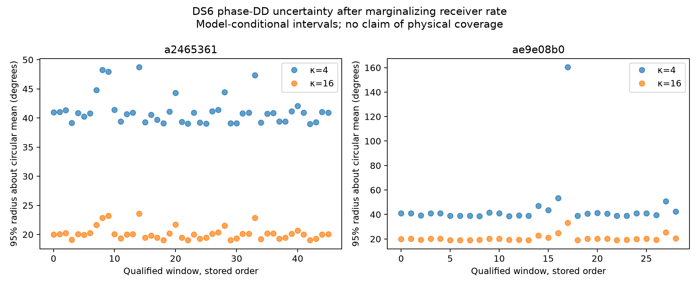
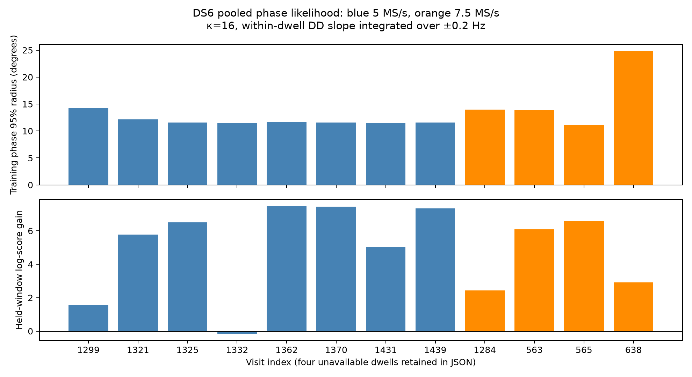

# DS6 marginalized pilot-phase likelihood and whole-window transfer

The new prototype retains a distribution over source phase difference instead
of treating a fitted phase as exact. Pooling these likelihoods within a dwell
predicts whole held windows better than an unconstrained phase model in 11 of
12 evaluable dwells; four further selected dwells lack enough qualified windows
for the fixed split. This establishes useful within-dwell predictability under
the model, not phase-assisted sub-kilometre location accuracy.

## Per-window likelihood

For each pilot, model its phase as a free source intercept plus a common
constant receiver residual frequency. Pilot errors are independent von Mises
with a fixed concentration κ. The source phase difference δ remains free.
For each frequency, let S_A and S_B be the sums of derotated source phasors.
Integrating the unknown common source phase analytically gives

`L(δ,f) = I0(κ |S_A + exp(-iδ) S_B|) / I0(κ)^N`.

We integrate frequency uniformly over ±375 Hz using 751 trapezoidal nodes,
and retain δ on a 720-node periodic grid. Both sources therefore keep free
phases; no operator coordinate, orbit, zero-phase calibration or fitted
geometric trend enters. The posterior uses fitting samples only. Held pilot
prediction is a joint evidence ratio, integrating the same frequency and
source intercepts rather than refitting them on held samples.

All 75 qualified windows from the two existing scan caches are retained.
The two fixed noise assumptions are sensitivity arms, not inferred physical
uncertainties or a per-window choice based on held results.

| Scan suffix | κ | Median model 95% phase radius | Range | Held score gain versus point fit at the same κ |
|---|---:|---:|---:|---:|
| `a2465361` | 4 | 40.85° | 38.96–48.73° | -34.23 |
| `a2465361` | 16 | 20.04° | 19.03–23.57° | +9.23 |
| `ae9e08b0` | 4 | 40.85° | 38.76–160.41° | -14.52 |
| `ae9e08b0` | 16 | 20.07° | 19.00–33.14° | +37.31 |

The radius encloses 95% of discrete posterior mass about its circular mean.
It is not a shortest credible arc, a measured physical coverage rate, or an
error bar on position. Fixed κ strongly affects the result. Scores are natural
log units and comparisons are matched within κ; κ=4 and κ=16 predict different
noise distributions. The broad κ=4 marginal model predicts worse than its point
comparator here, so marginalization is not claimed to improve every noise model.



## Pooling windows without discarding receiver uncertainty

A fixed seed permutes the six original window starts separately per visit.
The first three become training windows and the last three held windows,
intersected with the original qualification. A case needs at least two
qualified training windows and one held window. The split is frozen before
this pooling run, but the recordings are previously studied development data.

Each window retains an independent unknown common receiver phase and rate.
Only the source phase difference is linked across windows:

`δ(t) = δ_reference + 2π × slope × (t - reference)`.

The reference time uses training windows only. The within-dwell DD slope is
integrated uniformly over ±0.2 Hz on 41 nodes, and the reference phase has a
uniform circular prior. This permits slow geometric change rather than forcing
the source difference constant. It assumes a smooth source difference over
roughly 0.1 seconds, not across retunes. Midpoint receiver-reference rotations
cancel within each window's source difference.

The pool uses κ=16 as an explicit exploratory choice after inspecting the
per-window sensitivity results. Training uses fitting phasors from training
windows; prediction uses only evaluation phasors from whole held windows.
The comparison gives every held window its own independent uniform DD. The
score therefore tests whether source differences transfer across windows.

Twelve of sixteen selected dwells are evaluable. Eleven have positive held
log-score gains, ranging from +1.58 to +7.48; visit 1332 in the 5 MS/s scan
scores -0.16. Most training posterior radii are 11.1–14.2°, with the less
stable visit 638 at 24.8°. These probabilities must not be tightened further
by silently assuming more independent observations than the data support.



## Implication for positioning

The likelihood represents receiver-rate ambiguity explicitly and supplies
phase uncertainty that can be integrated into candidate association. It avoids
converting each optimized phase into a high-confidence direction measurement.
The whole-window result supports retaining source-difference information even
when absolute receiver phase fails to transfer.

However, the likelihood assumes independent pilot errors, a constant common
rate within each window and fixed κ. Interleaved fit/evaluation samples may
share interference or modelling error; within-dwell repeatability does not
validate geometric phase between visits. The two sources also have distinct
pilot support centres. Unknown RF phase centres, source response offsets,
catalogue identity and timing remain outside this extraction model.

No geographic position is fitted, and the required sub-kilometre benefit over
CFO alone is unverified. The next integration must carry these full likelihoods
through candidate and receiver-response uncertainty, retain unsuccessful scans,
and evaluate geographic accuracy on whole-scan holdouts. The narrower radii
here are not a substitute for that test.

## Verification and reproduction

Four tests pass: analytic common-phase integration versus numerical quadrature;
agreement between integrating δ and two independent uniform source intercepts;
common-phase gauge and source-exchange invariance; and complete cached-window
membership, source hashes, normalization and disjoint whole-window splits.
Doubling frequency nodes on the first stored window of each scan at both κ
values changes probabilities and predictive scores by less than 1e-13. This
is a limited quadrature audit, not a full physical or model-coverage validation.

Use the scientific Python environment from the repository root:

```sh
python reports/2026_09_27_ds6_phase_likelihood/run.py
python reports/2026_09_27_ds6_phase_likelihood/pool.py
python reports/2026_09_27_ds6_phase_likelihood/plot_pool.py
python -m pytest reports/2026_09_27_ds6_phase_likelihood/test_likelihood.py -q
```

All computations use saved phasors; no IQ read, new collection or production
change is required. `SHA256SUMS` seals the report artifacts except bytecode caches.
