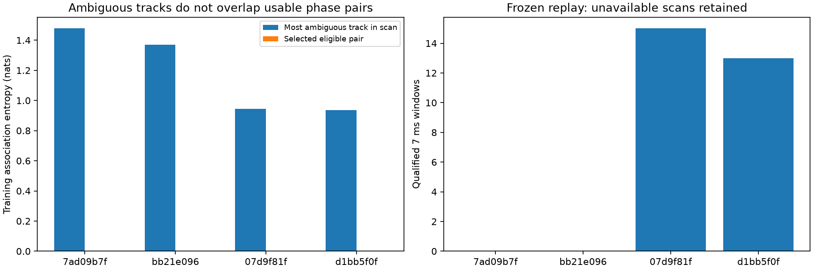
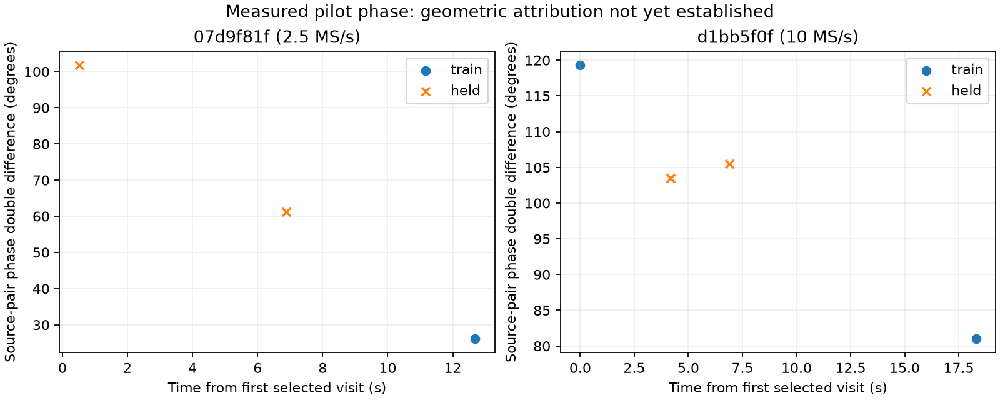

# DS6 phase opportunities selected by frequency ambiguity

The additional replay recovered 28 qualified pilot windows from two source
pairs, but did not find a pair with meaningful frequency-association ambiguity.
Only one pair has phase at both frozen training visits. This identifies a
selection problem: ambiguous tracks within a scan are not necessarily the
tracks that meet simultaneous dual-RX phase requirements.

| Scan suffix | Rate | Largest track entropy | Eligible selected-pair entropy | Qualified windows | Both training visits usable |
|---|---:|---:|---:|---:|---|
| 195bdbb87ad09b7f | 2.5 MS/s | 1.478 nats | No eligible pair | 0 | No |
| 457f07dabb21e096 | 2.5 MS/s | 1.369 nats | No eligible pair | 0 | No |
| a077447f07d9f81f | 2.5 MS/s | 0.945 nats | 0.001274 nats | 15/24 | No |
| 39ac2b14d1bb5f0f | 10 MS/s | 0.937 nats | 6.0e-14 nats | 13/24 | Yes |

Track entropy measures uncertainty within the inherited candidate model;
pair entropy is the sum for its two RX0 tracks. A tiny value means that model
already concentrates on one candidate. It is not proof of the true satellite
identity or catalogue completeness.

## Frozen selection and replay

All 43 scans were ranked at the corrected pooled CFO solution with exact
propagation, corrected causal elements, stationary training-only frequency
offsets and inherited candidate shortlists. No phase observations or operator
coordinate entered this ranking. Up to four scans outside the preceding
phase cohorts were chosen by their largest supported RX0 track entropy,
requiring at least 0.05 nats and frozen metadata readiness. No replacement
scan was substituted when two had no qualifying pair.

Within each selected scan, the planner chooses the eligible pair with greatest
summed training entropy. The original dual-RX epoch/CFO consistency gates,
exact track joins and whole-visit partitions are unchanged. At least two
training and two held visits are required. The earliest and latest eligible
training visits maximize separation; two held visits are chosen by the
existing seed. All choices are frozen before IQ replay. This change to visit
selection is explicit; it is not the earlier random-visit validation protocol.

The four plans yielded eight selected existing dwells and 48 examined 7 ms
windows. The original pilot extractor, disjoint within-window fit/evaluation
frames, shared-rate correction and quality gates were reused. None of eight
173-microsecond RX1-roll controls qualified; no clipping was observed.
The 2.5 MS/s extraction ran in 4.6 s and the 10 MS/s extraction in 23.4 s.

## What was measured

For `a077447f07d9f81f`, the first training visit (328) had zero qualified
windows. The two held visits and second training visit gave coherent
within-visit phase estimates, but held visits must not be substituted to
manufacture a second training endpoint. This pair cannot supply the frozen
two-training-visit association factor.

For `39ac2b14d1bb5f0f`, both training visits qualified over an 18.299 s span.
Their measured double differences are approximately 119.34 and 80.99 degrees;
held visits measure 103.53 and 105.54 degrees. These are source-pair pilot
double differences, not calibrated satellite path differences. Within-visit
coherence is high, but time variation has not yet been attributed to geometry
rather than receiver response or propagation effects. No physical phase
precision or geographic gain is claimed from this plot.

Shared-rate extraction lowers equal-window held frame RMS from 8.09 to 7.98
degrees in the 2.5 MS/s scan and from 12.84 to 12.31 degrees in the 10 MS/s
scan. This is extraction behavior, not positioning accuracy.

## Implication and provenance

The next association-targeted selection must rank **eligible track pairs**,
including training time separation and predicted phase discrimination,
rather than select scans by an unrelated track's uncertainty. The usable
18-second pair is also available for a held-phase geometric-versus-response
model check. None of this experiment changes the previously reported pooled
position estimate or establishes phase-assisted sub-kilometre improvement.

The early scan `195bdbb87ad09b7f` belongs to the orbital-element freshness
correction cohort. Its ambiguity ranking used corrected elements; the raw
phase plan retains the original preparation snapshot for provenance. It had
no selected pair. Any future association model for it must use the corrected
causal catalogue rather than silently loading that old snapshot.

`prepare.py` is adapted from the published common-rate validation metadata
planner; only cohort, group and training-visit selection differ as described.
`ranking.json`, frozen `protocol.json`, exact plans, complete replay outcomes
and individual qualified phasors are included. Two tests pass: deterministic
training-entropy selection/provenance and exact replay membership, partitions,
controls and unavailable-case retention. No new RF or calibration was used.
