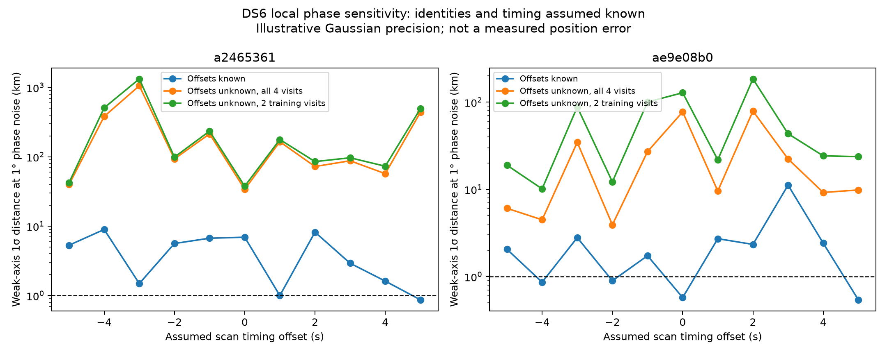

# DS6 phase sensitivity after unknown offset removal

The current two-training-visit, per-pair-offset model retains little direct
two-dimensional position information. At an illustrative independent phase
noise of one degree per observation, none of the tested training designs has
a local weak-axis uncertainty below 1 km. This helps explain why positive
orbital-phase evidence has not translated into reliable location improvement.
It does not prove that phase cannot aid CFO association or that richer DS6
phase measurements cannot achieve the goal.

This is a geometric sensitivity experiment on the actual observation epochs
and RF frequencies of two DS6 scans. It does not fit a location or estimate
phase noise from the recording. Satellite identities and timing are assumed
known within each hypothesis, making it optimistic relative to the real
association problem. No operator location is used.

| Scan suffix | Training-only weak-axis sigma at 1 degree noise | Required phase sigma for 1 km weak-axis sigma | All-four-visit weak-axis sigma at 1 degree noise |
|---|---:|---:|---:|
| `a2465361` (5 MS/s) | 37.7–1328.5 km | 0.00075–0.0265 degrees | 34.0–1057.0 km |
| `ae9e08b0` (7.5 MS/s) | 10.1–184.7 km | 0.00541–0.0987 degrees | 3.92–79.1 km |

Ranges span the eleven pre-existing integer timing hypotheses. Each timing
uses its own training-CFO MAP pair, so changes between adjacent plotted points
also reflect identity changes. They are not smooth timing derivatives or
posterior credible intervals. Very large kilometre values extrapolate a local
linearization outside its validity: interpret them as weak local information,
not predicted global errors. One kilometre at one sigma is also a weaker
criterion than reliable sub-kilometre accuracy.



The blue hypothetical calibrated-offset case retains absolute phase and can
look substantially stronger. These offsets are not known in the recordings;
the blue curve is not an available estimator or an achieved result. Orange
uses all four observation epochs, including held-out epochs, for a prospective
information calculation only. Green uses only the two existing training epochs
per pair. No held-out phase value is used by any calculation.

## Calculation

For each of two source pairs per scan, propagate the catalogue identities at
the four recorded phase epochs. Evaluate the nominal 80 mm east-west baseline
phase difference at the earlier CFO-derived observer, then perturb the observer
east and north. The baseline remains east at the perturbed position, matching
the preceding model. Altitude is fixed at zero. Earth-radius coordinate steps
define approximate local kilometres; the position conversion itself uses the
existing geodetic-to-ECEF implementation.

Central differences at 100 m give a matrix J of radians per kilometre. Removing
an unknown constant offset independently for each pair projects its columns
onto the complement of the constant vector: Jc = J - mean(J). Concatenate the
two groups. For independent equal phase variance sigma², the local information
is JcᵀJc / sigma². Its weakest singular value s_min gives weak-axis uncertainty
sigma / s_min. With only two training observations, each pair contributes at
most one independent offset-free temporal difference.

We compare 100 m and 10 m derivative steps; maximum disagreement is
9.98e-10 radians/km. Three tests pass: offset projection versus the exact Schur
complement, a separate one-sided finite-difference check, and information
scaling with repeated independent observations. These establish numerical
consistency, not physical correctness of the baseline or Gaussian error model.

Inputs are the frozen full-pair CFO audit, differential-CFO phase observation
metadata and original scan plans. The protocol seals those source bytes.
Each timing selects its pair using training CFO only. This diagnostic does not
marginalize candidate uncertainty, timing, RF phase centres, altitude or baseline
orientation, and it ignores temporal correlation and systematic phase error.
Those omissions prevent treating the plotted precision as achievable accuracy.

## What changes next

Free per-pair calibration protects against unknown phase offsets but discards
their constant geometric contribution. Recovering more information requires a
physically justified constraint, rather than setting offsets to zero or fitting
them against the operator location. The next useful recording-only test is
whether a shared receiver/channel phase response can explain multiple source
tracks and visits, with separate unknown geometric terms and a held-out check
for retune resets. More independent epochs and broader satellite geometry can
also strengthen the offset-free design. Shared offsets must be supported by
data before they are used to claim location precision.

The existing receiver-CFO drift experiments improve held prediction while
worsening position error; that alone does not establish a phase calibration.
An eventual joint estimator must compare CFO-only and CFO-plus-phase locations
on whole-scan holdouts, retaining candidate ambiguity and reserving the operator
coordinate for post-fit scoring. Sub-kilometre phase-assisted DS6 accuracy
remains unverified.

## Reproduction

Using the scientific Python environment with repository `src` on `PYTHONPATH`:

```sh
python reports/2026_09_27_ds6_phase_sensitivity/run.py
python -m pytest reports/2026_09_27_ds6_phase_sensitivity/test_sensitivity.py -q
```

`protocol.json`, `results.json`, the figure, code and tests are sealed in
`SHA256SUMS`. No new RF collection, IQ mutation or production change occurred.
