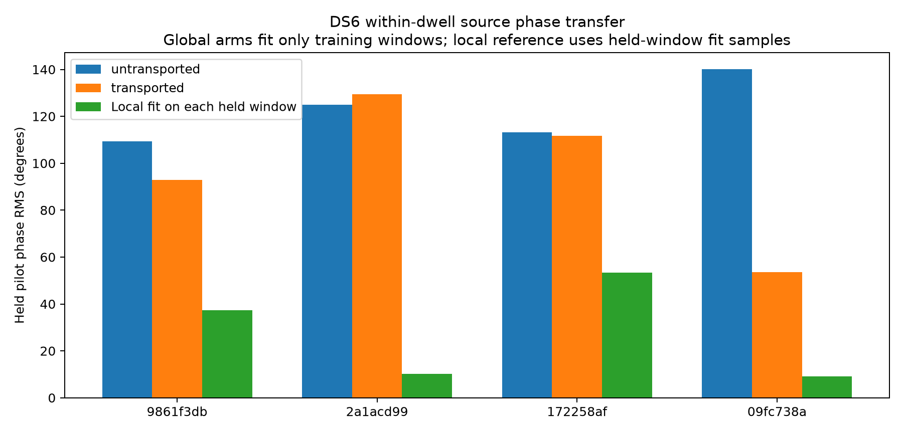

# DS6 individual-source phase transport audit

A constant common residual frequency does not reliably transfer individual
source phases between windows of the same dwell in the four evaluable cached
cases. Correcting the extraction's midpoint reference is necessary, but does
not solve the transfer problem. These results do not support assuming phase
continuity across retunes, nor do they prove that every nonlinear receiver
model must fail. Sub-kilometre phase-assisted positioning remains unverified.

The test uses cached pilot phasors from one preselected dwell in each of ten
DS6 scans. It retains the previous whole-window training/held partitions and
qualification decisions. Four dwells have at least two qualified training
windows and one held window; six remain explicitly unavailable. No new IQ
read, recording, reference-coordinate lookup, or satellite selection occurs.

| Scan suffix | No reference transport, held pilot RMS | Correct transport, held pilot RMS | Local-window fit reference RMS | Transported held-window DD RMS |
|---|---:|---:|---:|---:|
| `9861f3db` | 109.45° | 92.85° | 37.37° | 31.92° |
| `2a1acd99` | 124.89° | 129.44° | 10.15° | 15.25° |
| `172258af` | 113.28° | 111.61° | 53.28° | 13.43° |
| `09fc738a` | 140.16° | 53.61° | 9.14° | 6.03° |

The final column measures the difference between the two source mean residual
phases per held window. It is a different statistic from individual pilot RMS;
its reduction is consistent with substantial common error cancelling between
sources, not a quantified decomposition of hardware noise. These errors are not
position errors or uncertainties on a dwell's averaged geometric phase.



## Time-reference calculation

The existing pilot design uses `exp(i 2π f (t - midpoint))` independently in
each window. Both sources receive the same differential receiver-frequency
seed δ, the median of their RX1-minus-RX0 acquisition CFOs. A cross-receiver
coefficient therefore carries the physical phase at the window midpoint and
the residual phase evolution within the window.

For a common dwell reference, the correct quantities are

`z_global = z_window × exp(-i 2π δ × window_midpoint)`

`t_global = window_midpoint + local_pilot_centroid`.

This makes a physically constant receiver frequency appear as one constant
residual frequency across windows. The sign and reference are tested with
synthetic signals using a noninteger ~684 kHz seed, nonzero source phase
difference and future held samples. The rotation is identical for both sources,
so it cancels exactly in a same-window double difference. This audit does not
identify a reference bug in the earlier double-difference results, and does
not alter their saved measurements.

## Controlled fits

Both global arms estimate one residual rate and two independent source phase
intercepts from fitting samples in the original training windows only. Source
intercepts remain free, preserving their difference. Rates are searched over
the principal ±375 Hz pilot interval on a 0.25 Hz grid, followed by local
refinement of its best point. No held samples or operator location select the
rate or phases. This bounded rate search is not proof of global identifiability
under every possible alias.

Held evaluation phasors are predicted without adaptation. The untransported
arm intentionally omits the midpoint rotation as a reference-accounting
control. The local reference instead estimates its intercepts and common rate
using each held window's disjoint fitting samples, then evaluates its held
samples. It has more local information and is not an equal-information
forecasting competitor.

Individual corrected source intercepts, reference times and rates are saved
for all qualified windows in evaluable dwells. Across those windows the fitted
common residual rates span approximately -134 to -14, -41 to -8, -42 to +26,
and -46 to -19 Hz respectively. This variation can reflect receiver dynamics,
signal-model error, interference or estimator noise; the experiment does not
separate those causes. One constant rate is insufficient at the achieved
precision. No inter-visit or retune transfer is claimed to have been tested.

## Consequence for positioning

Raw individual source phases should not be linked across gaps under a constant
rate assumption. Same-window source differences are substantially more stable
and already remove the common midpoint reference. A richer common receiver
model can be investigated using local fitting samples, but it must preserve
independent source phases and pass held prediction before being used to bridge
visits. Correct bookkeeping alone does not supply the missing calibration.

The direct route still requires more precise simultaneous-source differences,
longer supported track coverage and a joint association model. This audit
rules out promoting the simple constant-rate transfer model on these cases;
it does not redefine the DS6 accuracy goal around a favorable subset.

## Reproduction

```sh
python reports/2026_09_27_ds6_phase_transport/run.py
python -m pytest reports/2026_09_27_ds6_phase_transport/test_transport.py -q
```

Use the repository's scientific Python environment. Two tests pass, covering
reference transport, preservation of source phase differences, and prediction
of disjoint future samples. The protocol hashes cached phasors, acquisition
seeds and original partitions. `SHA256SUMS` seals all report artifacts except
Python bytecode caches. This is a development diagnostic on real recordings,
with synthetic tests of the estimator mechanics.
