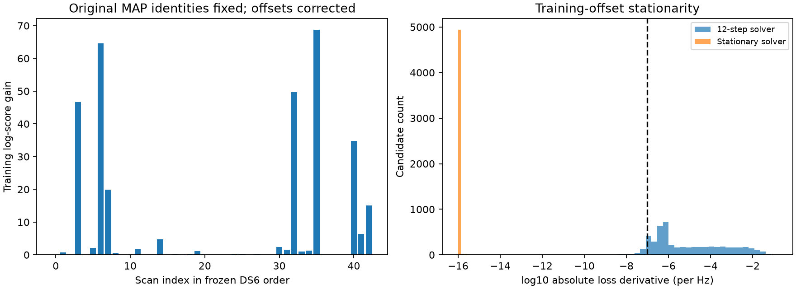

# Offset stationarity at the pooled DS6 location

The inherited 12-step frequency-offset profiler is numerically inadequate at
the current pooled DS6 solution. This is now checked at that actual solution,
not inferred from earlier individual-scan audit locations.

The bounded audit covers all 43 scans, 2,526 tracks and their two highest
original training-score visible candidates: 5,052 candidate offsets. The
stationary solver passes its derivative and positive-curvature checks for
every tested candidate. The original solver fails the 1e-7 per-Hz derivative
threshold for 4,718 candidates, though this count includes small deviations
and must not be interpreted as 4,718 scientifically significant errors.

Holding each track's original leading candidate identity fixed, corrected
offsets change total training log score by **+324.856** and held log score by
**+203.384**. Twenty tracks gain more than one training log unit; 64 gain more
than 0.01. The largest leading-candidate gain is 49.134 log units. One track
changes its leading identity within the tested top two. The largest offset
shift across both tested candidates is 6,830.55 Hz.

These are fixed-location, fixed-original-identity score comparisons, not
candidate-mixture evidence gains, new location errors or proof of geographic
improvement. They are much larger than the preceding phase gains and prevent
interpreting the tiny phase-induced shifts as meaningful accuracy evidence.
The previously reported approximately 762 m pooled error remains an output
of the old offset model, not a revalidated corrected-model result.

## Method and limits

`protocol.json` freezes the completed pooled CFO fit, inherited protocol,
solver digest, coordinates, scan clocks and candidate-selection rule.
Candidate selection uses training scores only. Orbit propagation is exact at
the fixed pooled position and clocks. Held observations never select offsets,
candidate identities or scalar modes. No operator reference is read.

The stationary solver is inherited from the separate local stationary-offset
prototype; its source is published as a dependency. It centers residuals,
initializes from training quantiles, searches derivative sign brackets with
Brent's method, retains positive-curvature roots and chooses by penalized
training likelihood. Unlike the old profiler, the weak offset penalty also
enters optimization. The maximum final absolute derivative is 5.57e-13 per Hz.

Stationarity does not prove global scalar optimality under finite bracketing.
Only the two original top candidates per track are audited, so this does not
prove candidate completeness or validate every offset in the catalogue.
The original MAP held total keeps those original identities fixed, rather
than switching them according to held performance.

Two tests pass: a multimodal synthetic likelihood check against a dense grid
with held-data isolation, and complete real-data provenance, training ranking,
positive-curvature stationarity and nondecreasing training scores. Execution
took approximately 53 seconds using existing observations and causal TLEs.

## Next step

Replace fixed-iteration profiling with an efficient converged implementation
in both matched location arms, preserving training-only offset selection.
Then refit location and clocks and repeat the phase comparison. Repeatedly
running the slow scalar mode search inside a large geographic optimizer would
be wasteful; the next implementation should reuse local roots with explicit
stationarity checks and audit alternative modes, while retaining this bounded
solver as a numerical comparison. No estimator is deployed by this audit.

Reproduce `run.py` in a fresh output directory with the same report-relative
dependencies, then `summarize.py` and `pytest test_audit.py`. Frozen protocols
refuse replacement. No IQ replay, receiver calibration or new RF is required.
