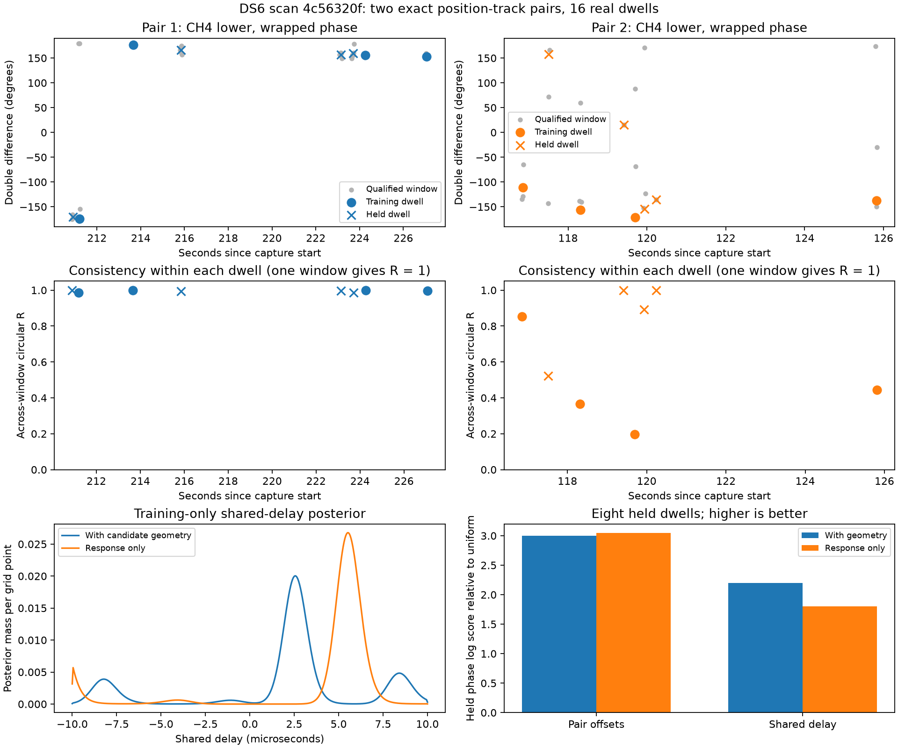
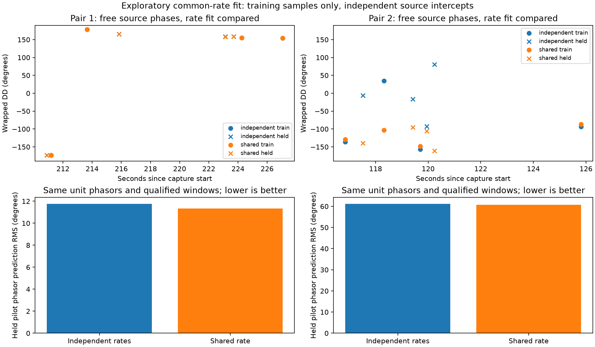

# DS6: phase from exact positioning tracks and a common-rate prototype

Enumerating jointly detected source pairs before choosing the strongest pair
recovered **two disjoint pairs of positioning tracks in 16 real dwells** from
`scan-fw-4c56320fb5ca6994`. Both pairs use channel 4's lower pilot region at
7.5 MS/s. The second pair has substantial phase instability even when its
signals pass detection checks. A prototype that fits one receiver phase rate
while preserving separate source phase intercepts improves its consistency,
but **no positioning or association improvement has been demonstrated**.

The previous 809 m position remains a CFO-derived result on this development
scan. This experiment neither searches position nor establishes accuracy across
DS6. The receiver coordinates used here came from that previous CFO fit;
operator-supplied location was not read by these scripts.

## Selection and integrity

The exact all-track positioning input contains 60 tracks. The earlier strongest
pair selection left only one recurring pair joined to those tracks. `plan.py`
instead enumerates compatible joint-RX candidate pairs and requires unique,
exact RX0 candidate-ID membership in two different positioning tracks. RX1
support is verified by the joint signal fit; RX1 membership in a positioning
track is not required or implied.

Six groups appear in the metadata; two have at least two training and two held
visits. Within each group, up to four visits from each existing partition are
chosen by a fixed hash seed, before reading their raw phase. Whole-visit
partitions come unchanged from the all-track experiment. These are development
partitions, not untouched DS6 validation scans.

| Pair | RX0 positioning track prefixes | Eligible visits | Selected visits | Original qualified windows | Refined qualified windows |
|---|---|---:|---:|---:|---:|
| 1 | `a5a4e73c`, `c5223642` | 30 | 8: 4 train, 4 held | 40 / 48 | 39 / 48 |
| 2 | `4ba8d279`, `b31d97c6` | 11 | 8: 4 train, 4 held | 20 / 48 | 20 / 48 |

All 16 selected dwells have at least one qualified original window. Six 7 ms
windows per dwell were examined at offsets 0, 21, 42, 63, 84 and 105 ms.
Fit, qualification and phase-evaluation samples occupy disjoint 20 microsecond
blocks. Both modes must improve prediction beyond donor-only and rolled-pilot
controls in both receivers. Sixteen additional controls shift RX1 by 173
microseconds: **0 / 16 qualify**. No sampled rows clip at the checked int16
limits. The public read-only storage adapter verified compressed and
uncompressed chunk hashes. No new recordings were collected.

The original pipeline remains the primary result. A separate common-CFO seed
refinement recovered 59 windows versus the original 60 and was not promoted.

## Does a shared receiver delay explain the phase?

The observable is a double difference:

`DD = phase(RX1 × conj(RX0), source B) − phase(RX1 × conj(RX0), source A)`.

The shared response model is
`DD = geometric DD + 2π × source frequency separation × receiver delay`.
It marginalizes one delay uniformly over ±10 microseconds, one baseline sign,
and one scan timing offset over −5 to +5 seconds in 0.25-second increments.
Nominal baseline magnitude is 80 mm, oriented east-west; it is not calibrated.
Each dwell has fixed von Mises concentration 1. Alternative independent pair
offsets are analytically marginalized. Four disjoint positioning tracks permit
the group products without counting a track twice.

Candidate probabilities use the full positioning tracks' training-only robust
Student-t4 CFO fits, with 100 Hz scale and frozen held-data offsets. Per-source
candidate shortlists are the earlier training-selected lists, then restricted
to six candidates at each timing value. Exact propagation is used at the
measurement epochs. Thus catalogue coverage and candidate truncation remain
limitations. The test conditions on the previous CFO-derived observer and uses
these four tracks; it is not a recomputation of the full 60-track position.

| Original phase: response model | Held phase log score relative to uniform ↑ | Held CFO log score ↑ |
|---|---:|---:|
| CFO only | — | −750.972018 |
| Independent pair offsets | 2.996394 | −750.972196 |
| Shared receiver delay | 2.195416 | −750.973073 |

Shared delay loses 0.801 log units of held phase prediction to independent
offsets and makes held CFO prediction slightly worse. Doubling the delay grid
from 201 to 401 points changes the relevant log scores by less than 0.00003;
the result is not explained by that quadrature resolution.

A post-result response-only null sets geometric phase to zero while preserving
the CFO banks. Geometry improves the shared-delay held phase score by only
0.390 log units. With independent offsets, geometry reduces it by 0.047.
Predictable phase therefore does not yet establish useful satellite geometry.

Circles denote training dwells and crosses held dwells. Gray points are
qualified individual windows. Phase is wrapped, so crossing ±180° is not a
physical discontinuity. Within-dwell R uses the window double differences;
one-window dwells have R = 1 by construction and provide no repeatability test.

## Debugging the unstable pair without removing distance information

Pair 1 has original within-dwell R between 0.985 and 1.000. Pair 2 ranges from
0.197 to 0.892 in its multi-window dwells. Some pair-2 source phase-rate fits
differ by hundreds of hertz even though fit and evaluation phase intercepts
often agree within a few degrees. Detection qualification alone is therefore
insufficient to establish stable geometric phase. This does not by itself
identify multipath, interference, CFO aliasing, or regression error as the cause.

`common_rate.py` re-extracts individual pilot cross-receiver phasors using the
original training-selected timing offsets. It compares independent source rates
with one shared receiver rate, **keeping independent source phase intercepts**.
Consequently it does not subtract a fitted source phase or force DD to zero.
Synthetic tests confirm preservation of arbitrary source phase differences.
Both prototype arms use equal-weight unit phasors, a profiled circular fit in
the ±375 Hz principal pilot alias interval, and the same qualified windows.
They are controlled comparisons to each other, not identical reproductions of
the amplitude-weighted original estimator. No held phasors choose the rate.

| Prototype metric | Independent rates | Shared rate |
|---|---:|---:|
| Pair 1 held pilot prediction RMS | 11.77° | 11.34° |
| Pair 2 held pilot prediction RMS | 61.20° | 60.81° |
| Pair 1 median multi-window dwell R | 0.9973 | 0.9974 |
| Pair 2 median multi-window dwell R | 0.5241 | 0.8888 |
| Held dwell phase log score, independent response offsets | 1.938963 | 4.811303 |
| Held dwell phase log score, shared response delay | 2.582256 | 4.508536 |

The shared-rate fit improves consistency and held-dwell phase prediction, but
the unstable pair still has roughly 61° held pilot error. Both response models
still slightly worsen held CFO prediction relative to CFO only. These are
post-result exploratory comparisons on one studied scan, not a fresh holdout
or a reason to increase phase weights in positioning.

The next useful step is to freeze the common-rate extraction and validate it
on previously unused whole scans, with training-only reliability estimates
that distinguish signal detection from phase precision. A geographic test
must then recompute the full track likelihood jointly with phase at every
position and timing offset. Adding a phase score at a fixed best timing to an
already timing-marginalized CFO score would be incorrect. Sub-kilometre accuracy
across DS6, and a benefit attributable to phase, remain unproven.

## Reproduction and checks

Run `plan.py`, `replay.py`, `response.py`, `common_rate.py`, then `diagnostics.py`
from this directory with the repository's `src` on `PYTHONPATH`. Raw replay
requires the existing `/srv/bulk/leo` corpus; planning requires the digest-bound
public tracking-input cache; response generation requires `/var/lib/leo/tle`.
NumPy, SciPy and Matplotlib are required. The scripts refer to the adjacent
all-track, exact-timing, dwell-phase and shared-response reports explicitly.
`diagnostics.py` runs entirely from saved JSON.

`python -m pytest test_artifacts.py test_common_rate.py -q` checks exact track
membership, frozen partitions, replay completeness, disjoint track factors,
delay quadrature convergence, preservation of true synthetic phase differences,
and independence of training fits from evaluation phasors. Artifact tests are
offline. Synthetic tests verify estimator mechanics; all tables above are
from actual recorded IQ.
