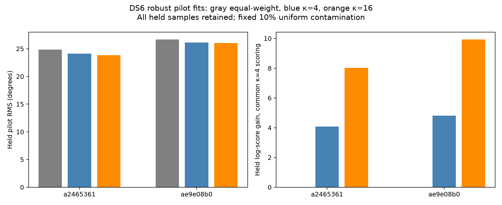
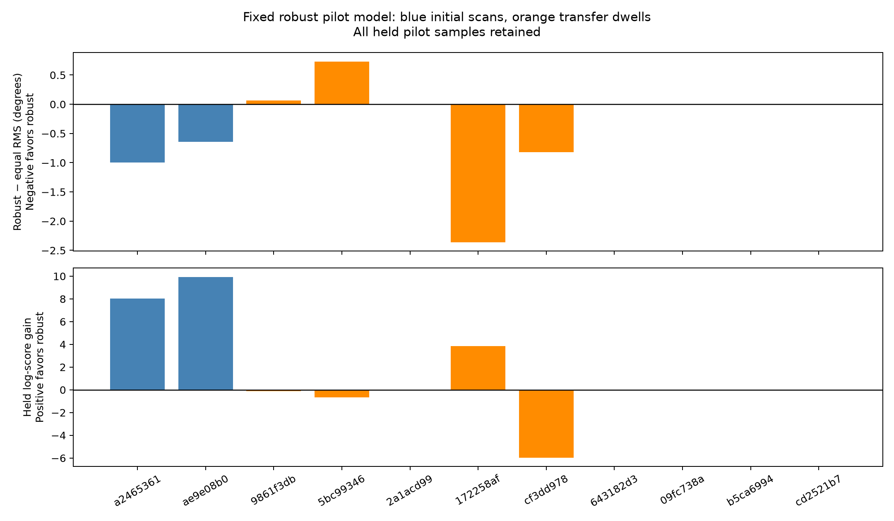

# DS6 robust pilot-phase prototype

A circular contamination model improves held-pilot prediction on the initial
two scans, but does not transfer consistently to the other cached dwells. It
also changes some dwell phase estimates substantially. This is useful evidence
of estimator sensitivity, not a validated correction toward satellite geometry.
The model is not adopted for positioning and sub-kilometre accuracy remains
unverified.

## Model and controlled comparison

All arms fit one common residual frequency and independent source phase
intercepts per 7 ms window. The baseline minimizes equal-weight circular
residuals. Two robust arms use a normalized mixture of 90% von Mises and 10%
uniform phase, with fixed concentrations κ=4 and κ=16. These are explicit
assumptions, not noise scales estimated from held data. The robust objective
softly reduces the influence of fitting pilots poorly explained by the model;
low responsibility does not prove a hardware fault or identify interference.

Frequency stays within ±375 Hz. A training-only 5 Hz grid ranks starts,
followed by bounded optimization from five starts. Source phase offsets remain
free, so their difference is not calibrated to zero or to an operator location.
Every held evaluation pilot is retained and scored without adaptation or
outlier removal. A common κ=4 mixture scoring rule is applied to predictions
from every arm for a matched predictive comparison. No arm is selected per
window by held score. Neither source coordinates nor orbit predictions enter
this extraction experiment.

## Initial two scans: 75 qualified windows

| Scan suffix | Equal-weight pilot RMS | κ=4 robust RMS | κ=16 robust RMS | κ=16 common held log-score gain | Fit/evaluation DD RMS, equal → κ=16 |
|---|---:|---:|---:|---:|---:|
| `a2465361` | 24.854° | 24.123° | 23.855° | +8.028 | 13.341° → 10.852° |
| `ae9e08b0` | 26.655° | 26.125° | 26.014° | +9.925 | 18.988° → 14.569° |

The κ=16 arm assigns fitting-pilot inlier probability below 0.5 to 14 and 9
pilots respectively. The baseline and robust arms evaluate identical samples.
These pooled scores are descriptive development results, not a confidence
interval or an independent per-pilot significance test.



## Fixed-arm transfer: ten other cached DS6 dwells

After the initial comparison, κ=16 was frozen for transfer to the ten existing
cached development dwells. Nine are evaluable, comprising 32 qualified windows;
the zero-window case stays unavailable. These dwells were previously studied
with other models, so they are not an untouched validation set.

| Scan suffix | Robust minus equal pilot RMS | Common held log-score gain |
|---|---:|---:|
| `9861f3db` | +0.068° | -0.115 |
| `5bc99346` | +0.730° | -0.658 |
| `2a1acd99` | -0.003° | +0.001 |
| `172258af` | -2.359° | +3.837 |
| `cf3dd978` | -0.819° | -5.956 |
| `643182d3` | approximately 0° | approximately 0 |
| `09fc738a` | approximately 0° | approximately 0 |
| `b5ca6994` | approximately 0° | approximately 0 |
| `cd2521b7` | approximately 0° | approximately 0 |

RMS decreases in five of nine cases and the common held score increases in
four; several changes are numerically tiny and should not be interpreted as
substantive wins. One case improves RMS but worsens the common predictive
score. The evidence does not justify selecting a universal robust extractor.



## Consequence for phase used in positioning

Most initial-scan dwell means move little, but the largest source-DD change
is 13.06°; another moves -4.59°. One window changes by 65.17° when its fitted
common rate changes from -59.39 to -16.06 Hz. Its robust fit assigns very low
responsibility to two fitting pilots. The experiment cannot determine which
estimate is geometrically correct. Source pilots occur at different support
centres, so a changed common rate can change the extrapolated source difference.

This sensitivity is material when the desired positional information is much
smaller than a degree. Better prediction of nearby held samples alone cannot
validate a geometric phase correction or determine its uncertainty across
visits. Neither the initial score gain nor an individual favorable transfer
case is used to claim position improvement. A future joint estimator must
account for extraction-model uncertainty and test geographic performance on
whole-scan holdouts alongside a matched CFO-only baseline.

## Integrity and reproduction

The experiment uses only digest-bound cached phasors. Original qualification,
source labels, centroids and fitting/evaluation partitions are preserved.
All 107 qualified windows from 11 evaluable scans are retained; the twelfth
scan is explicitly unavailable. No raw IQ, production service or recording
was modified. Results retain individual fitting responsibilities and complete
held error arrays for audit.

Three tests pass: mixture-density normalization and periodicity; preservation
of arbitrary synthetic source phase difference despite an injected pilot
outlier; and source hashes, exact window counts and all held-pilot counts.
Synthetic tests verify mechanics; the tables use real recording-derived data.

Using the scientific Python environment from the repository root:

```sh
python reports/2026_09_27_ds6_robust_pilot/run.py
python reports/2026_09_27_ds6_robust_pilot/transfer.py
python reports/2026_09_27_ds6_robust_pilot/summarize.py
python -m pytest reports/2026_09_27_ds6_robust_pilot/test_robust.py -q
```

`SHA256SUMS` seals the report artifacts, excluding Python bytecode caches.
