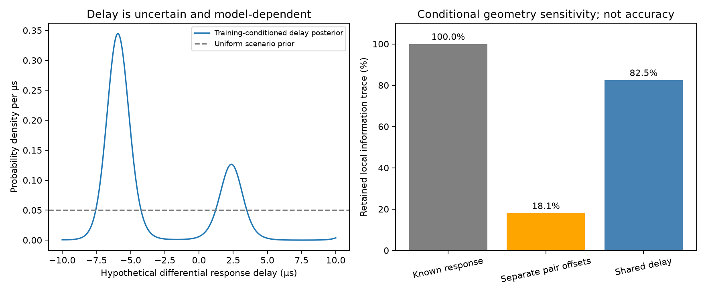

# DS6: preserving geometric phase with a shared receiver-response model

**Separate pair offsets remove useful geometric sensitivity in this example.
A shared delay retains more of it, but the real held-data benefit is negligible
so far. This does not establish a phase-assisted sub-kilometre result.**

The previous goal turn was progress: robust CFO plus phase selected an interior
point 809 m from the reference on one development scan, but phase did not move
the CFO winner. This experiment investigates that missing phase contribution
using a second DS6 scan, `scan-fw-da2858f6cd2521b7` at 02:35 UTC.

## Real input and physical hypothesis

The existing replay supplies two recurring pairs in **channel 3, lower pilot
band**, with six qualified visits each. Their RX0 frequency separations are
about 112–119 kHz and 28–33 kHz. Each pair retains its previously randomized
three-training/three-held whole-visit split. One circular double-difference
phase mean per visit is used; repeated windows do not multiply concentration.

The observer is fixed to the **other scan's CFO-derived position**,
37.856250, -122.484375. The supplied roof coordinate is never loaded by this
experiment. This is a conditional receiver-model test, not a geographic search
or independent validation of that inferred location. Both scans have already
been used in development.

The models share a causal orbit catalogue, training-only CFO candidate selection,
one scan-time offset in -5..+5 seconds, nominal ±80 mm east-west baseline sign,
100 Hz CFO scale, and phase concentration kappa=1 per visit. Each source retains
six candidates per timing offset; the candidate-pair distributions are summed,
not collapsed to an asserted identity.

- **Separate offsets:** each recurring pair has its own uniform unknown phase
  intercept, integrated analytically. This can absorb a position-dependent
  constant phase difference between sources.
- **Shared delay:** replace those intercepts with
  `2 pi (f_source1 - f_source0) delay`, using one delay common to both pairs.
  Integrate a uniform -10..+10 µs scenario prior jointly with both groups,
  baseline sign and shared timing. No per-pair intercept remains.

The frequency separation comes from GLRT seeds. Unresolved frequency aliases,
direction-dependent antenna phase, unequal retune behavior or a changing
receiver response can invalidate this model. The delay prior is illustrative;
its posterior is not a hardware calibration measurement. A common receiver
phase itself cancels in the simultaneous double difference; a frequency-dependent
response need not cancel.

## Held-data comparison

All values below use the 801-point delay grid. Higher log predictive score is
better; held phase density is relative to uniform phase. **Held CFO scores are
the comparable outcome when asking whether training phase improves candidate
prediction.** Held phase is not used to tune training parameters or CFO predictions.

| Model | Held phase log predictive | Held CFO log predictive |
|---|---:|---:|
| CFO only | — | -71.370411 |
| Separate pair offsets | 3.682617 | -71.370364 |
| Shared response delay | 3.707394 | -71.370423 |

Shared delay improves held phase by only **0.02478 log units** relative to
separate offsets and slightly worsens held CFO. These tiny differences do not
establish an association or positioning gain. The delay posterior is broad;
its approximate mode is -5.925 µs and mean -3.596 µs, conditional on all the
unverified geometry/response assumptions above. Neither should be interpreted
as a measured cable delay.

## What the calibration removes

A separate diagnostic takes the training-CFO MAP candidate pair for each group
at the common MAP orbit offset (-1 s), differentiates predicted geometric phase
with respect to east/north observer displacement, and projects out the nuisance
directions. Geodetic perturbations update both receiver position and its local
east baseline axis; the derivative is normalized by the ECEF displacement.

With unit phase precision, define `I = Jᵀ (I - P_nuisance) J`. This is a
**conditional local sensitivity diagnostic**, not a calibrated Fisher bound
or geographic error estimate. It ignores candidate uncertainty, phase wrapping,
nonlinear effects, baseline uncertainty and the finite delay prior.

| Response assumption | Retained information trace | Smallest matrix eigenvalue (km⁻²) |
|---|---:|---:|
| Known response | 100% | 8.213e-6 |
| Independent pair offsets | **18.1%** | 2.878e-7 |
| One shared delay | **82.5%** | 4.831e-6 |

Thus independent pair offsets discard about 82% of this conditional local
information, while the shared-delay nuisance discards about 18%. This provides
a concrete reason to investigate shared physical response parameters. It does
**not** mean the data retain 82.5% of real positioning accuracy, nor that the
shared model is valid for the hardware. The held comparison above remains the
relevant real-data warning.

## Verification and next action

Four tests pass: shared nuisance integration matches explicit enumeration,
held phase cannot alter training/CFO predictions, free offsets remove constant
geometric sensitivity, and refining delay integration from 401 to 801 points
changes log scores by less than 1e-5. Source and observer-result digests, candidate
banks, shortlists, derivatives and all scores are saved.

The next phase-specific step is to extract more simultaneously supported pairs
that join the all-track model exactly, then test shared response stability on
held groups and additional scans. A shared response should enter geographic
inference only with explicit uncertainty and demonstrated held predictive
support. The earlier 809 m result remains a single-scan robust-CFO result;
phase benefit and DS6-wide sub-kilometre accuracy are still unproven.

Reproduce with repository `src` on `PYTHONPATH` and the scientific runtime:
`python study.py`, `python information.py`, `python plot.py`, and
`python -m pytest test_study.py -q`. This work reads existing phase products and
the local causal orbit archive; raw recordings and production products are unchanged.
