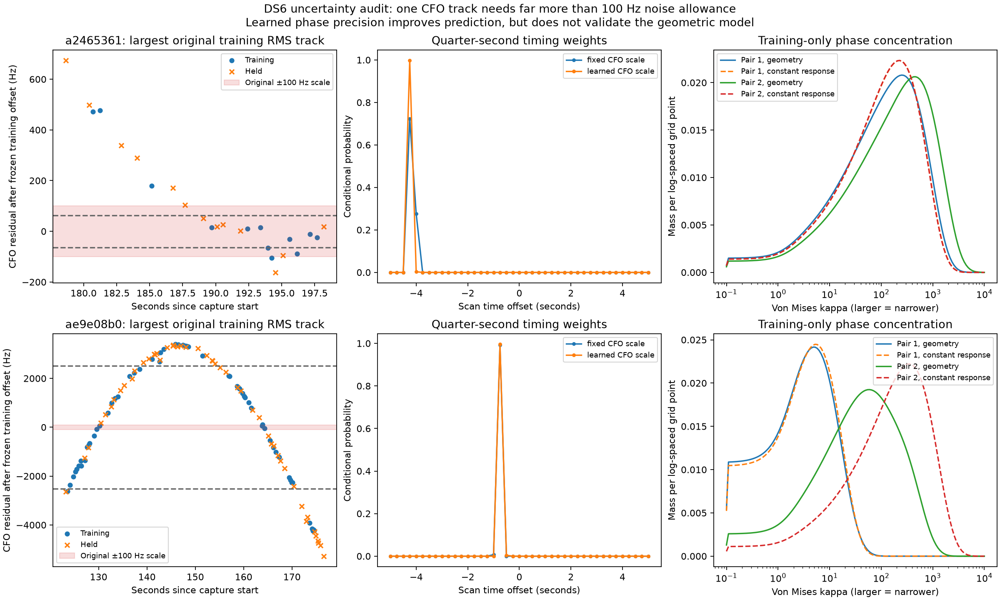
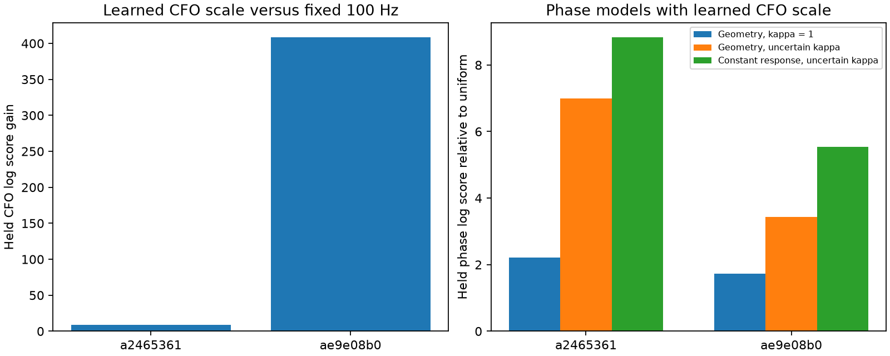

# DS6: CFO and phase uncertainty audit

**The fixed 100 Hz CFO noise scale is inappropriate for one phase-linked
track.** Its training residual RMS is 2.26 kHz and held residual RMS is 2.77 kHz.
Learning per-track scales from training data improves held CFO prediction on
both audited scans. Learning phase concentration also improves phase prediction,
but the candidate orbital model still predicts held phase worse than a constant
response offset. This does not establish phase-based positioning accuracy.

This audit uses the two evaluable scans from the preceding frozen four-scan
validation. It reads saved numerical observations and causal TLEs, with no raw
IQ replay, new RF, or pose-coordinate read. The observer remains the earlier
development scan's CFO-derived location. No geographic search is performed.
These are conditional development results, not fresh validation scans.

## What changed

The original CFO model used a Student-t distribution with four degrees of
freedom, a fixed 100 Hz scale and a separately fitted constant offset per track.
The offset was fit on training visits only and frozen for held prediction.

The new comparison estimates one scale per source track from the **training
residuals of the previous training-selected candidate/time hypothesis**:

`scale = max(10 Hz, median(abs(residual − median(residual))) / t4.ppf(0.75))`.

This is a Student-t scale, not Gaussian standard deviation or RMS. It is frozen
before rescoring candidates and is not re-estimated from held measurements.
Residuals around a wrong candidate can inflate it, so this is a transparent
robustness experiment, not proof that the measurement noise is known.

All eligible causal labelled Starlink candidates are rescored at integer scan
timing offsets under both scale arms. The union of each arm's top 12 candidates
per source/time is propagated at quarter-second timing offsets over −5 to +5 s.
The fine candidate sets contain 13–18 satellites per track. The final phase
banks retain six candidates per source/time. Both scale arms use the same
expanded candidate union and exact propagation. Coverage between coarse grid
points remains conditional on that union; this is not an exhaustive geographic
or continuous-time search.

For phase, the earlier fixed concentration `kappa = 1` is compared with an
unknown concentration per track pair. A proper log-uniform prior over
`0.1 ≤ kappa ≤ 10000` is numerically integrated. Each pair's constant circular
response offset is integrated analytically. Baseline sign and scan timing stay
shared between the two pairs in each scan. The unknown concentration is learned
only from whole training visits, including candidate/time uncertainty; held
visits fit no parameters. Only two phase-training dwells exist per pair, so
these posteriors retain substantial uncertainty and depend on their stated prior.

Both orbital geometry and a response-only null receive the same uncertainty
treatment. The latter sets geometric phase to zero while retaining all CFO
hypotheses. The nominal baseline is still an uncalibrated ±80 mm east-west
vector. No new baseline estimate is made here.

## Training-derived CFO scales

| Scan suffix | Source track prefix | Original train RMS | Original held RMS | Learned Student-t scale |
|---|---|---:|---:|---:|
| `a2465361` | `8e3a7da3` | 79 Hz | 58 Hz | 60 Hz |
| `a2465361` | `2d145135` | 206 Hz | 275 Hz | 63 Hz |
| `a2465361` | `f0ffa971` | 60 Hz | 68 Hz | 65 Hz |
| `a2465361` | `8d27d8b9` | 118 Hz | 88 Hz | 118 Hz |
| `ae9e08b0` | `bed5ce18` | 338 Hz | 331 Hz | 267 Hz |
| `ae9e08b0` | `48ed4d30` | 140 Hz | 130 Hz | 124 Hz |
| `ae9e08b0` | `39a05e22` | **2257 Hz** | **2772 Hz** | **2512 Hz** |
| `ae9e08b0` | `e24491ac` | 87 Hz | 95 Hz | 104 Hz |

The largest residual is a smooth curved pattern through time, visible below,
not simply isolated random outliers. Increasing its scale prevents the model
from treating that mismatch as precise evidence; it does **not** repair the
underlying candidate, trajectory or receiver model. Randomized visit partitions
also interleave along that same curve and do not establish extrapolation to a
different scan or time interval.

The first column shows each scan's largest-training-RMS source under the
original candidate/time hypothesis. Dashed horizontal lines are the new scale,
not fitted corrections to the residual. The timing and concentration plots
show conditional probability mass, not calibrated positioning confidence.

## Held prediction results

All comparisons below retain identical measurements and whole-visit partitions.
CFO scores include normalized Student-t densities, so a larger scale pays the
proper density penalty. Offsets are profiled rather than fully marginalized,
and residual independence remains an approximation.

| Scan | Fixed-scale CFO held log score, quarter-second timing | Learned-scale CFO held log score | Gain from learned scale |
|---|---:|---:|---:|
| `a2465361` | −447.592261 | −438.610093 | +8.982168 |
| `ae9e08b0` | −1493.377431 | −1085.175790 | +408.201641 |

Separately, refining timing from one second to a quarter second improves the
fixed-scale CFO held scores by 1.395 and 4.666 log units. MAP timing moves from
−4 to −4.25 s and from −1 to −0.75 s. The original integer grid concealed some
time uncertainty. The learned-scale models still concentrate strongly at those
fine-grid values; scale adjustment alone does not calibrate all model uncertainty.

With learned CFO scales:

| Scan | Geometry, fixed phase kappa | Geometry, uncertain phase kappa | Constant response, uncertain kappa | Geometry minus constant response |
|---|---:|---:|---:|---:|
| `a2465361` | 2.214280 | 6.991519 | 8.825926 | **−1.834407** |
| `ae9e08b0` | 1.735010 | 3.434626 | 5.546262 | **−2.111636** |

These are held phase log predictive densities relative to uniform phase, with
four held dwells per scan. Higher is better. Learned concentration recognizes
that some pairs are much more repeatable than kappa 1 allows. It also makes the
orbital mismatch more apparent: the constant response-only model remains better
on both scans. Geometry's phase contribution changes held CFO scores by only
0.000054 and 0.000134 log units—no meaningful association improvement.

Doubling concentration quadrature from 129 to 257 points changes reported
geometric-model log scores by less than 0.000001. Thus that quadrature resolution
does not explain the result. This does not eliminate sensitivity to the chosen
prior range, residual model, candidate shortlist or baseline assumptions.

## What this means for sub-kilometre phase positioning

The two concrete corrections are a finer timing grid and training-derived CFO
scales. The phase experiment also shows why a fixed weak phase weight can hide
model disagreement. None should be tuned against the supplied receiver position.

The remaining failure is not resolved by increasing phase weight: the nominal
orbital phase curve loses to a constant offset even after uncertainty learning.
The next useful audit is the structured CFO residual and the physical relation
between jointly detected modes. In particular, simultaneous source CFO
differences can test associations while cancelling a common receiver frequency
drift, and phase must then be tested against those hypotheses with baseline and
receiver-response uncertainty preserved. A mode detection is not itself a
verified satellite identity. Free response offsets also discard constant
geometric phase; a shared physical response model still needs held validation.

The earlier 809 m position remains a CFO-derived development result. There is
still no demonstrated phase improvement in geographic error and no DS6-wide
sub-kilometre validation.

## Reproduction and checks

With `src` on `PYTHONPATH`, the existing scientific Python runtime and one BLAS
thread, run `run.py`, `summarize.py`, then
`python -m pytest test_uncertainty.py -q`. TLE access is read-only through
`/var/lib/leo/tle`; all other inputs come from adjacent report artifacts.
Protocol and source digests are retained, and `SHA256SUMS` seals this report.

Seven checks cover the Student-t scale convention, offset invariance, analytic
circular integration against direct quadrature, high-concentration numerical
stability, agreement with the prior kappa-1 model, held-data isolation, the
response-only null, source/partition bindings, and real-data quadrature
convergence. All measurement tables and figures are from recorded DS6 data;
synthetic checks test the numerical machinery only.
