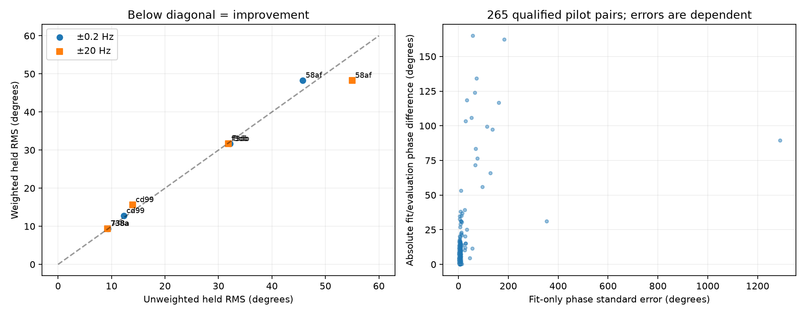

# DS6: training-only pilot uncertainty weighting

**Uncertainty weighting is not a consistent improvement, and sub-kilometre
positioning is still unproven.** This experiment follows the previous dwell
phase prototype on exactly the same ten selected real recordings and dwells.
It does not select easier replacements for the six unevaluable dwells.

## Method

For each refined pilot regression, compute fitting residuals separately for
RX0 and RX1. Sum their complex coefficient influence scores within the same
physical 20 microsecond blocks used by the extractor, then form the phase
influence `imag(delta_beta_RX1/beta_RX1 - delta_beta_RX0/beta_RX0)`.
This retains residual correlation between receivers. The block sandwich
covariance estimates uncertainty in the fitted receiver phase difference.
It assumes independence between blocks and uses a local small-error phase
approximation; neither assumption is guaranteed for these recordings.

The prototype uses diagonal inverse-variance weights with a fixed 0.5 degree
standard-error floor, median normalization within each window and a relative
weight cap of 100. Off-diagonal covariance is saved but not used by this arm.
These choices were set before this run and never selected using evaluation
errors. They are research settings, not calibrated probabilities.

The double-difference intercept and slope use only the original randomly
assigned training windows. Held-window fitting samples estimate only common
receiver nuisance terms. Evaluation samples fit neither weights nor parameters.
Both weighted and unweighted scores use **unweighted** held per-pilot RMS on
the same qualified support, so downweighting a difficult pilot cannot directly
lower the reported error. These are conditional phase errors, not geographic
errors or independent satellite truth.

## Results

Four of ten dwells have sufficient support; the other six remain unavailable.

| Scan suffix / visit | Slow unweighted | Slow weighted | Wide unweighted | Wide weighted |
|---|---:|---:|---:|---:|
| 9861f3db / 909 | 32.146° | 31.639° | 31.880° | 31.639° |
| 2a1acd99 / 1636 | 12.259° | 12.722° | 13.983° | 15.610° |
| 172258af / 484 | 45.761° | 48.275° | 55.022° | 48.235° |
| 09fc738a / 1003 | 9.347° | 9.400° | 9.259° | 9.371° |

Slow means the ±0.2 Hz differential-rate bound; wide means ±20 Hz. Weighting
wins one of four slow comparisons and two of four wide comparisons. It is
not promoted as an improved phase estimator. For visit 909, both weighted
arms find approximately 0.1014 Hz without hitting the slow bound; this does
not validate its geometric origin because held errors remain about 31.6°.

Across 265 pilot pairs in qualified windows, the median fit-only standard
error is **5.763°**, while the median absolute fitting/evaluation phase
difference is **7.799°**. These are dependent observations, and the latter
contains errors from both partitions; comparing these medians is not a
coverage calibration. Different effective time centroids can also contribute
to their raw phase difference when common receiver phase rotates.

The largest complex regression Gram-matrix condition number is **1.4955**
across the 60 windows. This argues against near-singular template regression
as the explanation for these cases. It does not rule out wrong templates,
missing sources, multipath, source misassociation or an inadequate phase model.

## Validation and consequence

Four tests pass. A 300-replicate Monte Carlo with block-correlated complex
noise checks estimated phase variance against empirical variance within 25%.
Other checks cover paired-receiver noise cancellation, evaluation isolation,
uniform-weight equivalence to the prior fit, preservation of nonzero injected
phase/rate, and lower weight for a weak pilot. This validates the implementation
under controlled assumptions, not uncertainty coverage on real RF.

The preceding goal turn was progress: it produced the raw-IQ refinement and
matched dwell comparison. This turn adds fit-only uncertainty and evidence
against both near-singular regression and simple weighting as the missing
solution. The goal remains active. Subsequent positioning work should retain
the CFO-only baseline and treat phase as an optional uncertain constraint,
with candidate identities, wraps and receiver offsets represented explicitly.
Further smoothing alone cannot establish sub-kilometre recovery.

Reproduce using the repository `src` on `PYTHONPATH`, NumPy, SciPy, Matplotlib
and the read-only capture store: `python run.py`, `python plot.py`, and
`python -m pytest test_model.py -q`. Source timing/refinement choices and random
assignments are inherited from the preceding frozen protocol. No raw capture,
production product or DS6 membership is modified.
