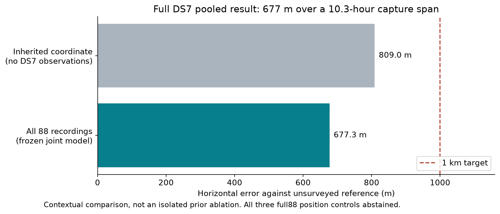
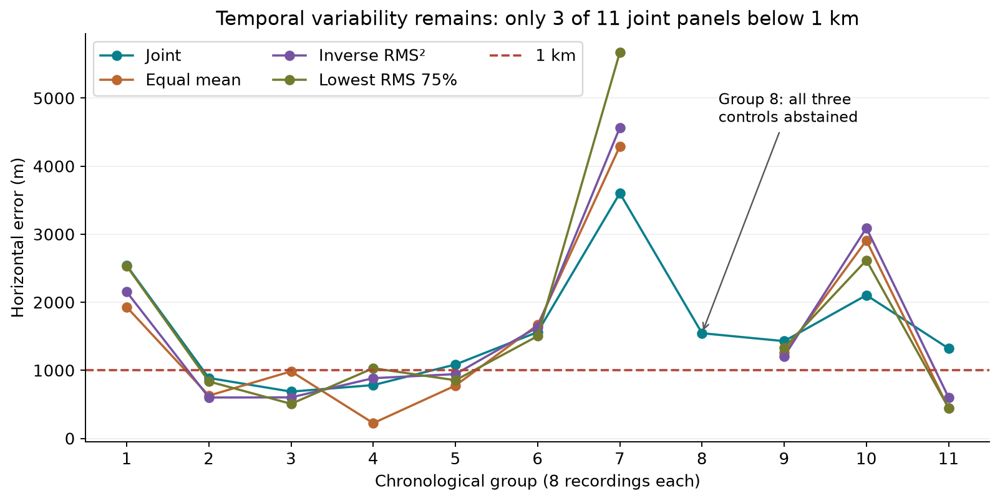
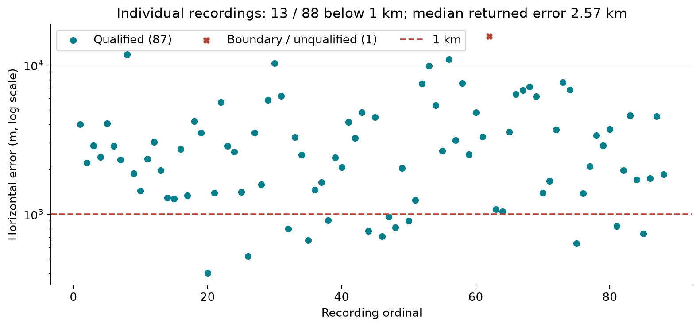

# DS7: 677 m from the complete pooled dataset

The [complete original report](../2026_09_27_ds7_full88/REPORT.md) and its
sealed evidence chain are now published alongside this illustrated summary.

**The frozen joint estimator reached 677.323 m horizontal error using all 88
DS7 recordings**, spanning 10 h 19 min 59 s. It converged without hitting
position or timing bounds. This meets the predeclared complete pooled benchmark.

The main observed change was expanding the unchanged scientific model to the
full recording set. Matched search, orbit-freshness, and initialization tests
produced negligible position changes. Computational batching preserved the
prediction while making larger evaluations practical. **No isolated component
ablation establishes which part caused the full88 improvement.**

This is an exposed, single-site benchmark against an **unsurveyed operator
reference**. The inherited DS6 coordinate already has 809.029 m error without
DS7 observations. The fitted result improves that distance by **131.706 m
(16.28%)**, but does not demonstrate surveyed accuracy, unseen-site
generalization, or reliable sub-kilometre accuracy for individual recordings.

## Ablations: what changed, and what the evidence supports

Errors below use the same great-circle metric (mean Earth radius 6,371,008.8 m).
Negative changes mean lower error. Comparisons with different recording budgets
are coverage experiments, not matched component ablations. The rows must not
be added together as contributions to a total gain.

| Comparison | Fixed evaluation scope | Baseline → variant | Error change | Interpretation / evidence |
|---|---|---:|---:|---|
| More recordings, unchanged joint science | Nested first 1 / 2 / 4 / 8, then all 88 | 4,004.26 → 3,638.94 → 2,771.03 → 2,541.48 → **677.32 m** | First 8 → all 88: −1,864.16 m | Observed coverage effect; recording count and temporal diversity change together. [Prefix results](evidence/wave2-results.txt), [full88 score](evidence/joint-score.json) |
| Full88 vs inherited coordinate | Same site/reference; different use of observations | 809.029 → **677.323 m** | −131.706 m (−16.28%) | Contextual comparator; not a prior-removal ablation. [Prior diagnostic](evidence/prior-diagnostic.json) |
| Equal averaging instead of joint fit | Same first 8 recordings | 2,541.48 → 1,930.07 m | −611.41 m | Equal averaging wins this panel; does not explain the full88 joint result. [Source comparisons](evidence/wave2-results.txt) |
| Inverse training-RMS² weighting | Same first 8 independent estimates; equal mean baseline | 1,930.07 → 2,152.44 m | +222.36 m | Worse here; low training RMS is not geographic confidence. [Source comparisons](evidence/wave2-results.txt) |
| Retain lowest-training-RMS 75% | Same first 8 inputs; frozen rule retains 6 | 1,930.07 → 2,532.71 m | +602.63 m | Worse here; no error-selected membership. [Source comparisons](evidence/wave2-results.txt) |
| Wider geographic search | Same single-001 objective, banks and 180-evaluation allowance | 4,004.257505 → 4,004.257743 m | +0.000238 m | Effectively unchanged; nine starts did not resolve the gap. [Local](evidence/local-score.json), [wide](evidence/multibasin-score.json) |
| Add fixed 1% constant-frequency null | Same single-001 data; likelihood alternative | 4,004.257505 → 4,004.258741 m | +0.001236 m | Effectively unchanged; tests one narrow alternative source model. [Null score](evidence/null-score.json) |
| Fresher archived GP selection | Same single-001, fixed 11,119-object roster | 4,004.257505 → 4,004.270183 m | +0.012678 m | Effectively unchanged; unavailable precise orbit products were not tested. [Orbit score](evidence/orbit-score.json), [protocol context](evidence/wave1-results.txt) |
| Historical-style initialization | Same first 8 objective/banks/bounds | 2,541.479510 → 2,541.465146 m | −0.014364 m | Negligible; two alternative starts vs three baseline starts, so total compute is not matched. [Score](evidence/historical-init-score.json) |
| Batched numerical objective | Same first 8 frozen fit | **Byte-identical response** | 0 m | Computational enabler, not an accuracy gain. 144.97 s vs earlier 170.30 s under different host load; no controlled speed ratio. [Equivalence receipt](evidence/batched-equivalence.json) |
| All three independent-position controls | Same complete 88-source denominator | Joint: 677.32 m; controls: **abstained** | Not available | Required single-062 is unqualified; no numeric full88 control ranking is possible. [Equal](evidence/full88-equal.json), [inverse RMS²](evidence/full88-inverse_rms2.json), [lowest 75%](evidence/full88-lowest_rms75.json) |

The data support “the complete pooled execution achieved the target,” not
“each successive model change improved accuracy.” Pooling is not monotonically
helpful across methods or chronological panels. A matched prior-removal or
weakened-prior full88 ablation was not run, so the contribution of inherited
site knowledge remains unresolved.

## Directions investigated but not responsible for this result

| Direction | Evidence obtained | Positioning status |
|---|---|---|
| Pilot/CFO extraction | Ordinary/robust held waveform coherence above scrambled controls in one eligible lane/visit; differential phase rejected for boundary hits | No downstream position ablation; not used to obtain 677 m. [Receipt](evidence/cfo-receipt.txt) |
| Receiver-clock drift | Conditional sensitivity and synthetic nonlinear recovery prerequisites passed | Independent hardware calibration/bounds absent; no real-data correction admitted. [Review](evidence/clock-review.txt) |
| Orbit-error hierarchy | Candidate repetition reviewed | Independent identity/calibration priors absent; hierarchy not fitted. [Admission evidence](evidence/wave1-results.txt) |
| Precise orbit alternatives | Availability investigated | Required historical product coverage unavailable; no accuracy claim. [Orbit evidence](evidence/wave1-results.txt) |

## All panels and individual recordings

See also the [DS7 performance table by dwell time and sample rate](prior-aggregation/README.md),
with separate Reno and Sacramento prior-search median, mean, and P90 errors.
The corrected table groups by active dwell (120 / 240 / 360 ms); the initial
version mistakenly grouped by the separate 120 ms `valid_visit_ms` field.
These are published per-recording prior searches, separate from the joint model below.

All 11 joint panels converged away from bounds, but only **3 / 11** were below
1 km; median error was **1,429.43 m**. Each aggregation control qualified on
10 / 11 panels. The gap at panel 8 is an abstention, not a zero-error result.
The first panel remains 2,541.48 m. Chronological groups describe temporal
variation; they are not randomized held-out validation or independent sites.

All **88** independent estimates were evaluated: **87 qualified**, one hit a
boundary, and **13 / 88** were below 1 km (13 / 87 qualified). Eight qualified
estimates improved on the inherited 809 m coordinate. Median error was
**2,571.168 m** across all returned positions and **2,515.151 m** among qualified
positions. The returned range was 402.815–15,644.019 m; the maximum is the
unqualified `single-062`, retained in the chart and denominators.

Exact outcomes and provenance: [11-panel data](evidence/group-panels.json),
[88-recording ledger](evidence/individual-outcomes.json), and the corresponding
source-score files indexed in [SOURCE-MANIFEST.json](evidence/SOURCE-MANIFEST.json).

## Frozen method and execution

The joint fit uses a Student-t likelihood (four degrees of freedom, 100 Hz
scale), per-track stationary frequency offsets, a finite candidate mixture,
the inherited DS6 spatial prior, ±12 km position bounds, and ±5 s
recording-specific timing bounds on 41-point quarter-second banks. Its three
frozen starts (timing 0, −2, +2 s) all converged inside the bounds. The +2 s
start won by training likelihood; geographic errors did not select it.

The fit used **5,131 eligible tracks across all 88 recordings**. Eleven tracks
were excluded by pre-existing eligibility rules: five with fewer than two
training observations and six with no held-out observation. No recording was
excluded. Training conditional RF RMS was 625.227 Hz; it is not an accuracy or
held-out validation metric. The estimated position was
37.854429757806905, −122.48938804955883.

Predictions were sealed before scoring. Adapter time was **1,480.174 s**
(outer wall **1,488.76 s**), within the 1,800 / 1,920 s limits, using one
CPU/BLAS thread, nice 19, and an enforced 8 GiB address-space limit. A live
adapter high-water observation was **5.74 GiB**. Exact final peak memory and
total CPU time were not measured: outer GNU time's counters covered its
privilege wrapper. There was no new RF collection or raw-IQ processing for
this pooled run. See the [frozen specification](evidence/full88-spec.txt),
[response](evidence/joint-response.json), [run seal](evidence/joint-run-seal.json),
and [terminal receipt](evidence/joint-terminal-receipt.json).

The unchanged implementation had passed 91 relevant tests and Ruff before
this run. The closeout verified 2,623 earlier wave file/source bindings and
eight final run/score seals covering 36 files, with zero errors. The
[original benchmark closeout](evidence/benchmark-closeout.json) preserves the
full local evidence inventory.

## Preserved failures and limits

The supplementary all-88 fixed-prediction residual audit **failed**, exit 1
after 60.31 s (5.70 GiB maximum RSS). Its unchanged program rejects the
required unqualified `single-062` with
`ValueError: audit requires a qualified frozen estimate`. It produced no
residual result and was not retried. **No held-out residual validation is
claimed.** This separate failure does not alter the sealed location score.
[Failure receipt](evidence/residual-failure.json).

Earlier failed search, loader, and preparation attempts remain in the local
sealed histories; they are described in the [wave-1](evidence/wave1-results.txt)
and [wave-2](evidence/wave2-results.txt) snapshots. No failures were converted
to zero error or removed to make the full88 controls qualify.

This publication is a compact report and evidence export, not a complete
rerunnable observation/bank archive. JSON receipts preserve their original
paths and hashes, which may refer to local artifacts not included here.
The [source manifest](evidence/SOURCE-MANIFEST.json) maps every copied evidence
file to its original path and SHA-256; original bytes were preserved. The
[original final report snapshot](evidence/original-report.txt) is included.
The original sealed report directories were not edited for publication.

Figures can be regenerated from the included JSON using
`python plot.py` with Matplotlib installed. PNGs are embedded above; equivalent
SVGs are supplied under `figures/`. No new scientific fits were run to prepare
this publication. The next scientific priorities are individual-recording
reliability, a matched prior-sensitivity ablation, and independent surveyed-site
evaluation with reproducible randomized group holdouts.
