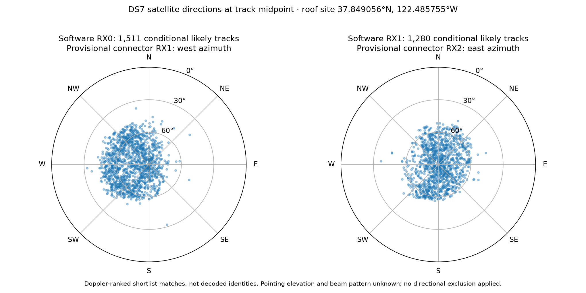

# DS7: receiver geometry and likely Starlink track associations

All **5,142 exported tracks in 88 DS7 recordings** now have an annotation.
This is a descriptive association at the operator-supplied location, not a
blind position solution or decoded satellite identity. Existing frozen research
inputs and results were preserved. No raw IQ was read and no RF was collected.

Open [the searchable table](local/annotations.html), download
[track annotations](local/track-annotations.csv), or inspect
[the top three candidates per scored track](local/top-three-candidates.csv).
The searchable table filters by receiver, status, session, satellite name,
NORAD number, or track ID. All generated data are git-ignored under `local/`.

## Receiver geography and geometry

The frozen [pose authority](../2026_09_27_ds7_post_ds6/pose-authority.json)
places radio `.20` at **37.849056280893684° N, 122.48575489722863° W** on the roof.
Every recording's pose companion was hash-checked against the DS7 manifest and
bound to its source recording. The corpus spans 2026-09-27 05:46:47.936854 through
16:06:47.298702 UTC. Capture UTC brackets are 0.362–0.369 seconds wide.

| Property | Available evidence | Treatment |
|---|---|---|
| Site | Operator-supplied coordinates, WGS84 assumed; unsurveyed | Fixed known site for association |
| Physical RX1 | West azimuth, provisionally software RX0 | Direction reported, no hard beam exclusion |
| Physical RX2 | East azimuth, provisionally software RX1 | Direction reported, no hard beam exclusion |
| Fixture | LT3D-001A, nominal 80 mm mount separation and 10° outward tilt | Not treated as measured RF baseline or actual sky elevation |
| Elevation / phase centers | Unknown | No beam-cone or interferometric constraint |
| Altitude | Unknown | 0 m ellipsoidal working value, with +100 m sensitivity check |

The two paths are treated as colocated for Doppler geometry. Their millimetric
mount separation cannot supply useful geometric discrimination at this precision,
and the directed RF baseline is unknown. No phase-difference localization was
attempted. East/west descriptions do not imply horizontal boresights.



Of the conditional likely matches, RX0 has 1,254/1,511 (83.0%) midpoint
directions in its provisionally west-facing half-sky. RX1 has 660/1,280 (51.6%)
in its provisionally east-facing half-sky. Median elevation across likely
matches is 66.5°. These distributions reflect detection, tracking, candidate
selection, and constellation availability as well as antenna response; they
are not measured beam patterns or proof of cable mapping. Near-zenith reception
also makes a simple azimuth hemisphere a weak physical discriminator.

## Annotation results

| Status | Tracks | Meaning |
|---|---:|---|
| `likely_conditional` | 2,791 | Good Doppler fit, separated alternative, validation and sensitivity gates pass |
| `tentative` | 1,846 | Some fit support, but at least one likelihood gate fails |
| `unresolved_poor_fit` | 494 | Even the training-selected best candidate has validation RMS >500 Hz |
| `unresolved_no_candidate_bank` | 11 | Track exists in export but was excluded from its bank for inadequate split support |

All 88 recordings are represented. Counts refer to the existing qualified
track exports (at least six observations and three seconds), not every weak
detection or possible signal in 860 GB of raw IQ. A top candidate in an
unresolved row is an explicitly poor-fit suggestion, not an assigned identity.

There are 1,139 different NORAD objects among conditional likely rows. A single
satellite can appear in several track fragments, channels, receivers, or sessions.
The table retains those track identities rather than counting them as independent
satellite observations. Overlap with the opposite receiver is reported separately
and is not used to inflate confidence.

### Links to the previously studied signal excerpts

Actual exported visit membership links our earlier raw-bit excerpts to these
geometric candidates:

| Recording suffix / visit | Software RX | Likely candidate | NORAD | Validation RMS |
|---|---|---|---:|---:|
| a2d5dadd1a63c960 / 191 and 208 | 0 and 1 | STARLINK-30257 | 57526 | 173.1 / 141.7 Hz |
| a40658642d9ade6a / 2022 | 1 | STARLINK-5530 | 56494 | 113.4 Hz |
| 0da0bd80eeec99cf / 947 | 0 and 1 | STARLINK-31225 | 59040 | 236.5 / 223.9 Hz |

All listed rows meet the conditional likely rule. For visit 2022, only RX1 has
an exported qualifying track containing that visit; no RX0 identity is inferred
by copying the RX1 result. Visits 191/208 fall in the same respective receiver
tracks, so they are not four independent confirmations. Exact links and runner-up
candidates are in [recovered-signal-track-links.json](local/recovered-signal-track-links.json).
These labels come from geometry/Doppler, not from the recovered T-code bits.

## Method and confidence limits

1. Resolve the 88 frozen exports and hash-bound orbit banks. Resolve numerical
   candidate row indices to NORAD IDs and names through the exact archived
   baseline catalogue, using the installed release's public TLE reader and
   the same debris exclusion policy. The seven baseline catalogues preserve
   the row identity used when banks selected fresher per-object elements.
2. Compute receiver ECEF position and local east/north/up axes. Use orbit-bank
   ECEF positions and rotating-frame velocities at nominal capture UTC.
   Doppler is `-f/c * range_rate`, with **11.2 GHz** because the track pipeline
   normalizes each measured CFO to that canonical RF. The original tuned RF
   remains a separate output field. Do not apply the original RF a second time.
3. Require candidates above the geometric horizon at 95% of observations.
   Fit one constant frequency offset per candidate using only the frozen
   training visits, then rank by training RMS. This absorbs a static oscillator
   or alias offset without fitting away Doppler curvature.
4. Evaluate the selected candidate and training-selected runner-up on the
   disjoint validation visits. Fit a radio-only straight-line null on training
   data as a diagnostic. The existing split hashes whole visits; it is not a
   chronological future holdout. No validation samples select a satellite.
5. Repeat candidate ranking at ±0.25 s and +100 m receiver altitude, and under
   a ±25 Hz/s bounded additional drift. Report whether the winner changes.
   These are sensitivity scenarios, not measured uncertainty bounds.

The **heuristic** conditional likely rule requires at least 20 observations,
at least 10 seconds, validation RMS ≤250 Hz, training and validation runner-up
gaps ≥100 Hz, stable winner in all sensitivity checks, and validation RMS at
least 25 Hz better than the straight-line null. It is not a calibrated probability
or externally validated identity threshold. Tentative requires validation RMS
≤500 Hz; the remaining rows are unresolved.

The banks are **shortlists**, built previously using five geographic anchors,
a ±5 s timing grid, and training-only top-eight unions from the full archived
catalogue. This annotation does not repeat a full-catalogue search. Candidate
omission remains possible, particularly for unresolved tracks. Orbit element
errors, transmitter precompensation, unmodelled receiver drift, and track mixing
can also affect ranking. Unknown surveyed height/site uncertainty and antenna
beam response remain limitations. The pose is user-authorized input here;
these results must not be cited as a blind receiver-position accuracy test.

## Files and reproduction

- `prepare.py`: resolves inputs, verifies pose/source binding, hashes local
  orbit banks, and reads exact historical catalogue identities. Run with the
  installed `17484895464c225ebba977487aa36d3d81658bd8` release interpreter and
  read permission for `/var/lib/leo/tle`. It produces `local/inputs.json`.
- `annotate.py`: produces JSON/CSV annotations, top-three candidates, and an
  88-recording coverage summary. Uses NumPy, no storage or network calls.
- `present.py`: produces the standalone searchable HTML, sky plot, and excerpt
  links. Requires NumPy and Matplotlib.
- `test_annotate.py`: verifies cardinal geometry, Doppler sign/scaling, and
  isolation of validation samples from offset fitting.

```sh
OPENBLAS_NUM_THREADS=1 .venv/bin/python reports/2026_09_27_ds7_satellite_annotations/annotate.py
OPENBLAS_NUM_THREADS=1 uv run --no-project --with numpy --with matplotlib python reports/2026_09_27_ds7_satellite_annotations/present.py
.venv/bin/python -m unittest discover -s reports/2026_09_27_ds7_satellite_annotations -p 'test_*.py'
```

The hash-verifying all-recording numerical pass took approximately 22 seconds.
Three focused numerical tests pass. No production component, persisted contract,
golden fixture, sealed DS7 input, or prior position evaluation was modified.
