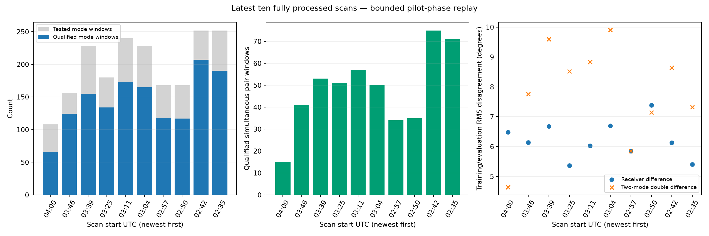
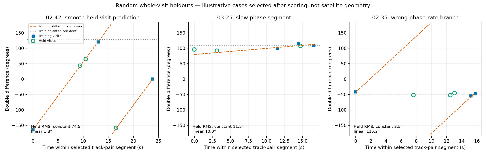
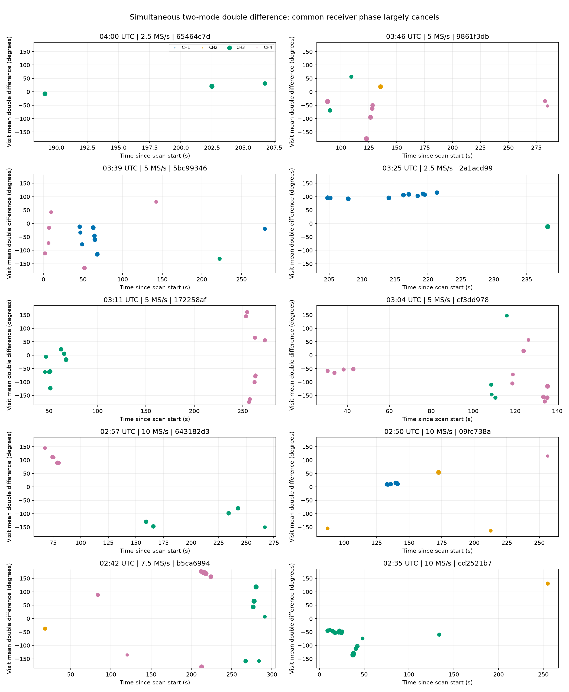

# Phase review of the latest ten fully completed scans

**All ten scans contain useful qualified phase.** The bounded replay recovered **1,449 receiver-phase measurements out of 1,980 tested signal/window combinations**, including **482 simultaneous two-mode double differences across 131 dwells**. Pooled training/evaluation disagreement is **6.20° for receiver differences** and **8.29° for double differences**. These are internal repeatability measurements, not satellite-position accuracy.

The cohort is frozen from the published adaptive history at **2026-09-27 04:45:39 UTC**. Captures start between **02:35 and 04:00 UTC**, span four sample rates, and have completed capture, GLRT and tracking products. Newer partially processed scans are excluded explicitly in [selection.json](selection.json). This extends the earlier DS5 work to recent recordings; it is not a new RF collection.

## Results by scan

Each selected dwell contributes six 7 ms windows. A mode window is one signal observed by both receivers; a pair window contains two independently qualified signals. Raw replay covers **195 selected dwells / 1,170 windows**, not every dwell in these recordings. There were **zero extraction errors and zero clipped rows in the selected IQ**.

| Start UTC | Scan suffix | MS/s | Qualified/tested mode windows | Pair windows / dwells | Receiver RMS | Double-difference RMS | Median dwell DD R |
|---|---|---:|---:|---:|---:|---:|---:|
| 04:00 | [65464c7d](scan-fw-40ebc07665464c7d.json) | 2.5 | 66 / 108 | 15 / 3 | 6.5° | 4.6° | 0.997 |
| 03:46 | [9861f3db](scan-fw-609d7a8d9861f3db.json) | 5 | 124 / 156 | 41 / 10 | 6.1° | 7.8° | 0.994 |
| 03:39 | [5bc99346](scan-fw-f147dd8a5bc99346.json) | 5 | 155 / 228 | 53 / 16 | 6.7° | 9.6° | 0.997 |
| 03:25 | [2a1acd99](scan-fw-851486cc2a1acd99.json) | 2.5 | 134 / 180 | 51 / 11 | 5.4° | 8.5° | 0.991 |
| 03:11 | [172258af](scan-fw-3ebf3526172258af.json) | 5 | 173 / 240 | 57 / 17 | 6.0° | 8.8° | **0.883** |
| 03:04 | [cf3dd978](scan-fw-898b709fcf3dd978.json) | 5 | 165 / 228 | 50 / 16 | 6.7° | 9.9° | 0.992 |
| 02:57 | [643182d3](scan-fw-11c47d46643182d3.json) | 10 | 118 / 168 | 34 / 11 | 5.8° | 5.9° | 0.999 |
| 02:50 | [09fc738a](scan-fw-00ff81dc09fc738a.json) | 10 | 117 / 168 | 35 / 11 | 7.4° | 7.1° | 0.997 |
| 02:42 | [b5ca6994](scan-fw-4c56320fb5ca6994.json) | 7.5 | 207 / 252 | 75 / 18 | 6.1° | 8.6° | 0.995 |
| 02:35 | [cd2521b7](scan-fw-da2858f6cd2521b7.json) | 10 | 190 / 252 | 71 / 18 | 5.4° | 7.3° | 0.996 |

R near one means phases cluster. The last column measures agreement **between qualified windows within a dwell**, requiring at least two windows. It differs from the approximately 0.99 coherence measured *inside* individual windows. The 03:11 scan shows why this distinction matters: good short-window phase does not guarantee stable dwell-level phase. Whole-visit bootstrap confidence intervals are available in [summary.json](summary.json). Sample rates are confounded with different recordings and selection; this is not a controlled bandwidth comparison.

## Does it follow tracks across visits?

**Sometimes very well; sometimes the wrapped-phase rate is ambiguous.** Fourteen recurring track-pair groups support randomized whole-visit prediction checks. A linear circular-phase fit beats a constant phase in 11 groups, but some failures are severe. These small development comparisons do not establish general improvement or satellite identity.

- **02:42:** one pair predicts three held visits with **1.84° RMS**, versus **74.50°** for a constant. This is a strong example of repeatable changing phase.
- **03:25:** a slow segment gives **9.99°** held RMS versus **11.47°** for a constant. It resembles the gradual evolution we want, but is not yet a geometric satellite fit.
- **02:35:** a nearly constant segment has **3.48°** constant-model error, while the chosen linear rate gives **115.25°**. Sparse training visits admit an incorrect additional phase cycle.
- **02:50:** another stable segment gives **2.43°** constant-model held error, versus **3.13°** for a linear fit.

Illustrations were selected after scoring and include a failure. They are not used to tune the reported fits. The dashed lines are generic circular-phase models, not orbit predictions. Raw training/held visit assignments and every group score are retained.

Of the 1,449 qualified mode windows, **581 (40.1%) link uniquely to published tracks in both RX0 and RX1**. The others lack at least one published-track membership under the frozen configuration; they must not silently become satellite observations. All reconstructed track IDs matched their published counterparts. There is useful phase outside existing track coverage, but using it to extend or join tracks requires a separate association test.

## All-scan illustrations

Each point above is a circular mean within one dwell; larger points contain more qualified windows. Colors identify channels, **not satellite identities**. Different track pairs can share a channel, so disconnected clusters must not be stitched merely because their color matches. Phase is wrapped to ±180°; jumps at that boundary need not be physical discontinuities.

- [Within-dwell double-difference R versus time](dwell-coherence-time.png): consistency across windows.
- [Receiver phase versus time](phase-time.png): qualified RX1−RX0 phase; receiver LO phase remains present.
- [Window R versus time](coherence-time.png): colored points qualify; gray crosses fail source checks.
- [CFO versus time](cfo-time.png): circles are RX0, crosses RX1, colored by channel. These are raw GLRT mixing seeds, not normalized/dealiased orbital Doppler.

## What passed, and what remains uncertain

The replay uses joint pilot-source regression, common receiver frequency referencing, training-only fractional timing and rate estimation, separate qualification/evaluation samples, and rolled-pilot controls. It does not promote the earlier inconsistent shared-rate or adaptive-CFO models. **Ten scientific tests pass.** A continuous-time synthetic RF oracle checks both edges at all four rates, with maximum double-difference error **0.86°** under idealized propagation. **All 20 real RX1 misalignment/permutation controls fail pair qualification**, as intended. These controls do not establish a population false-positive rate.

The most useful next association experiment is to preserve a **distribution over phase-wrap/rate hypotheses**, rather than choosing one fitted slope. Use 02:42 and 02:50 as positive examples and the 02:35 alias failure and 03:11 unstable dwells as stress cases. Carry phase as an optional wrapped likelihood alongside CFO, with neutral fallback for unqualified or unjoined evidence. Preserve source-specific slow phase while constraining shared receiver behavior.

This review demonstrates usable phase across recent scans. **It does not yet prove improved satellite identification or recover an absolute distance difference/sky direction.** Effective baseline, hardware response and independent identity truth remain unresolved. Complete tracking status also includes deferred catalogue groups; it does not mean every signal has been assigned a satellite.

See [method and reproduction](METHOD.md), [frozen plans](plan.json), [numerical results](summary.json), [negative controls](negative-controls.json), [physical oracle](physical-oracle.json), [test receipt](tests.xml), and [coverage audit](coverage-audit.json).
