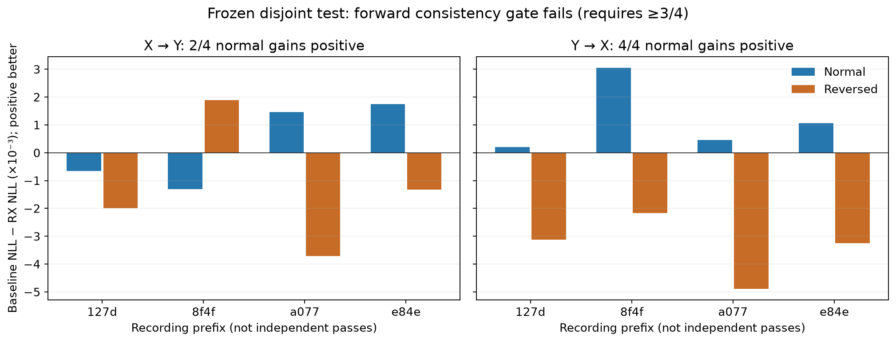
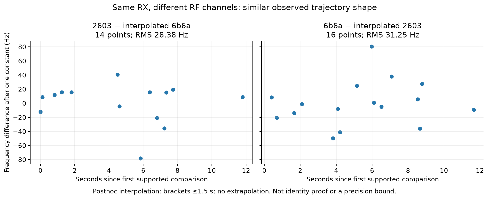

# Follow-up: regularization, disjoint testing, and frequency continuity

27 September 2026. This supplements, rather than replaces, the historical experiments in the [main report](README.md). No new location search was run in this follow-up. All gains below are reductions in held-frequency negative log likelihood (NLL) per observation, not kilometres or evidence of a decoded satellite identity.

## Outcome and decision

The recording-disjoint test has small positive average gains, but **fails the frozen progression gate**: only two of four recordings improve in X→Y, below the required three. Do not advance this unchanged model to another geographic evaluation. The previous best observed geographic mean remains 3.954 km on an already-unblinded development cohort; it is not newly validated here.

The most useful new diagnostic is that two simultaneous, same-receiver tracks in different RF channels agree to approximately **28–31 Hz RMS after removing one constant**, despite much larger residuals against the selected satellite curves. This motivates investigating shared trajectory/orbit mismatch. It does not distinguish a common satellite from receiver effects, prove the satellite ID, or establish improved position accuracy.

## 1. Why the original association update was unreliable

The original six-recording temporal replay used 344 tracks and 688 reciprocal predictions. Only 12 tracks in each direction changed their maximum-probability (MAP) satellite. Nevertheless, unchanged-MAP tracks contributed −0.005416 to the A→B pooled gain, outweighing the +0.001177 from changed-MAP tracks. Keeping the top ID is therefore not a sufficient safety criterion: the update can still suppress useful alternatives.

The A→B gain remains negative when any single recording is omitted (−0.007975 to −0.001063). The B→A sign changes under those descriptive omissions. These are not refitted leave-one-recording-out validations. Baseline maximum candidate probability is at least 0.99 for 300/344 forward and 306/344 reverse predictions, indicating concentrated model posteriors, not certified correct associations. Low-confidence bins also failed to provide a consistent gate.

Sources: [concentration analysis](followup_sources/2026_09_27_rx_transfer_concentration/README.md), [exact attribution](followup_sources/2026_09_27_rx_transfer_concentration/results.json).

## 2. A conservative mixture helps—but geometry-free mixtures help more

We first tried `q_safe = (1 − λ) q_frequency + λ q_RX`, with λ=0.5 primary and 0.25/0.75 sensitivity checks. The candidate is shared across the held block. Keeping baseline support bounds the extra block-normalized loss by `−log(1 − λ) / N_held`. This is a support-preserving mixture, not a calibrated physical reliability probability.

| 50/50 blend target | A→B gain | B→A gain | Recordings improving |
|---|---:|---:|---:|
| Normal RX posterior | +0.002103 | +0.008979 | 3/6; 6/6 |
| Reversed RX direction | +0.004551 | −0.000353 | 4/6; 2/6 |
| Uniform over the same shortlist | **+0.088390** | **+0.097273** | 6/6; 6/6 |
| Frozen training prior | +0.039935 | +0.047624 | 6/6; 6/6 |

Normal RX gains at λ=0.25 were +0.002191/+0.007516, and at λ=0.75 +0.001188/+0.009400. Generic diversification was much more effective than the RX blend. The uniform/prior controls were added after examining reversal and are explicitly posthoc. This temporal replay was already inspected and retained globally calibrated frequency parameters; it is not randomized validation. The gain must not be attributed to receiver geometry.

Source: [conservative blend and controls](followup_sources/2026_09_27_rx_transfer_concentration/CONSERVATIVE_RESULTS.md).

## 3. Rebuild the comparison with matched regularization and grouped splits

We changed the question to whether RX adds information beyond a regularized frequency baseline:

```text
baseline posterior = 0.5 q_frequency + 0.5 uniform
RX posterior       = 0.5 q_frequency+RX + 0.5 uniform
```

Both use the same conditioning-partition shortlist. Candidate selection from the full visible catalogue and the constant CFO fit are rebuilt separately for X and Y. Conditioning frequency evidence enters once; the held observations only score prediction. Direction features are recomputed for the newly selected candidates, with shared detection and ratio nuisance effects integrated.

The split is reproducible, randomized, and session-wide: 10-second UTC blocks, seed 20260927, with connected components joining overlapping raw intervals, common RX opportunities, and physical RX pairs. Components are assigned by a SHA256-derived rule, not by outcomes or historical train labels. A three-part design supported only 98/344 tracks; the two-part design with at least three observations per side supported **259/344**. All 85 unsupported tracks remain accounted for. Ten-second grouping does not establish independence, and reconstructed tracks still use the full recording.

| Six-recording development replay | X→Y | Y→X |
|---|---:|---:|
| Normal RX, occupied-second weighted gain | +0.004056 | +0.000994 |
| Normal RX, equal-recording mean gain | +0.004235 | +0.000867 |
| Recordings improving | 5/6 | 4/6 |
| Reversed direction gain | −0.005221 | −0.004299 |
| Candidate-independent null | approximately zero | approximately zero |

There were 518 reciprocal predictions and 6,401/6,373 held observations. RX coefficient fitting excluded each held recording, but global frequency and pairing calibration still used all six. This is conditional development, not fully nested validation. Several design elements changed together; we cannot assign the improvement to one change in isolation.

Sources: [protocol](followup_sources/2026_09_27_rx_transfer_concentration/RANDOMIZED_REBUILD_PROTOCOL.md), [results and per-recording table](followup_sources/2026_09_27_rx_transfer_concentration/GROUPED_REBUILD_RESULTS.md), [summary](followup_sources/2026_09_27_rx_transfer_concentration/grouped-rebuild-summary.json).

## 4. Frozen, recording-disjoint confirmation

The frozen 43-capture DS6 manifest yielded seven eligible recordings after excluding 28 prior RX membership IDs and requiring tracking completeness and source-span attestation. Four were selected by the lowest SHA256(`20260928:session_id`), before their RF-derived observations were loaded. There were no replacements or outcome tuning. These recordings were unused by this RX experiment, not necessarily unseen in every other DS6 study.

Frequency parameters, pairing calibration, feature scaling, reception coefficients, and shared-effect scales came from the frozen six calibration recordings, disjoint from all four test recordings. Their capture intervals also do not overlap. The pre-outcome contract binds 196 code/model/input files. The same grouped split, separately refitted X/Y candidates/CFO, and matched uniform regularization were used.

| Recording suffix | MHz | Supported / retained tracks | Normal X→Y | Normal Y→X |
|---|---:|---:|---:|---:|
| e84e2f55976c0a8c | 2.5 | 31/64 | +0.001753 | +0.001059 |
| 8f4f960d9db67798 | 10 | 44/60 | −0.001313 | +0.003058 |
| a077447f07d9f81f | 2.5 | 49/58 | +0.001457 | +0.000462 |
| 127d8fc36e804ae2 | 2.5 | 55/59 | −0.000661 | +0.000207 |
| Occupied-second pooled | — | 179/241 | **+0.000157** | **+0.001178** |
| Equal-recording mean | — | — | +0.000309 | +0.001197 |
| Reversed RX, pooled | — | — | −0.001285 | −0.003342 |



All four runs completed: 179 supported tracks, 62 unsupported, and 358 reciprocal predictions. These are dependent predictions, not 358 independent samples. The selected captures form two nearby-in-time pairs (01:46/01:53 UTC and 04:43/04:50 UTC), not four independent satellite passes.

The frozen gate required positive pooled and equal-recording gains in both directions, at least three of four recordings improving in each direction, and normal pooled gains exceeding reversal. **X→Y improves only 2/4: gate failed.** All other conditions pass. This gate is a progression rule, not a significance test. It has not been relaxed.

The candidate-independent null cancels to floating-point precision. `summary-v2.json` is authoritative: the original summary incorrectly counted tiny positive roundoff as an improvement. V2 uses a 1e−10 tolerance for reporting counts only; scores, normal/reversed counts, and the gate decision are unchanged. Both versions are archived.

Sources: [frozen protocol](followup_sources/2026_09_27_rx_disjoint_confirmation/PROTOCOL.md), [selection manifest](followup_sources/2026_09_27_rx_disjoint_confirmation/manifest.json), [contract](followup_sources/2026_09_27_rx_disjoint_confirmation/contract.json), [complete results](followup_sources/2026_09_27_rx_disjoint_confirmation/RESULTS.md), [authoritative summary](followup_sources/2026_09_27_rx_disjoint_confirmation/summary-v2.json).

## 5. What causes the two forward regressions?

Posthoc attribution covers all four recordings and both directions. A deeper component audit examines the two most harmful forward tracks in each regressing recording. This selected diagnostic subset is not a fresh validation set.

In `127d`, two MAP-switch tracks contribute −0.001377 and the 53 unchanged-MAP tracks +0.000716. In `8f4`, seven switches contribute −0.000683 and 37 unchanged-MAP tracks −0.000631. Both changes of winner and changes in probability under the same winner can hurt. Full X/Y shortlist sets match in only 13/55 and 3/44 tracks respectively; improving recordings also have unstable shortlists, so instability alone is not a reliable rejection rule.

| Track prefix / recording | RX-favoured ID vs frequency MAP | Detection log-likelihood advantage | Ratio advantage | Finding |
|---|---|---:|---:|---|
| 0eb46864 / 127d | 69664 vs 100316 | +10.175 | 0 | 28 rx0 anchors, no matches; frequency probability for 100316 falls from 0.9223 to 0.00045 |
| d9e09279 / 127d | 64940 vs 47389 | +2.225 | +5.273 | Six rx1 anchors, all matched; both reception terms favour an alternative |
| 6b6a5800 / 8f4 | 57347 vs 57871 | +1.572 | +5.878 | 13 rx1 matches; probability for 57347 rises from 0.0054 to 0.9430 |
| 2603aa08 / 8f4 | 57347 vs 57871 | +1.928 | +6.792 | 16 rx1 matches; 57871 stays MAP but falls from 0.9605 to 0.6069 |

The two `8f4` tracks share no exact conditioning physical-pair keys; their similarity is not exact reuse of the same reception pair. This does not establish independent physical sources.

The frequency model is also imperfect. At the frequency-MAP candidate, held residual RMS before/after a held-only Student-t CFO refit is:

| Track prefix | Frozen-CFO held RMS Hz | Held-refitted RMS Hz | CFO change Hz |
|---|---:|---:|---:|
| 0eb46864 | 2,178.3 | 2,192.5 | −577.0 |
| d9e09279 | 773.0 | 630.0 | +215.0 |
| 6b6a5800 | 1,374.0 | 773.5 | −1,605.3 |
| 2603aa08 | 949.7 | 383.1 | −793.5 |

The held refit is diagnostic and uses outcomes: it is not a valid predictive improvement. It minimizes a robust Student-t objective, not RMS, so RMS can increase. Large remaining residual slopes likewise do not prove oscillator drift; wrong identity, orbit/timing mismatch, trajectory construction, and measurement effects remain plausible.

Source: [regression diagnosis](followup_sources/2026_09_27_rx_disjoint_confirmation/REGRESSION_DIAGNOSIS.md), with [127d components](followup_sources/2026_09_27_rx_disjoint_confirmation/failure-components-scan-fw-127d8fc36e804ae2.json) and [8f4 components](followup_sources/2026_09_27_rx_disjoint_confirmation/failure-components-scan-fw-8f4f960d9db67798.json).

## 6. Source continuity: cross-channel shape agrees much better than orbit fits

We joined the four tracks back to public source candidates and checked UTC, RX, channel/edge, RF, source CFO, normalized CFO, alias, and sample bounds. Each track stays on one receiver, one channel/edge, and one RF: **zero RF/channel transitions**. The largest gaps are 3.127, 3.469, 2.868, and 1.483 seconds for 0eb4, d9e0, 6b6a, and 2603 respectively. Large frequency changes across these gaps are not evidence of instantaneous discontinuities.

Normalization follows the installed trajectory model:

```text
normalized CFO = (source CFO − alias_index × alias_spacing) × canonical_RF / actual_RF
canonical_RF = 11.2 GHz; alias_spacing = 1 / 4.4 microseconds
```

Reconstructing the integer alias gives maximum discrepancy ≤4.44e−16. Track 0eb4 changes alias index four times; the other three retain a constant index. Arithmetic consistency does not prove the chosen alias or constructed path is physically correct. In particular, normalized-minus-source CFO also includes RF scaling and must not be interpreted directly as physical drift.

The same software receiver (`rx1`) observes `2603` at 10.96 GHz and `6b6a` at 11.21 GHz over overlapping intervals. After interpolation only within brackets at most 1.5 seconds wide, no extrapolation, and removal of one fitted constant:

| Comparison direction | Supported points | Removed difference Hz | Difference RMS Hz |
|---|---:|---:|---:|
| Left-to-right receipt (2603 versus interpolated 6b6a) | 14 | −8,190.475 | **28.378** |
| Right-to-left receipt (6b6a versus interpolated 2603) | 16 | +8,193.250 | **31.254** |



The two interpolation directions reuse the same measurements; they are a robustness diagnostic, not independent replication. A fitted constant and correlated interpolation errors mean 28–31 Hz is not a receiver precision bound. However, the observed shapes agree far better with each other than with the currently selected orbit curves. Before adding flexible independent polynomials, investigate a shared latent trajectory, catalogue/orbit/time mismatch, and track identity across channels. Common-source Doppler and common receiver behaviour are both possible; this comparison alone cannot select between them.

Sources: [summary and interpolation pairs](followup_sources/2026_09_27_rx_disjoint_confirmation/source-audit-summary.json), [127d source audit](followup_sources/2026_09_27_rx_disjoint_confirmation/source-audit-scan-fw-127d8fc36e804ae2.json), [8f4 source audit](followup_sources/2026_09_27_rx_disjoint_confirmation/source-audit-scan-fw-8f4f960d9db67798.json).

## 7. What should happen next?

1. Diagnose whether cross-channel agreement reflects common satellite motion, receiver frequency behaviour, or a track-construction error, using existing recordings and source receipts. Do not infer truth from whichever fitted candidate has lowest residual alone.
2. Compare a shared, physically constrained frequency discrepancy or an explicit unmodelled-track state against the current model. Avoid giving each track an unconstrained polynomial that can erase the distinguishing Doppler shape.
3. Freeze the next model and thresholds before testing it on new disjoint groups. Preserve matched geometry-free regularization, normal/reversed/null controls, support accounting, and independent Sacramento/Reno candidate generation.
4. Only after consistent predictive benefit, perform a matched geographic comparison. Report kilometres and uncertainty separately from NLL; improve reference and pose calibration before claiming finer spatial resolution.

These are proposed experiments, not implemented improvements. No new RF collection, production modification, or geographic result is implied.

## Reproduction and evidence limits

The [follow-up source manifest](followup_sources/manifest.json) binds archived protocols, aggregate receipts, detailed source audits, and implementation/test snapshots. Large prediction shards, caches, raw RF, and the historical Python runtime are not included. Archived runners may refer to original workspace paths and cannot be treated as standalone portable experiments. Full-run hashes remain in the original receipts. The portable figure generator reads only bundled summaries; no network, RF, or database access is required.

The original follow-up suites were rerun for this publication: **23 transfer/rebuild tests and 12 disjoint/diagnostic tests passed**. These test implementation and receipt integrity, not scientific effectiveness. An initial development extraction attempt rejected an invalid all-evaluation mask before producing results; the successful runs use complementary valid masks. A toy-test expected value was corrected from 0.34 to 0.38. Neither event is hidden as a successful experiment.

```bash
python build_followup_figures.py
python -m unittest discover -s . -p 'test_*.py'
```

Verify `SHA256SUMS` before rendering; Matplotlib versions can change output bytes. The [figure manifest](followup_figure_manifest.json) binds generator, input summaries, and figure hashes.
