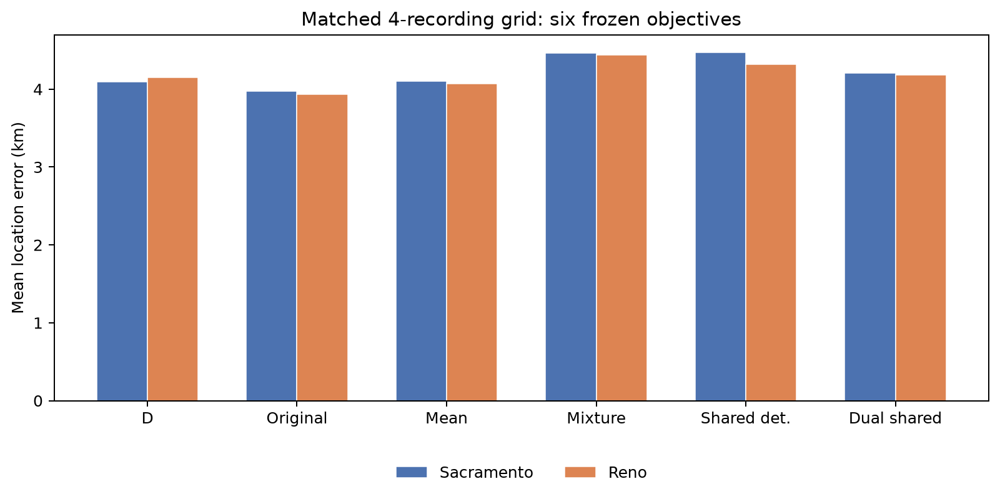
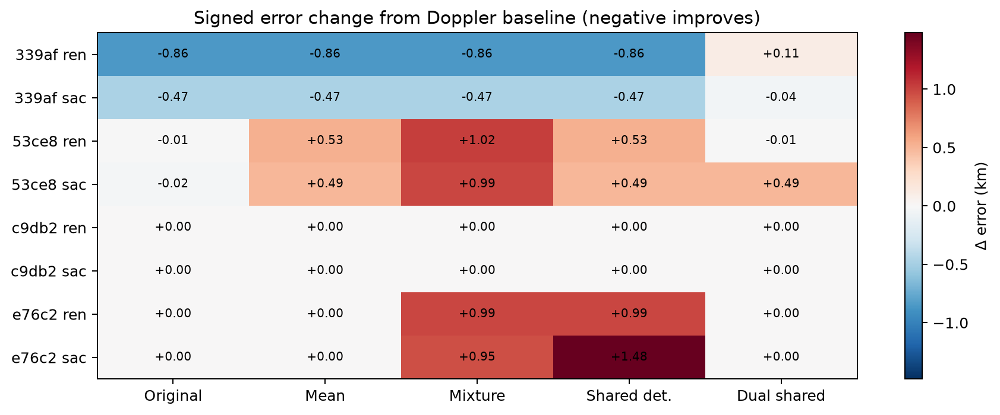
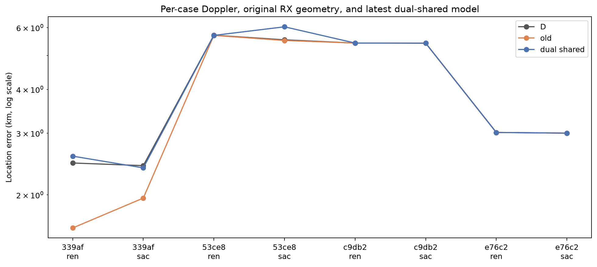
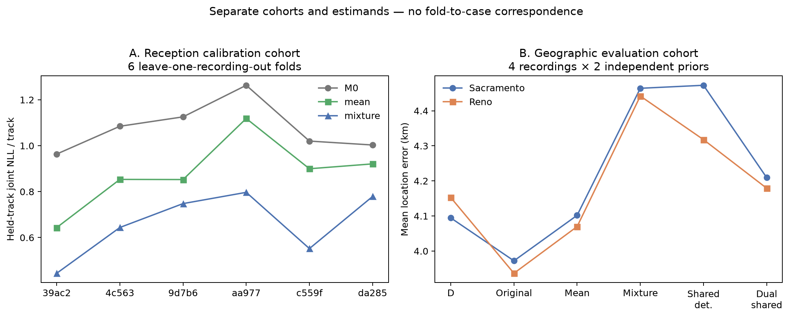
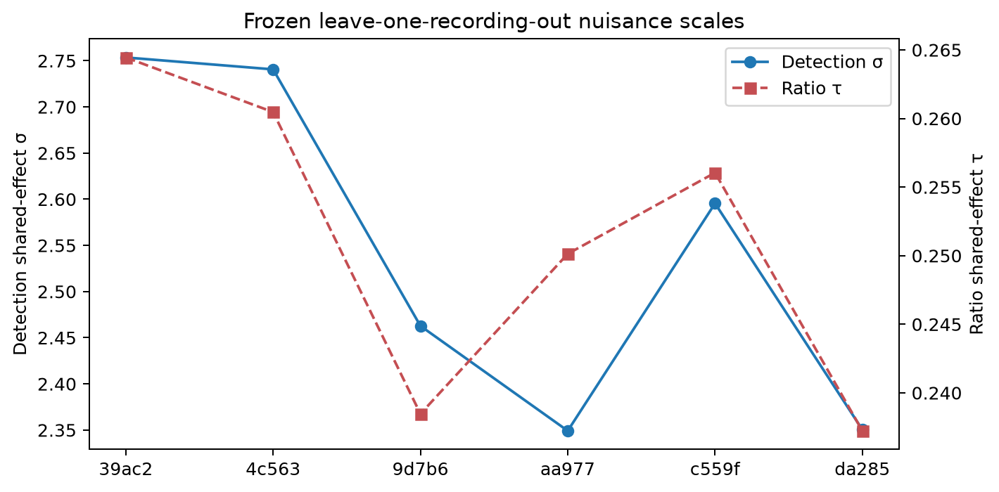
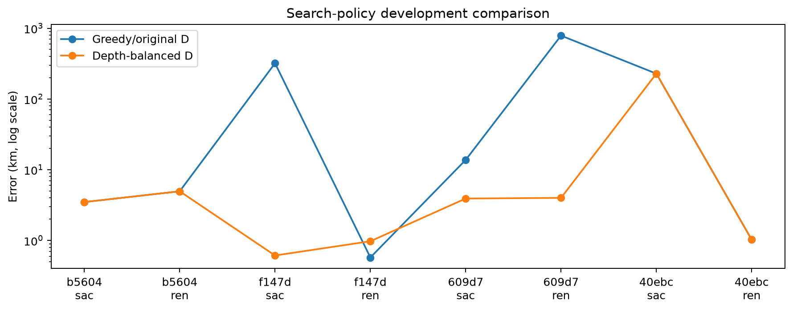
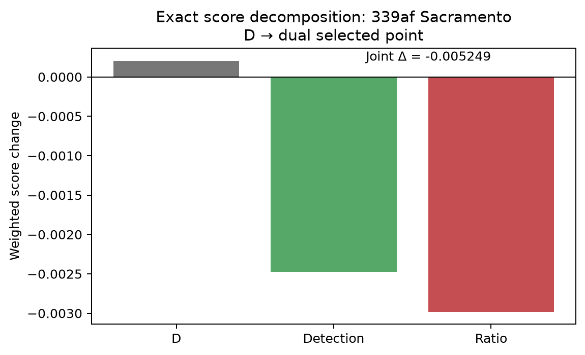
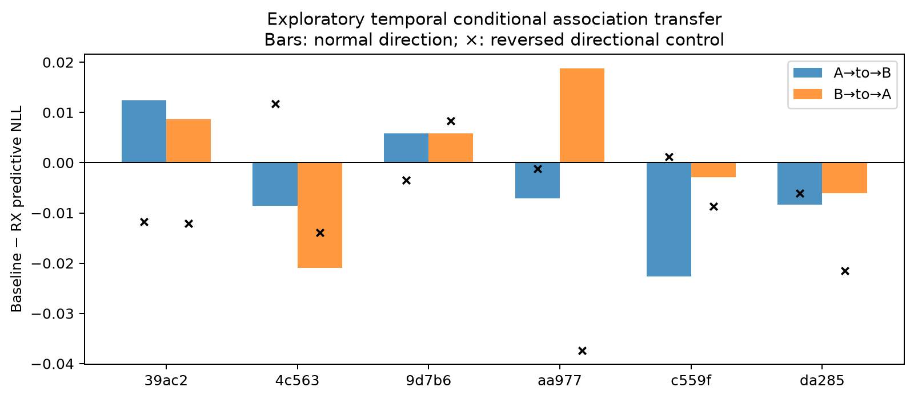

# Receiver geometry, association, and positioning: comprehensive research report

**Evidence cutoff: 27 September 2026. Status: research prototypes, not a production-model promotion.**

## Executive summary

We tested whether Doppler, uncertain satellite associations, historical TLE corrections, and two receivers' directional reception could recover a more accurate receiver position. There is substantial signal, but its usefulness depends on what we ask it to predict.

- **Search coverage explains several catastrophic errors.** A better allocation of the same search budget repaired large errors even without receiver geometry. Candidate sharing across Sacramento and Reno is not an acceptable solution and is excluded from the valid comparisons.
- **TLE-aware timing and joint association improve fit and some known-site rankings.** They do not establish better geographic accuracy by themselves. Flexible polynomial residual corrections can erase the Doppler information needed to distinguish satellites.
- **Receiver direction predicts reception.** Accounting for shared track-level noise improves reception likelihood substantially. But those improvements have not translated into a consistent reduction in geographic error.
- **Best observed matched-grid mean:** the original geometry model achieved **3.954 km**, versus **4.124 km** for Doppler alone, on four already-unblinded DS6 recordings. The newest dual-shared model achieved **4.194 km**, slightly worse than Doppler. These are development results, not a demonstrated resolution improvement.
- **Latest recording-disjoint test fails its consistency gate:** after matched geometry-free regularization and grouped refitting, average predictive gains are positive, but only 2/4 new recordings improve in X→Y (required: 3/4). This does not justify another geographic search with the unchanged model.
- **New source-continuity finding:** two same-receiver, different-channel tracks agree to 28–31 Hz RMS after one constant, while selected orbit fits have much larger residuals. This motivates shared-trajectory diagnostics; it does not prove satellite identity or improved location accuracy.

The [chronological experiment log](EXPERIMENT_LOG.md) records the tried methods, outcomes, rejected approaches, and caveats. [Source snapshots](sources/INDEX.md), [plot data](plot_data.json), and [figure provenance](figure_manifest.json) accompany this report.

The [detailed follow-up](FOLLOW_UP.md) adds conservative mixtures, geometry-free controls, randomized grouped rebuilding, the frozen four-recording test, regression attribution, source continuity, and two new figures. Sections below retain the original experiment chronology; the follow-up contains the latest decision.

## 1. What was measured—and what was not

“Sacramento” and “Reno” label **independently initialized location searches**, not receiver installations in those cities. Their resulting estimates can be near or far from the known receiver. Error is great-circle distance from the selected position to the reference.

For the roof experiments the reference is the operator-supplied coordinate **37.849056280893684, −122.48575489722863**. It is **not surveyed GPS ground truth**. Physical RX1 faces west and RX2 east; software mapping is provisional. Absolute elevations, phase centers, world-frame tilt, and altitude remain insufficiently calibrated. A nominal 8 cm mount separation and 10° outward tilt are not a measured phase-center baseline. We therefore make no metre-accuracy claim.

| Evidence set | Scope | What it supports |
|---|---:|---|
| DS5 timing/association evaluations | 42 scans | Fixed-location score discrimination; selected prototypes also searched locations |
| DS6 frozen manifest | 43 captures | Dataset inventory—not 43 completed evaluations of every new model |
| Roof direction subset | 12 DS6 recordings | Reception calibration/development and held-recording comparisons |
| First geographic confirmation | 4 DS6 recordings | Frozen search experiment, followed by clearly labeled development repair |
| Second geographic confirmation | 4 different DS6 recordings | Outcome-blind primary result; subsequent local grids were posthoc |
| Current six-model exact-grid comparison | Same 4 second-cohort recordings × 2 priors | Matched development comparison; eight cases are not eight independent recordings |
| Shared-effect calibration / transfer | 6 calibration recordings, 344 tracks | Conditional predictive diagnostics, not geographic validation |
| Grouped, refitted development replay | 259/344 supported tracks on those 6 recordings | Incremental RX signal beyond matched uniform regularization; global calibration remains conditional |
| Frozen recording-disjoint follow-up | 4 additional RX-test recordings; 179/241 supported tracks | Failed progression gate; no new geographic search |

Calibration folds exclude the held recording from RX coefficient fitting, but frequency hyperparameters were calibrated using all six recordings. Thus these are **conditional leave-one-recording-out results, not fully nested end-to-end validation**. The temporal association-transfer diagnostic is exploratory; it does not satisfy the current repository requirement for reproducible random grouped validation. No historical result is relabeled as randomized.

## 2. How the model works

### Frequency, timing, and identity

At a candidate receiver position, the satellite orbit predicts a Doppler trajectory. Each observed track has a constant frequency offset (CFO); fitting that constant removes an unknown intercept, **not frequency drift**. Constant-residual RMS measures the remaining mismatch after this subtraction. A quadratic residual fit removes additional shape and can make a wrong satellite look good, so low quadratic RMS is not identity proof.

Earlier DS5 models introduced a scan clock correction plus a satellite-specific orbital timing correction, with distributions learned from historical TLE differences and conditioned on element age. These are different nuisances: a clock is shared by a scan, while an orbit correction is shared by tracks of one satellite. A wide timing search can improve fit simply by searching more opportunities. A normalized prior and marginal likelihood account for that flexibility more honestly than accepting the lowest RMS across a wide interval. Large fitted corrections can still indicate wrong association or other model mismatch—not actual clock/orbit truth.

The roof comparison freezes timing to zero and uses a robust Student-t frequency likelihood: scale **130.035 Hz**, degrees of freedom **1.5307**. CFO and a top-three candidate shortlist are obtained from training observations. The same candidate identity is shared across all scored frequency and reception observations within a track. Candidate construction and geographic searches remain independent between Sacramento and Reno.

### Reception and correlated uncertainty

For candidate satellite `k` on track `t`, let `e_det` be its anchor-signed eastward direction (east for the software rx0 anchor, negative east for rx1). The ratio is always log(rx1/rx0) and uses geographic east `e_ratio`, without that anchor-sign flip. The latest model combines:

```text
other-receiver detection: logit P(detected) = nuisance features + β_detection e_det + u_t
matched log-margin ratio: ratio = nuisance features + β_ratio e_ratio + v_t + ε
u_t ~ Normal(0, σ²), v_t ~ Normal(0, τ²), ε ~ Normal(0, s²)
track evidence = sum over k [candidate prior × integrated frequency/reception likelihood]
```

Nuisance features include channel/edge, sample rate, anchor receiver, and margin. Shared effects prevent many correlated rows from masquerading as independent evidence. Full-fit values are **σ = 2.5619 logits**, **τ = 0.25181 log-ratio**, **s² = 0.105565**, **β_detection = 7.9200**, and **β_ratio = 1.57013**. Detection and ratio effects are independent conditional on identity. Detection integration uses mode-centered 64-node quadrature, checked against 128 nodes; the ratio integral uses its analytic correlated Gaussian covariance.

The objective divides the **negative log** of track evidence by the fixed reserve observation count, then combines tracks using **occupied one-second bins** as weights. This is not equivalent to counting every GLRT frame independently, nor to arbitrarily capping bad satellite RMS. Longer tracks contribute more occupied seconds, while repeated reception evidence is moderated by the shared nuisance variables. This weighted composite score is not a fully generative likelihood for the entire recording.

## 3. Models compared on exactly the same locations

Each prior has 289 coordinates per recording: **2,312 evaluated coordinates** across four recordings and two independent priors. Training frequency fits and location grids are matched. No winner hits a grid/prior boundary. Names below describe research objectives, not deployed production versions.

| Model | Difference from Doppler baseline | Sacramento mean km | Reno mean km | Combined mean km |
|---|---|---:|---:|---:|
| D | Robust frequency evidence only | 4.095 | 4.153 | 4.124 |
| Original geometry | Initial directional reception terms | 3.972 | 3.937 | **3.954** |
| Recalibrated mean | Consistent mean-direction reception calibration | 4.102 | 4.070 | 4.086 |
| Candidate mixture | Integrate candidate-specific reception and frequency | 4.464 | 4.442 | 4.453 |
| Shared detection | Candidate mixture plus track detection intercept | 4.473 | 4.318 | 4.395 |
| Dual shared | Also integrate track ratio offset | 4.209 | 4.179 | 4.194 |



Original geometry improves mean error by about **4.1%** relative to D. Dual shared is about **1.7% worse** than D, although better than the independent candidate mixture. “Best observed” is not “best validated”: these models were repeatedly developed on this small, already-inspected cohort.



Negative cells mean improved geographic error. Original geometry improves four cases and ties four. Dual shared improves two, worsens two, and ties four versus D. Against original geometry, dual shared improves none, worsens three, and ties five.



The original gain is concentrated in `339af`. Two changes in `53ce` are only about 24 m and 7 m in **radial error** on a 0.5 km grid: they are not evidence of metre-scale spatial resolution. The 5 MHz `e76c` case is also outside the 2.5/7.5/10 MHz calibration rates. Full recording identifiers and exact values are in the bundled plot data.

## 4. Why better likelihood did not mean better location

Conditional calibration per-track joint reception NLL improves from **0.65851** for the independent candidate mixture to **0.54291** with shared detection and **0.47611** with both shared effects. Both shared-effect additions improve all six calibration folds. Nevertheless, their geographic means remain worse than D.



The two panels are separate experiments, not matched individual points. Predicting whether a receiver heard a satellite and determining which nearby location generated the signal require different information. Reception can identify broad sky direction without supplying enough trustworthy local spatial variation.

Shared track effects reveal why a long track is not automatically many independent position measurements. For the ratio model, uncertainty in the track average approaches `τ`, rather than zero, as the number of rows grows. The average standard deviation is about **0.411** for one row, **0.262** for 20, and **0.254** for 100. Within-track trajectory changes still carry information; shared effects do not remove all direction sensitivity.



As an illustration only, a satellite 550 km away changes direction by roughly 1/550 radian for a 1 km receiver shift under favorable geometry. That corresponds to about 0.0144 detection logits or 0.00285 log-ratio under the fitted coefficients—small beside track nuisance variation. **550 km is not a measured range for these tracks, and this calculation is not a position-error lower bound.** Multiple trajectories and Doppler can combine information. The [sensitivity audit](sources/2026_09_27_roof_balanced_confirmation/RX_SPATIAL_SENSITIVITY_AUDIT.md) retains the distinction.

## 5. Search failures versus scoring failures

The first frozen geographic confirmation had two improvements, four regressions, and two ties. Sacramento's mean fell dramatically, but mainly because one search found a basin that Doppler also preferred. Reno's mean slightly worsened. The post-outcome depth-balanced search repair recovered major failures using Doppler alone at the same 160-point budget.



This is **development evidence about search coverage**, not a new physical measurement. The second frozen confirmation was mixed: overall mean 4.711 → 4.592 km, but median 5.371 → 5.611 km; Sacramento mean worsened and Reno mean improved. Only subsequently did the matched local-grid comparison above take place. The chronology matters: the local-grid gain is not an independent confirmation of the model chosen using that grid.

Historical shared-proposal experiments are retained in the log solely as failure diagnostics. They violate the user's clean different-prior requirement and cannot count as accuracy gains.

## 6. Detailed failure mechanisms

In `339af`, moving from the original-geometry winner toward the dual-shared winner generally improves Doppler while weakening a previously helpful ratio contribution. **62 of 64 joint MAP satellite labels stay fixed.** The two changing labels oppose, rather than cause, the selected move. Thus a geographic regression can happen without widespread association switching.



This figure decomposes the Sacramento **D-winner → dual-winner** comparison under the dual objective; it is a scoring diagnostic, not a new search. Contributions telescope to the total. A negative score change means the objective prefers the move, not that the move is closer to the reference.

In the `53ce` Sacramento regression, all 62 joint MAP labels stay fixed. An exact same-candidate decomposition assigns the preferred move mainly to improved frequency likelihood at RX-supported identities. Direct detection and ratio changes slightly oppose it. Reception can therefore change which satellite's frequency evidence dominates even when the most probable label stays the same. Neither stable labels nor low fitted RMS proves the physical satellite identity.

## 7. Can RX evidence improve association out of sample?

The latest bounded diagnostic freezes the training shortlist/CFO, updates identity probabilities using frequency plus RX evidence in one reserve block, and predicts frequency in the other. It compares normal orientation, reversed orientation, and a candidate-independent null. The null cancels exactly. Both temporal directions are reported rather than pooling away their disagreement.

All **344 tracks** across six recordings completed; **32 of 6,378 reserve rows** were removed by the fixed midpoint guard, leaving 3,142 early-A and 3,204 late-B rows. Provenance grouping excludes raw overlap across partitions. There are 688 directional predictions, not 688 independent tracks. Training frequency observations are interleaved, so this is not future forecasting.

| Occupied-second-weighted result | Early A → late B | Late B → early A |
|---|---:|---:|
| Baseline predictive NLL/observation | 6.960636 | 7.117185 |
| With normal RX update | 6.964875 | 7.116826 |
| Improvement: baseline minus RX | **−0.004239** | **+0.000359** |
| Recordings improving | 2 / 6 | 3 / 6 |
| Reversed-RX improvement | −0.001652 | −0.014347 |



The result is mixed and direction-asymmetric. It does **not** establish a reliable association benefit, physical ID correctness, or geographic improvement. Because this uses temporal partitions and globally calibrated frequency hyperparameters, it is labeled **exploratory conditional evidence**, not current-standard randomized grouped validation.

## 8. Have these models been tried on all of DS6?

**No: the newest RX-geometry objectives have matched geographic results on four DS6 recordings, not all 43.** The calibration and earlier experiments cover other DS6 subsets. Some DS6 recordings already informed model development, so an all-DS6 aggregate would not become an untouched test set merely by including the remaining recordings.

Separate work on main has evaluated other approaches:

- [Full-DS6 fast transfer](../2026_09_27_ds6_fast_transfer/REPORT.md): aggregation of 43 published Sacramento-prior search products. Inverse-RF-RMS-squared weighting gives a 1.978 km pooled error; this is cross-recording pooling, not a result for the six RX models or per-scan resolution. Published searches are marked incomplete and have 12.5 km resolution.
- [Continuous phase-assisted experiment](../2026_09_27_ds6_continuous_phase/README.md): a separate three-scan continuous fit changes error from 3312.408 m to 3312.459 m with phase; the approximately 0.051 m radial regression is not a precision claim. It does not demonstrate useful geographic gain.
- [DS5 model inventory and transfer coverage](../2026_09_27_ds5_results/REPORT.md): complementary detailed model/parameter inventory. Its different cohorts/objectives should not be mixed into the matched table above.

## 9. Recommended next experiment—not a claimed result

1. Freeze one model and comparison protocol before viewing additional geographic outcomes. Use reproducible randomized **whole-group** partitions, record the seed and assignments, and keep overlapping/correlated observations together. Nest frequency preprocessing and RX calibration inside training folds.
2. Use existing recordings to calibrate software/physical RX mapping, direction response, rate/edge effects, and uncertainty. Quantify what orientation metadata are measured versus assumed. Obtain a surveyed reference before claiming metre-level accuracy; no new collection is authorized by this report.
3. Separate association quality, conditional frequency prediction, search coverage, and geographic error as different endpoints. Require consistent predictive benefit before another expensive unchanged-model geographic run.
4. Preserve independent Sacramento/Reno candidate generation. Use the same bounded search allocation and matched evaluated coordinates when comparing scores; report basin discovery separately from local refinement.
5. Report paired per-recording changes, uncertainty at the recording/group level, catastrophic-error counts, and both priors. Longer tracks should receive more weight only to the extent they add independent trajectory information.

The most useful current outcome is a clearer diagnosis: large errors can be search failures, and reception can strongly reweight associations without providing reliable fine-scale geographic information. We should not promote the newest model merely because its calibration likelihood is better.

## 10. Reproduction and audit trail

The bundle contains ten figures in PNG and SVG (eight original, two follow-up), compact exact plotting data, an experiment log, a detailed follow-up, archival source reports/results, and checksummed provenance. Raw RF, pickled working caches, and large per-location search shards are deliberately not republished. Source snapshots preserve historical wording and may refer to local research artifacts outside this bundle; they are evidence archives, not portable full experiment runners.

From this directory, with Python, NumPy, and Matplotlib installed:

```bash
python build_figures.py
python build_followup_figures.py
python -m unittest discover -s . -p 'test_*.py'
sha256sum -c SHA256SUMS
```

Figure rendering can vary across Matplotlib versions; checksums describe the published artifact bytes, so verify them before regenerating. `build_figures.py --extract` is an optional original-workspace operation requiring the source receipts; ordinary rendering uses only bundled `plot_data.json`. Tests check cohort sizes, numeric consistency, source hashes, and report links. The completed underlying association-transfer implementation/reporter suite had **288 passing tests**; those tests concern implementation correctness, not scientific effectiveness.

This publication changes report artifacts only. It does not modify a runtime model, dataset manifest, RF recording, production service, or scientific golden fixture.
