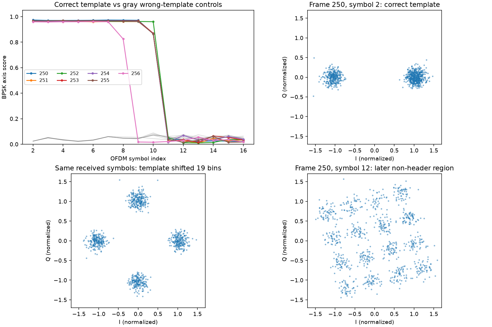

# UT Ku-band post-SSS header recovery

## Motivation

Locate the apparently unencrypted header described by Qin in the clean UT
recording before attempting semantic interpretation or a packet decoder.

## Problem

QPSK constellations alone cannot distinguish headers, scrambled binary
structure, and payload. A reference-driven procedure can also manufacture
apparent agreement if the same template is used to fit channel corrections.

## Solution

Recovered a sharply bounded post-SSS region in all seven complete UT frames.
After channel correction and removal of the published reference template,
these symbols form two antipodal clusters. Frequency-shifted and
symbol-shifted templates fail the same test. This reproduces the reported
header structure, with symbol polarity still ambiguous. It is not a recovered
satellite ID, timestamp, FEC-decoded header, or decrypted user packet.

## Method

Run on 2026-09-27 using the 50 ms, 250 MS/s UT `exemplar250-257.bin` file.
The source, references, metadata and analysis script are SHA-256 bound in
`local/results.json`. All downloaded and derived data remain Git-ignored.
The final incomplete frame 257 is excluded. The acquisition uses author TOAs
to select small search windows, then searches delay and carrier frequency
against PSS+SSS. Thus this is metadata-assisted acquisition, not a blind scan.

### Processing and safeguards

1. Read interleaved little-endian int16 IQ; resample 250 to 240 MS/s (24/25).
2. Search PSS+SSS over +/-2 MHz at 25 kHz spacing, followed by bounded carrier
   refinement. Integer-sample frame starts agree with author TOAs within
   1.71 ns; this comparison is conditional on metadata-centered windows and
   is not an absolute timing accuracy measurement.
3. FFT 1024 samples per OFDM symbol, starting inside the cyclic prefix.
   Estimate the channel from SSS and smooth over nine neighboring bins.
4. Select 857 central non-pilot, non-gutter subcarriers, with normalized
   absolute frequency below 0.42. Conclusions do not cover omitted carriers.
5. Correct per-symbol residual phase slope with a blind fourth-power fit.
   This fit does not use the header reference or a guessed bit sequence.
6. Multiply by the conjugate published template. Measure the magnitude of
   the mean squared unit phasor: `abs(mean((D / abs(D))**2))`.
   BPSK points share a common axis and approach score 1; four equally
   populated phase directions cancel. This is a concentration statistic,
   not a probability, bit accuracy, or encryption detector.
7. Repeat the statistic on the *same corrected samples* with frequency rolls
   of 7, 19, 43 and 101 selected bins, and a template shifted by 17 symbols.
   Controls do not receive favorable refitting.
8. Rotate deviations to their estimated axis for display/export. Each symbol
   retains a global sign ambiguity; this does not affect the axis score.

The template comes from the UT exemplar corpus containing these frames.
This is an intended reference-assisted reproduction, not independent discovery
or evidence that a learned model generalizes to another satellite/capture.

## Findings

OFDM indexing uses PSS=0 and SSS=1. “Clean region” below is the initial
contiguous run with score >0.90, a descriptive threshold selected for this
experiment, not a qualified detector threshold or exact protocol boundary.

| Exemplar frame | Clean post-SSS symbols | Correct-template score range | Maximum wrong-template score |
|---|---|---|---|
| 250 | 2–9 | 0.9703–0.9738 | 0.0590 |
| 251 | 2–9 | 0.9593–0.9624 | 0.0584 |
| 252 | 2–10 | 0.9606–0.9651 | 0.0816 |
| 253 | 2–9 | 0.9658–0.9680 | 0.0590 |
| 254 | 2–9 | 0.9620–0.9658 | 0.0591 |
| 255 | 2–9 | 0.9646–0.9697 | 0.0589 |
| 256 | 2–7 | 0.9581–0.9619 | 0.0614 |

For most frames, symbol 10 is transitional (about 0.87), followed by a score
near the control floor at symbol 11. Frame 256 transitions at symbol 8 (0.83),
then drops at symbol 9. Do not interpret transitional symbols as fully decoded
headers; mixed resource allocation or boundary structure remain possibilities.

Sync correlation spans 0.825–0.965. The estimated carrier correction is about
-170 to -173 kHz; it is not independently established as orbital Doppler.
The header sign patterns vary between frames. Their low lag-60 correlation
distinguishes them from the simple later periodic structures found in some
frames; no T-code semantics are assigned by this experiment.



The top-left panel shows the template match and boundary. The top-right panel
shows two clusters after correct template removal. The bottom-left panel uses
the same received symbol with a wrong template. The bottom-right panel shows
a later region that does not exhibit the header's binary structure.

## Verification

- Four synthetic tests passed: delay/CFO acquisition under noise, blind phase
  slope recovery, correct/wrong-template discrimination, and a noise-only null.
- Repeated the complete experiment with channel smoothing widths 5 and 13.
  Every clean-region endpoint remained unchanged; header scores stayed above
  0.954 and wrong-template scores below 0.083.
- Ruff checks and formatting passed. No production component, persisted
  contract, or golden fixture changed. No radio collection was performed.

## Reproduce

From the repository root, with the catalog's local UT files present:

```bash
uv run --no-project --with numpy==2.5.2 --with scipy==1.18.1 --with matplotlib python reports/2026_09_27_ut_header/test_analyze.py
uv run --no-project --with numpy==2.5.2 --with scipy==1.18.1 --with matplotlib python reports/2026_09_27_ut_header/analyze.py
```

This uses a separate cached research environment; it adds no application
dependency. Python was 3.12.14. Optional sensitivity runs use
`--channel-smooth 5 --out reports/2026_09_27_ut_header/local/smooth5`
and the equivalent width-13 arguments.

Outputs:

- `local/results.json`: input digests, environment, acquisition and per-symbol metrics.
- `local/soft_deviations.npz`: normalized complex template deviations, indexed by
  frame 250–256, symbol 2–301, and the included `subcarriers` array. Signs of
  real components give candidate binary decisions with per-symbol polarity
  ambiguity; values outside the validated early region are exploratory.
- `local/header_evidence.png`: focused comparison above.
- `local/header_structure.png`: whole-frame diagnostic.
- `local/smooth5/` and `local/smooth13/`: sensitivity runs.

## Claim boundary and next step

We found the **reported header's binary structure in real Ku-band IQ**.
That supports pursuing unencrypted control information, consistent with the
[Qin paper](https://www.nature.com/articles/s44459-026-00075-6). It does not by
itself prove all header content is unencrypted, establish bit/byte ordering,
resolve symbol sign, validate FEC/CRC, or identify a semantic field.

The next bounded task is phase/polarity resolution against independent known
symbols, then investigating header coding and interleaving with integrity
checks. Stable symbol patterns must not be labeled spacecraft IDs without
multiple independently labeled satellites and held-out validation.
