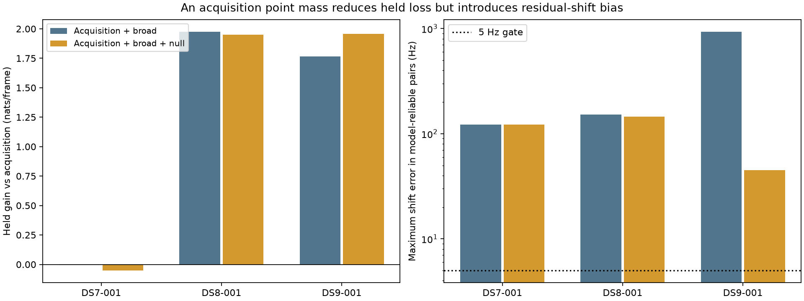

# Acquisition-aware frequency mixtures: reject for residual-frequency correction

**An explicit acquisition-frequency alternative nearly removes the DS7 held
prediction loss, but creates substantial bias when correcting an unchanged
acquisition anchor. Neither new arm passes the frozen gate on any dataset.**
Do not substitute these estimates into the geographic solver. No position fit,
frequency-truth calibration or sub-kilometre improvement is claimed.

This exploratory follow-up reuses all 168 archived pilot frames, 56 from each
dataset's first recording. The earlier results were already exposed. It adds
no recordings or waveform reads, changes no window membership and performs no
geographic filtering. The [protocol](PROTOCOL.md) fixes the new priors before
execution and retains the preceding advance criteria.

## Model and held results

Retain the preceding integrated Gaussian tone-gain model, training-only power
scales, alternating-symbol split and uniform 401-point ±2 kHz frequency grid.
Add a point mass at the acquisition residual frequency, zero. The broad grid
already contains zero; this is extra prior mass at zero, not disjoint support.

| New arm | Acquisition prior | Broad-frequency prior | Noise-only prior |
|---|---:|---:|---:|
| Acquisition + broad | 0.50 | 0.50 | 0 |
| Acquisition + broad + null | 0.25 | 0.25 | 0.50 |

Training evidence updates these weights. Held symbols only evaluate predictions;
they never choose a component or tune the priors. Predictive density is the
weighted sum of component densities, not the weighted average of their log
scores. All components use the same training-derived tone scales. As before,
these empirical-Bayes weights are not calibrated physical signal probabilities.

| Dataset | Arm | Held gain vs acquisition (nats/frame) | Gain vs previous broad + null | Positive windows vs acquisition |
|---|---|---:|---:|---:|
| DS7 | Acquisition + broad | −0.005937 | +0.235944 | 2/4 |
| DS7 | Acquisition + broad + null | −0.051442 | +0.190439 | 2/4 |
| DS8 | Acquisition + broad | +1.975190 | +0.037045 | 3/4 |
| DS8 | Acquisition + broad + null | +1.951022 | +0.012877 | 3/4 |
| DS9 | Acquisition + broad | +1.766131 | −0.337750 | 3/4 |
| DS9 | Acquisition + broad + null | +1.957988 | −0.145892 | 3/4 |

Means weight the four windows equally; each window has 14 frames. All original
five arms were replayed and agree with their published predictions within
1e−8. Full old/new per-frame predictions and component weights are retained in
each dataset's `result.json`. Window-level comparisons are in [scores.json](scores.json).

The null component changes held gain by −0.045505 nats/frame on DS7, −0.024168
on DS8 and +0.191857 on DS9. Retaining acquisition is useful for prediction in
some cases, but an aggregate gain does not establish unbiased frequency recovery.
The acquisition itself was selected from the original probe, including the
later-held symbols; this is conditional refinement evaluation, not independent
validation of the acquisition stage.

## Known-shift bias and coverage

Apply ±250 Hz ramps to each already-demodulated matrix. Translating **both** the
frequency grid and acquisition point with the known shift preserves component
weights, posterior means (after translating back) and held predictions within
3.76e−12 in all 672 arm/frame/shift cases. This checks a change of coordinates.

Keeping the grid and acquisition point fixed is different: the added point mass
continues to favor the original frequency even after a residual shift. The
following errors are measured against the known injected increment. They are
diagnostics of correcting an unchanged acquisition anchor, not proof that an
end-to-end acquisition/refinement chain would fail if acquisition were rerun.

“Reliable” is the protocol's training-only rule: both signal weights above .99
and at least .99 of the original conditional signal mass remaining inside the
shifted fixed interval. It is not an independently calibrated reliability label.
In the no-null arm, signal weight is one by construction and provides no
weak-signal protection.

| Dataset | Arm | Reliable pairs / all | Reliable errors >5 Hz | Max reliable error (Hz) | Max all-pair error (Hz) |
|---|---|---:|---:|---:|---:|
| DS7 | Acquisition + broad | 112/112 | 100 | 121.749 | 121.749 |
| DS7 | Acquisition + broad + null | 94/112 | 85 | 121.749 | 121.749 |
| DS8 | Acquisition + broad | 112/112 | 96 | 151.804 | 151.804 |
| DS8 | Acquisition + broad + null | 104/112 | 90 | 144.957 | 151.804 |
| DS9 | Acquisition + broad | 94/112 | 77 | 932.347 | 932.347 |
| DS9 | Acquisition + broad + null | 44/112 | 32 | 45.193 | 932.347 |

No pairs are silently removed. Both arms fail the ≤5 Hz reliable-pair gate on
every dataset; both also retain a negative DS7 held gain versus acquisition.
The earlier broad-frequency model's reliable-pair shift errors were below
0.000001 Hz. This comparison isolates the cost of anchoring additional prior
mass at zero. It does not imply that model averaging or physically justified
frequency priors are universally inappropriate.

## Noise controls

Score the same symbol-wise QPSK scrambled held values using unchanged training
weights. No control tunes a parameter. Means relative to noise-only are:

| Dataset | Arm | Real (nats/frame) | Scrambled (nats/frame) |
|---|---|---:|---:|
| DS7 | Acquisition + broad | +54.616122 | −33.653178 |
| DS7 | Acquisition + broad + null | +54.570617 | −24.729314 |
| DS8 | Acquisition + broad | +52.897238 | −34.894312 |
| DS8 | Acquisition + broad + null | +52.873070 | −26.722196 |
| DS9 | Acquisition + broad | +60.585619 | −37.718147 |
| DS9 | Acquisition + broad + null | +60.777477 | −34.331157 |

Both models predict the real pilot data better than noise on average, but that
does not rescue their residual-shift bias. Correlated frames and one scramble
per frame do not support population false-positive claims.

## Validation, provenance and reproducibility

Five component tests pass, covering mixture normalization, equivalence to
joint/train evidence, held-weight isolation and the underlying Gaussian model:
[tests.log](tests.log). All three bounded jobs exited zero. Each used one numerical
thread, nice19, a 60-second/2-GiB cap and the workspace Python environment.
Jobs ran sequentially without retries. Exact measured resources and commands
are stored in each dataset directory. No IQ, RF or catalogue work was added.

The runner replays 1,680 preceding real/control predictions. A separate scorer
reconstructs all 672 new predictions directly as joint/train component evidence
ratios using a different log-sum reduction. Maximum disagreement is 5.69e−14.
It also verifies component-weight normalization and source/input hashes.

Two cosmetic lint adjustments were made after execution: import grouping and
an unused-import annotation. Exact executed source copies are preserved under
`executed-source/`, mapped by [executed-source-map.json](executed-source-map.json).
The scorer verifies that finalized and executed versions have identical Python
ASTs, and validates launch hashes against the exact archived bytes. No executed
scientific computation was changed. Ruff checks pass for the finalized source;
the immutable historical copies retain their original cosmetic diagnostics.

- [Model averaging helper](../../tools/ds789_acquisition_mixture.py), [runner](run.py), [launcher](launch.py), [scorer/audit](score.py), [plotter](plot.py).
- Each dataset's `result.json` retains training evidences, component weights,
  original and new predictions, and every injection diagnostic.
- [Scores and audit counts](scores.json), [evidence inventory](evidence-sha256.json), [SVG figure](acquisition-mixture.svg).
- [Underlying frequency model](../2026_09_28_pilot_frequency_mixture/README.md)
  supplies integrated-gain assumptions and its dense covariance verification.
- [Original waveform evidence](../2026_09_28_pilot_split_transfer/README.md)
  supplies the candidate-bound matrices. They are hash-bound, not duplicated.

Replay only in a separate checkout/output copy; scripts use exclusive output
creation to protect this record. Replaying the numerical experiment requires
the archived matrices and NumPy, not the original IQ storage.

## Next modeling priority

Stop tuning an acquisition point mass on this exposed panel. The three waveform
experiments have not justified a global frequency correction. Return to direct
geographic comparisons using the existing eight-record panels from DS7, DS8
and DS9: test one shared position across the 24 records and transfer when an
entire dataset is held out. Keep the larger observation budget distinct from
the earlier eight-record fits, and retain held-likelihood checks alongside
geographic error. Reliable sub-kilometre accuracy remains unproven.
