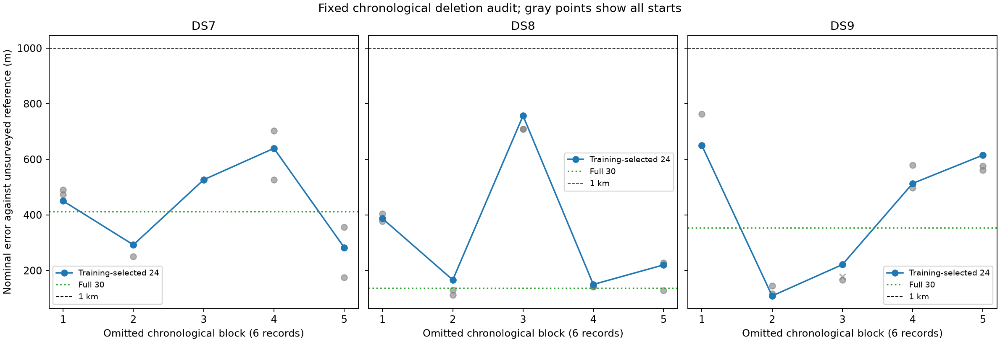

# Chronological-block deletion robustness of DS7/DS8/DS9 localization

All **15 training-selected deletion fits remain below 1 km**. Worst selected
errors are **DS7 639.571 m, DS8 756.744 m and DS9 649.950 m**. All 45 returned
starts, including one unqualified optimizer result, are below 762.340 m.
The expanded-panel result therefore survives every planned six-record temporal
deletion. This supports robustness within these panels; it does not yet verify
the full DS7/DS8/DS9 populations or surveyed accuracy.

This audit tests the dependence of the
[30-record shared-scale results](../2026_09_28_combined30/README.md) on recording
coverage. It removes each of five consecutive six-record blocks from each
dataset and refits the remaining 24 records. All 15 dataset/block combinations
are fixed before execution. The complete 30-record errors were 411/135/352 m
for DS7/DS8/DS9; they are comparisons, never initializations or fallbacks.

## Geographic results

| Omitted chronological block | DS7 selected error (m) | DS8 selected error (m) | DS9 selected error (m) |
|---|---:|---:|---:|
| 1 | 450.180 | 386.861 | 649.950 |
| 2 | 292.351 | 166.216 | 108.600 |
| 3 | 526.549 | 756.744 | 221.322 |
| 4 | 639.571 | 149.882 | 513.430 |
| 5 | 282.733 | 220.172 | 615.204 |
| Full 30, no deletion | 411.107 | 135.092 | 352.435 |

Gray circles show all qualified starts; the gray cross is the rejected DS9
block-3 northwest result. The blue line selects by training likelihood, not
distance to the reference. Worst errors across all starts are 703.101 m for
DS7, 756.744 m for DS8 and 762.339 m for DS9. Thus the sub-kilometre conclusion
does not depend on the optimizer selecting the geographically closest start.

Sensitivity is nevertheless substantial. Omitting DS8's third block moves the
selected error from 135 to 757 m. Omitting DS9's earliest six recordings moves
its error from 352 to 650 m, while removing its second block reduces it to
109 m. These are descriptive changes from losing a specific collection of
records. Time coverage, rate mix and observation content change together; this
is not a causal estimate of dwell time, sample rate or clock drift.

## Retained-data prediction

| Dataset | Omitted block | Union held change (nats) | Outside held change (nats) |
|---|---:|---:|---:|
| DS7 | 1 | -1.044 | +102.123 |
| DS7 | 2 | -2.313 | +5.625 |
| DS7 | 3 | +9.098 | -7.145 |
| DS7 | 4 | +5.441 | +80.071 |
| DS7 | 5 | +2.995 | +66.474 |
| DS8 | 1 | -5.352 | +15.275 |
| DS8 | 2 | +9.431 | -0.256 |
| DS8 | 3 | -13.944 | +29.219 |
| DS8 | 4 | +6.349 | -2.252 |
| DS8 | 5 | +13.523 | -6.659 |
| DS9 | 1 | +4.730 | +1.685 |
| DS9 | 2 | -3.877 | +5.668 |
| DS9 | 3 | +9.075 | -9.155 |
| DS9 | 4 | -11.443 | +16.253 |
| DS9 | 5 | +4.591 | +1.547 |

Nineteen of 30 constituent-panel comparisons improve. Summed over both retained
panels within each deletion, held scores improve in 14 of 15 cases; DS9 block 3
loses 0.080 nats. These improvements concern the records still used for training,
with their held visits preserved, and do not imply better prediction of omitted
recordings. Do not aggregate the overlapping deletion fits as independent data.

Two selected DS8 fits (blocks 2 and 4) have 3.679 and 2.452 fewer training nats
than the full-30 fit restricted to those retained records. The latter is a
feasible better point, revealing residual local optimization sensitivity.
It is not substituted: the frozen audit forbids initialization or fallback
from the complete-data fit. All alternatives and score deltas remain archived;
the fits are qualified local solutions, not certified global optima.

## Qualification and numerical checks

Forty-four of 45 source fits qualify. DS9 block 3's northwest fit reports
`ABNORMAL` optimizer termination, gradient infinity norm 0.001063 and nominal
error 177.845 m. It has 46.653 fewer training nats than the selected southeast
fit. Small gradient and low error do not override the success gate. Its two
qualified alternatives suffice for selection; no retry or fallback occurs.

All 60 scientific processes exit zero: 45 fits and 15 selected-point audits.
Every selected fit passes all numerical checks. Across 60 E/N gradient
comparisons at 1 m/0.5 m, maximum discrepancy is 6.546e-5 against tolerance
0.002. Training replays, row sums and matched track/count checks pass within
their declared tolerances. The scorer verifies 698 execution/input bindings,
reconstructs every omitted and retained record from the original combined plan,
and confirms all 90 distinct records appear in exactly four retained panels.

Six existing scientific tests pass in [tests.log](tests.log), and all four
report scripts pass Ruff lint and formatting checks. Maximum job wall time is
51.10 seconds, maximum RSS 1,781,296 KiB, and summed job wall time 1,637.32 seconds
(not elapsed campaign duration). There are no process failures or timeouts.
The one optimizer failure remains explicit above.

## Frozen design

[PROTOCOL.md](PROTOCOL.md) fixes the unchanged shared-track-scale likelihood,
all deletion blocks, three generic geographic starts and qualification gates.
Each unit starts at E/N (0,0), (3,-3) and (-3,3) km with all timings zero.
The model uses multivariate Student-t4 residuals at 100 Hz scale, a diagonal
scale matrix, shared latent track scale and the existing weak offset prior.
Candidate banks, visibility, catalogue normalization and whole-visit training
partitions remain unchanged.

L-BFGS-B uses maxiter 140/maxfun 200, ftol 1e-14, gtol 1e-8 and maxls 30,
with bounds ±12 km and ±5 seconds. Qualification requires optimizer success,
interior parameters and gradient infinity norm ≤0.01. Selection uses only the
greatest training score among qualified starts. There are no retries, relaxed
gates or previous-fit fallback. No omitted-record observations enter a refit.

The five blocks are consecutive by recording index, not equal-duration time
windows. Block numbers in this report are one-based; `block0` through `block4`
in artifact paths are zero-based. The first block consists entirely of six
early union-panel recordings for every dataset. The later blocks mix union
and outside-panel recordings. Each original record is retained in four fits
and omitted in one, so the resulting fits and their scores are dependent.

| Omitted block | DS7 capture-start span (h) | DS8 capture-start span (h) | DS9 capture-start span (h) |
|---|---:|---:|---:|
| 1 | 0.589 | 0.590 | 0.589 |
| 2 | 1.531 | 1.296 | 1.886 |
| 3 | 2.003 | 1.768 | 2.474 |
| 4 | 2.002 | 1.416 | 2.475 |
| 5 | 2.121 | 1.530 | 2.592 |

These are intervals between the first and last omitted capture starts, not
active dwells or total acquisition time. The exact omitted IDs and original
panel labels are in [plan.json](plan.json).

## Prediction comparisons and limits

Held predictions are evaluated on the **retained 24 records**, comparing each
refit's rows with the matching rows from the full 30-record fit. Original
union/outside membership is preserved in separate aggregates. Counts change
between deletion blocks, but each individual comparison matches exact track
identities and held observation counts. Positive differences favour the refit.
This audit does not predict the omitted six recordings. It measures geographic
sensitivity to a temporal coverage gap and prediction changes on retained data.

The 30-record source panel was assembled from previously studied recordings.
Neither model choice, records nor reference are research-blind. Distances use
an exposed, unsurveyed operator reference; the inherited origin is already
809 m away. A sub-kilometre deletion result is not surveyed accuracy, confidence
coverage, full-dataset validation or cross-site evidence. The 15 overlapping
fits are not 15 independent experimental replications. Held likelihood and
geographic error remain distinct criteria.

## Evidence and reproduction

Run order is `prepare.py`, `launch.py source`, `launch.py transfer`, then
`score_plot.py`. Here the transfer phase selects source fits and performs their
held/numerical audits; there are no excluded-dataset target fits. The launcher
preserves commands and runtime in `launch.json`, uses exclusive directories,
and seals each stage's logs, results, resources and exit code.

The prepare step binds the full combined plan, original dataset and pose
authorities, all existing scientific inputs, and full-panel comparison results.
The runner loads only the 24 retained records. The scorer reconstructs every
deletion from the original chronological membership, verifies starts and
qualification decisions, and preserves all alternative errors. Retained
training scores replay within 1e-7, numerical positional gradients are checked
at 1 m/0.5 m with tolerance 0.002, and distances receive an independent spherical
vector check.

[scores.json](scores.json) contains all selections, alternatives, omitted IDs,
track/observation counts, per-panel and per-record held changes and gradient
checks. [resource-summary.json](resource-summary.json) retains every process
receipt. [evidence-sha256.json](evidence-sha256.json) binds the report and its
dependencies, excluding itself. Input archives were already published with
the preceding studies. Existing component code and golden fixtures are unchanged.

Each scientific process is capped at 180 seconds/4 GiB, BLAS1/nice19, at most
two concurrent workers. No new export, waveform read, provider fetch, orbit
propagation or RF collection occurs.

## Decision and next step

Keep shared track scale with broad within-dataset coverage as the leading
approach. It now gives sub-kilometre nominal results in all three 30-record
fits and all 15 fixed 24-record deletion fits, across diverse generic starts.
This is materially stronger than the earlier success on a single chosen
15-record panel; the outside-only DS9 failure remains part of the evidence.

The next gap is population coverage: these experiments use 30 of 88 DS7,
30 of 65 DS8 and 30 of 105 DS9 recordings. Audit remaining cached scientific
inputs and extend the same fixed model toward complete manifest membership
in bounded batches. Keep each dataset's estimate independent, retain generic
starts and qualification checks, and report any missing or ineligible inputs
instead of silently treating these panels as complete datasets. The local
optimization gaps above also remain a caveat; expanding data is not proof of
global optimization or a calibrated confidence radius.
