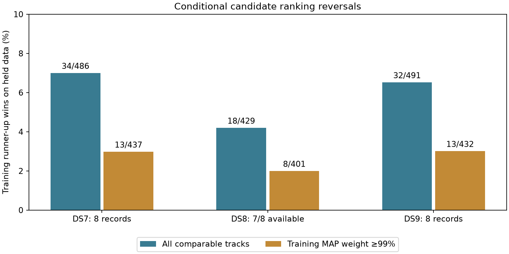

# Candidate discrimination across DS7/DS8/DS9

**Most training-selected candidates retain their predictive advantage on held
observations, conditional on the existing position and nominee bank.** The
training runner-up wins on 34/486 DS7 tracks, 18/429 DS8 tracks and 32/491 DS9
tracks. These are ranking reversals, not measured satellite-identification
errors: neither candidate has independent physical truth labels.

The audit also finds that **453/491 DS9 tracks keep the same top candidate**
between independent and pooled location fits. Those unchanged-MAP tracks
account for **524.630 of the 549.943 nats of net pooled held-score loss**.
Thus candidate-label changes do not account for most of that predictive loss.
The result directs attention toward systematic measurement/orbit/timing effects
within retained hypotheses, rather than assuming that another candidate-ranking
adjustment alone will repair the geographic gap.

## Coverage and primary comparison

Membership is the first eight chronological baseline records of each dataset.
**23/24 records and 1,406 tracks were audited.** DS8-008 retains its earlier
candidate-bank timeout and is unavailable; no record was replaced. All 23
available baseline estimates were qualified. No location was refitted or
scored against geographic truth in this audit.

| Conditional diagnostic | DS7 | DS8 | DS9 |
| --- | ---: | ---: | ---: |
| Audited / selected records | 8/8 | 7/8 | 8/8 |
| Tracks with a visible alternative | 486/486 | 429/429 | 491/491 |
| Training runner-up wins on held data | 34/486 (7.00%) | 18/429 (4.20%) | 32/491 (6.52%) |
| Same rate, equal weighting per record | 7.00% | 4.16% | 6.48% |
| Tracks with training MAP weight ≥99% | 437 | 401 | 432 |
| Runner-up held wins in that subgroup | 13/437 (2.97%) | 8/401 (2.00%) | 13/432 (3.01%) |
| Median training MAP–runner-up gap (nats) | 61.704 | 66.044 | 48.877 |
| Mixture excluding MAP beats original mixture on held data | 39/486 | 19/429 | 38/491 |
| Summed alternative-minus-original held score (nats) | -36,759.282 | -34,710.472 | -31,832.115 |

Every track has at least two visible nominees here, so there are no hidden
single-candidate exclusions. Alternatives are chosen by training score, with
catalogue-number tie breaking; held data never selects the runner-up. For the
second comparison, the MAP candidate is removed and all remaining nominees
retain normalized **training** weights. Each nominee uses its own offset fitted
only to training observations. This is a counterfactual predictive calculation
at the original position, not a position refit with the winner excluded.

A ≥99% training weight is conditional on the likelihood, profiled offsets and
retained bank. The held reversal rate is not a calibration curve for physical
identity correctness, and should not be compared directly with a claimed 1%
identification-error bound. Outcomes are also clustered within recordings;
these counts do not establish independent-trial population error rates.

## Every selected recording

| Unit | Tracks | Runner-up held wins | ≥99% weight tracks | Held wins in ≥99% subgroup |
| --- | ---: | ---: | ---: | ---: |
| DS7-001 | 56 | 5 | 45 | 1 |
| DS7-002 | 59 | 3 | 54 | 1 |
| DS7-003 | 61 | 4 | 57 | 2 |
| DS7-004 | 63 | 10 | 53 | 5 |
| DS7-005 | 60 | 2 | 60 | 2 |
| DS7-006 | 61 | 3 | 55 | 2 |
| DS7-007 | 64 | 0 | 59 | 0 |
| DS7-008 | 62 | 7 | 54 | 0 |
| DS8-001 | 64 | 4 | 58 | 0 |
| DS8-002 | 64 | 4 | 60 | 2 |
| DS8-003 | 63 | 1 | 57 | 1 |
| DS8-004 | 64 | 3 | 61 | 2 |
| DS8-005 | 59 | 2 | 57 | 1 |
| DS8-006 | 60 | 2 | 57 | 1 |
| DS8-007 | 55 | 2 | 51 | 1 |
| DS8-008 | — | Prior bank-export timeout | — | — |
| DS9-001 | 64 | 10 | 54 | 5 |
| DS9-002 | 61 | 3 | 51 | 1 |
| DS9-003 | 59 | 1 | 55 | 0 |
| DS9-004 | 64 | 1 | 60 | 0 |
| DS9-005 | 62 | 4 | 56 | 3 |
| DS9-006 | 60 | 5 | 49 | 2 |
| DS9-007 | 60 | 6 | 55 | 2 |
| DS9-008 | 61 | 2 | 52 | 0 |

These are chronological development panels, not complete DS7/DS8/DS9 surveys.
Track counts and observation support vary; no sample-rate or receiver causal
effect is inferred from the pooled counts.

## Why the DS9 joint fit loses held score

The earlier [DS8/DS9 panel report](../2026_09_28_ds89_baseline_panel/README.md)
found a 1,212.955 m DS9 pooled estimate versus a 4,777.534 m median individual
error. Its held prediction worsened on all eight records. This audit aligns
the existing independent and joint outputs by session, exact track ID and
the same candidate-bank artifact bytes; it does not generate new fits.

| Candidate-MAP comparison | Tracks | Joint-minus-independent held score | Tracks with positive held change |
| --- | ---: | ---: | ---: |
| Same top candidate | 453 | -524.630 nats | 202 |
| Changed top candidate | 38 | -25.313 nats | 19 |
| Total | 491 | -549.943 nats | 221 |

MAP changes per recording are 5, 8, 1, 4, 3, 5, 6 and 6, in chronological
order. About 95.4% of the **net** loss lies in the unchanged-MAP group. This
partition is descriptive: positions, timing, offsets and non-MAP weights also
change, so it is not a causal ablation that holds association uncertainty fixed.
Stable MAP labels are not independent proof of correct identities; a retained
bank can omit the real emitter or contain a systematically favored proxy.

The [complete summary](summary.json) includes per-track catalogue comparisons;
the [held-loss partition](joint-change-summary.json) records the two sums.

## Existing tests reviewed before this audit

- The [earlier search results](../2026_09_27_ds7_wave2/RESULTS.md) tested additional
  starts and a fixed constant-frequency null on the first DS7 recording. They
  did not establish broad wrong-association rejection or physical labels.
- The [orbit-increment study](../2026_09_28_rx_orbit_increment/README.md) already
  tested zero, reversed and shifted motion on a different reception-forecast
  likelihood. It supports short-horizon prediction, not the absolute identities
  of these stationary-position fits. Repeating that test would not answer this
  conditional ranking question.
- The [track-competition semantics audit](../2026_09_28_rx_track_competition/SEMANTICS.md)
  documents cross-receiver duplicate hypotheses and unresolved physical
  coexistence. It does not justify forcing all overlapping receiver tracks to
  share one satellite or treating each track as a separate physical emitter.
- The [noise-scale pilot](../2026_09_28_track_scale_pilot/README.md) improved held
  prediction while worsening geographic error on all three tested recordings.
  Better residual likelihood therefore remains an insufficient promotion rule.

No new cross-receiver identity constraint was imposed here.

## Method, verification and reproducibility

The [protocol](PROTOCOL.md) and [24-row plan](plan.json) were frozen before the
bounded replay. The original Student-t(4,100 Hz) candidate profiles, stationary
offset penalty, visibility rule, full-catalogue normalization, visit masks,
positions and timing offsets remain unchanged. The numerical audit reads no
pose authority. It uses candidate identifiers from the exact bound NPZ row
ordering rather than inferring identifiers from track names.

All 23 training-score sums reproduce their historical response within absolute
1e-8; all held-score sums reproduce the previously published held references
within 1e-8. The [independent arithmetic audit](summarize.py) checks **168 distinct
launch/fit bindings** and independently recomputes all **1,406** normalized
weight, ranking and predictive comparisons from saved scores. It additionally
verifies the published DS9 joint request/response/held artifact hashes, input
equality and exact track ordering before comparing MAP identifiers. It is not
a second optimizer or independent physical validation.

[Three component tests pass](tests.log): training-only alternative selection
and row-permutation invariance, normalized predictive mixtures including a
high-weight ranking-reversal counterexample, and invisible/single-candidate
handling. Ruff passes. The final visualization was inspected.

| Replay worker | Wall time | Maximum RSS | Exit code |
| --- | ---: | ---: | ---: |
| DS7 | 7.02 s | 235,860 KiB | 0 |
| DS8 | 6.11 s | 241,072 KiB | 0 |
| DS9 | 5.21 s | 220,252 KiB | 0 |

Each worker had a 120-second/4-GiB limit, one numerical thread and nice19.
DS7/DS8 ran concurrently, followed by DS9. No new failure, retry, propagation,
IQ processing, RF collection or source-store mutation occurred. The earlier
DS8-008 preparation failure is preserved in both the plan and summary.

[Results](results/) retain candidate IDs, training scores, weights, offsets,
held scores and comparisons for every audited track. [Receipts](receipts/)
bind inputs, commands and terminal outputs. The [evidence index](evidence-sha256.json)
and [input archive map](input-archive-map.json) cover replay dependencies,
including exact DS7 candidate-bank bytes formerly addressed through local cache
paths. Existing DS8/DS9 banks and the first DS7 bank remain in their earlier
published reports. Restore archived bytes or create freshly rebound requests
when replaying at a different checkout path; do not alter historical seals.

## Consequence for the sub-kilometer effort

Do not replace the baseline's top candidate with its runner-up based on these
held outcomes, and do not promote likelihood concentration to satellite identity
confidence. Most retained top candidates have a real conditional predictive
advantage, while systematic location disagreement remains within largely stable
labels. The audit neither certifies those identities nor rules out missing
catalogue candidates.

Next, prioritize **structured residual effects within stable hypotheses** and
independent orbit/timing evidence. Any correction needs defensible constraints
and an identifiability check; the prior free-slope and noise-scale regressions
remain negative controls. Broader candidate coverage remains a separate open
question, not a reason to reinterpret the retained-bank weights as truth.
This audit changes the diagnosis, not geographic performance: the sub-kilometer
objective remains unmet and the DS8 eight-record pooled comparison is still
unavailable.
