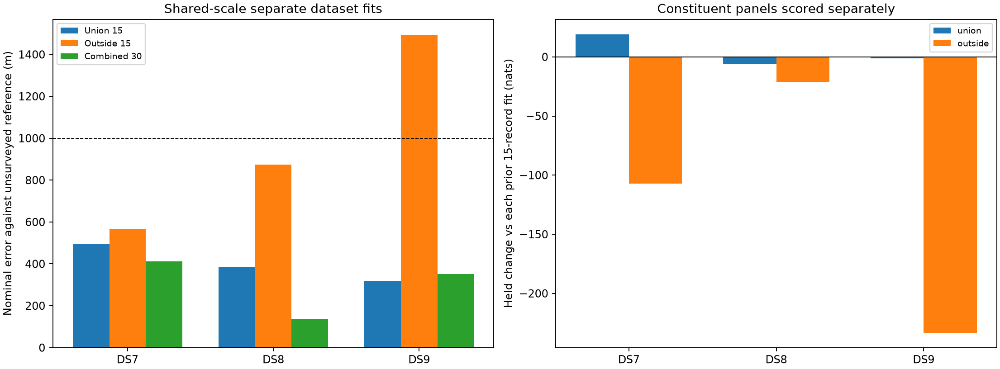

# Shared-scale localization with 30 recordings per dataset

All three separate-dataset fits are below 1 km: **DS7 411 m, DS8 135 m and
DS9 352 m**. All nine geographic starts qualify and fall below 412 m. Expanding
the existing evidence resolves the outside-panel DS9 failure for these combined
fits without changing the likelihood. This establishes a sub-kilometre nominal
result on the expanded panels, not surveyed accuracy or full-dataset robustness.

This experiment combines the two previously evaluated, disjoint 15-record
panels for each of DS7, DS8 and DS9. Each dataset receives its own independent
30-record position fit. No observations from another dataset enter that fit.
The complete 90-record membership is fixed before optimization; no records are
dropped or replaced based on outcomes.

## Results and ablation

| Dataset | Union 15 error (m) | Outside 15 error (m) | Combined 30 error (m) | Range across all three combined starts (m) |
|---|---:|---:|---:|---:|
| DS7 | 496.517 | 564.109 | **411.107** | 298.830–411.109 |
| DS8 | 386.367 | 875.002 | **135.092** | 115.793–155.660 |
| DS9 | 318.854 | 1,492.941 | **352.435** | 315.500–352.435 |

All three training-selected winners start southeast. DS7's origin start is
closer to the reference at 298.830 m but has 194.027 fewer training nats, so it
is not selected. DS8's northwest start reaches 115.793 m but has 379.093 fewer
nats. DS9's northwest start reaches 315.500 m but has 110.072 fewer nats.
The result is not produced by choosing the geographically closest start.
DS7's southeast and northwest fits are effectively training-score ties
(6.3e-9 nats difference); their errors differ by only 0.003 m.

The substantive change from the outside-panel model is the addition of all 15
union recordings for that same dataset, with the same generic geographic
starts as the original outside experiment. No receiver tilt, identity label,
new residual model or reference-derived penalty is introduced. The DS9 error
reduction from 1,493 to 352 m therefore supports broader within-dataset evidence
as a useful approach, but does not show that every added recording is helpful
or that a particular physical bias has been corrected.

| Dataset | Union held change (nats) | Positive union records /15 | Outside held change (nats) | Positive outside records /15 |
|---|---:|---:|---:|---:|
| DS7 | +19.109 | 8 | -107.090 | 5 |
| DS8 | -6.202 | 8 | -21.029 | 6 |
| DS9 | -1.425 | 7 | -233.244 | 6 |

Training changes on union/outside are -30.086/-44.781 nats for DS7,
-29.935/-35.221 for DS8 and -20.119/-97.666 for DS9. Sharing one position across
both panels imposes a prediction cost relative to separately fitted positions.
The geographic gain coexists with lower held prediction on five of six panel
comparisons. In particular, DS9's previously failing outside panel loses 233.244
held nats. This is a limitation of the current likelihood as a geographic
selection criterion, not evidence to suppress or reinterpret as improvement.

| Dataset | Records | Eligible tracks | Training observations | Held observations |
|---|---:|---:|---:|---:|
| DS7 | 30 | 1,777 | 49,953 | 33,424 |
| DS8 | 30 | 1,775 | 48,483 | 31,892 |
| DS9 | 30 | 1,822 | 50,530 | 34,216 |
| Total | 90 | 5,374 | 148,966 | 99,532 |

## Design and comparison

The [union panel](../2026_09_28_union_panels/README.md) produced shared-scale
separate errors of 497/386/319 m. The
[outside panel](../2026_09_28_timing_grid/README.md) produced 564/875/1,493 m.
The two timing audits did not resolve outside-panel DS9. The present experiment
tests whether using both panels together stabilizes separate-dataset estimates.
It is an exposed-data follow-up, not a fresh independent validation.

Only the leading shared-track-scale likelihood is evaluated: multivariate
Student-t4 at 100 Hz scale with a diagonal scale matrix and shared latent
track scale. The weak offset prior, candidate banks, visibility, catalogue
normalization and whole-visit training split remain unchanged. This selection
of model follows earlier geographic results and is not blind model selection.

Three generic geographic starts per dataset are E/N (0,0), (3,-3) and (-3,3) km,
all with zero record timings. These match the original outside-panel starts;
they differ from the union experiment's source-informed starts. Thus the union
comparison changes both membership and initialization. No prior panel's
selected geographic point seeds a combined fit.

[PROTOCOL.md](PROTOCOL.md) fixes L-BFGS-B maxiter 140/maxfun 200, ftol 1e-14,
gtol 1e-8 and maxls 30; bounds ±12 km and ±5 seconds. Qualification requires
optimizer success, interior parameters and gradient infinity norm ≤0.01.
Selection maximizes training score among qualified starts. There is no
previous-fit fallback, retry, relaxed gate or reference-based selection.

Held comparisons retain exactly each constituent panel's tracks and held
observation counts. They compare the new combined fit with the original union
selected fit and the latest outside timing-grid selected fit. New and prior
fits use their own training-fitted locations, timings and offsets. These are
descriptive likelihood comparisons; pooling data changes the fitted parameters.
Positive held changes favour the combined fit. All scores are reported
separately by constituent panel to expose unequal effects.

## Evidence and reproduction

All 12 scientific processes exit zero, all nine source fits qualify, and all
three selected-point audits pass. All 12 positional gradient comparisons at
1 m and 0.5 m pass; the largest discrepancy is 3.031e-5 against tolerance 0.002.
Selected training scores and row sums replay within 1e-7. Both panel track
sets and held counts match their previous results exactly. All 90 recording
identities are distinct, and independent spherical-vector distance checks pass.

The scorer verifies 453 execution/input bindings, including the dataset and
pose authorities. Six existing scientific tests pass in [tests.log](tests.log),
and all four report scripts pass Ruff lint and format checks. Each process is
capped at 180 seconds/4 GiB, BLAS1/nice19, at most two workers. Maximum duration
is 41.66 seconds, maximum RSS is 2,170,508 KiB, and summed job wall time is
358.28 seconds. No timeouts, optimizer failures or retries occur.

[plan.json](plan.json) records all 90 session identities, chronological order,
original panel membership, manifests, pose authorities, input artifacts,
comparison baselines and exact starts. [prepare.py](prepare.py) checks that the
panels are disjoint and that artifact and pose bytes match their authorities.
The ordinary baseline loader revalidates the scientific documents for each job.
No new export, orbit propagation, provider fetch, waveform read or RF collection
occurs. Existing scientific component implementations remain unchanged.

Run order is `prepare.py`, `launch.py source`, `launch.py transfer`, then
`score_plot.py`. The transfer phase only selects source fits and evaluates
their held observations; this experiment has no excluded-dataset targets.
Commands and exact scientific runtime are retained in each stage's launch
receipt. Stage directories are exclusive and cannot silently overwrite results.

[scores.json](scores.json) preserves every source fit, selected points,
geographic errors, per-panel and per-record score changes, observation counts
and numerical audits. [resource-summary.json](resource-summary.json) retains
resource receipts. Per-stage logs, exit codes and seals remain archived.
[evidence-sha256.json](evidence-sha256.json) binds this report and its dependencies,
excluding itself. Source inputs were already published with the earlier reports.

## Interpretation limits

Distances use the same exposed, unsurveyed operator reference. The inherited
origin is already 809 m away. The 90 recordings are an expanded sample of the
datasets, not their full 88/65/105-record populations. Original first-eight
coverage contributes dense early observations; this combined membership is
not uniform random sampling. No claim of surveyed accuracy, calibrated
confidence coverage, new-site transfer or certified blind validation follows.
Held likelihood and geographic error remain distinct outcomes.

## Next robustness check

Retain the shared-scale 30-record fit as the leading separate-dataset result.
Before claiming consistent sub-kilometre performance, test its dependence on
recording coverage. A fixed five-block chronological deletion audit can remove
six consecutive records at a time from each dataset, refit the remaining 24
from the same three generic starts, and retain all 15 dataset/block outcomes.
This uses the existing banks and tests sensitivity to losing a temporal region.
Do not initialize from the complete 30-record fit or select deletions using
errors. Freeze the split and gates before execution; report worst-case errors
and qualification failures, not only mean performance. This is a proposed next
test, not a completed robustness claim.
