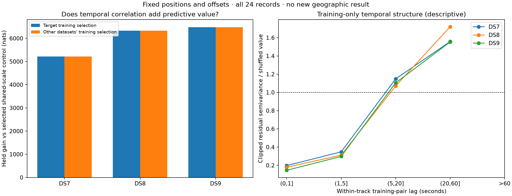

# Temporal covariance screen on DS7, DS8 and DS9

**A correlated residual model passes the fixed-position predictive screen on
all three datasets.** Training independently selects the same 10-second
correlation decay and 100 Hz scale in DS7, DS8 and DS9. Selecting parameters
using the other two datasets gives the same choice. Held likelihood improves
in every one of the 24 records beyond the shared-scale, zero-correlation control.

This supports a bounded geographic refit as the next experiment. It does **not**
establish improved position accuracy: every geographic position, timing and
per-candidate offset was frozen at the original eight-record baseline fit.
Correlation can explain residuals while reducing positional information.

## Design

The preceding [transfer-loss audit](../2026_09_28_transfer_loss_audit/README.md)
showed widespread held losses even with unchanged MAP candidates. This screen
tests residual dependence as a separate modeling hypothesis. It uses the same
first eight records per dataset, all 1,462 eligible tracks and 26,065 held
observations. No waveform reads, new satellite propagation, track deletion or
RF collection was needed.

Fifteen arms were specified in the [protocol](PROTOCOL.md) before execution:

- Independent Student-t4 observations at scale 100, 300 or 1,000 Hz.
- One multivariate Student-t4 per track, at the same scales, with correlation
  decay 0, 1, 10 or 60 seconds. Zero decay is defined as an identity scale
  matrix. Positive decay uses `sigma² × [0.8 exp(-|dt|/tau) + 0.2 I]`.

The 20% diagonal nugget is fixed. Marginal variance is twice the scale matrix;
100 Hz denotes the Student-t scale, not its standard deviation. The
zero-correlation multivariate control still shares a latent scale across the
track, so it is distinct from independent Student-t errors.

Each arm recomputes training candidate weights using the marginal training
density, unchanged weak offset penalty, visibility and full-catalogue
normalization. Held prediction is the exact joint-to-training mixture density
ratio. It conditions on training values, with the appropriate multivariate-t
conditional scale and degrees of freedom. Held observations do not fit
parameters or select arms. The original offsets were fitted under the iid
model and have not yet been optimized for the covariance model.

Selection maximizes summed training likelihood within each family: iid,
multivariate zero-correlation, and positive-correlation. Donor selection uses
the other two datasets' training scores; the target retains its own original
training-fitted position and offsets. **This is covariance hyperparameter
transfer, not geographic leave-one-dataset-out validation.**

## Predictive ablation

All entries below are held likelihood gains against original iid Student-t4,
100 Hz, in nats. Larger is better. Models use the same fixed positions, offsets,
observations and candidate banks. Complete training and held scores for all
45 dataset/arm combinations are in [all-arms.csv](all-arms.csv).

| Change from original model | DS7 | DS8 | DS9 |
|---|---:|---:|---:|
| Broaden independent scale to 300 Hz | −1,020.073 | −1,018.227 | −26.955 |
| Broaden independent scale to 1,000 Hz | −8,867.479 | −9,232.518 | −7,075.239 |
| Shared track scale; zero correlation; 100 Hz | +2,674.107 | +2,606.603 | +3,570.735 |
| Shared scale + 1-second correlation; 100 Hz | +6,256.980 | +7,049.584 | +7,838.763 |
| Shared scale + **10-second correlation**; 100 Hz | **+7,890.495** | **+8,941.352** | **+10,051.510** |
| Shared scale + 60-second correlation; 100 Hz | +7,440.136 | +8,406.339 | +9,467.366 |

Training chooses 100 Hz for all three families and 10 seconds for the
correlated family. Both within-dataset and donor selection produce the
following identical evaluation (these are not two independent replications):

| Dataset | Tracks | Held observations | Correlation increment over selected zero-correlation control | Positive records |
|---|---:|---:|---:|---:|
| DS7 | 486 | 8,622 | +5,216.388 nats | 8/8 |
| DS8 | 485 | 8,959 | +6,334.750 nats | 8/8 |
| DS9 | 491 | 8,484 | +6,480.775 nats | 8/8 |

The selected zero-correlation control also uses the same 100 Hz scale, so
these increments isolate adding temporal covariance within this multivariate
family. Candidate posterior weights can change between arms; this is not a
fixed-assignment ablation. Gains establish useful conditional predictive
structure on this existing split, not emitter identity or better geolocation.

## Training-only lag diagnostic

For each track, use its original training MAP residuals, clip them to ±500 Hz,
divide by 100 Hz, and form within-track pairs. Compare lag-binned semivariance
with one deterministic permutation of those residual values within that track.
The following ratios are descriptive; paired observations are dependent and
one shuffle supplies neither a confidence interval nor a significance test.

| Lag | DS7 ratio to shuffle | DS8 ratio to shuffle | DS9 ratio to shuffle |
|---|---:|---:|---:|
| (0, 1] seconds | 0.197 | 0.179 | 0.146 |
| (1, 5] seconds | 0.348 | 0.312 | 0.297 |
| (5, 20] seconds | 1.148 | 1.070 | 1.104 |
| (20, 60] seconds | 1.557 | 1.719 | 1.553 |

There are no zero-lag or >60-second training pairs in these eligible track
panels. Short-lag residuals are much more alike than shuffled values, consistent
with the covariance screen. Long-lag ratios above one also suggest trajectory
structure; this diagnostic does not identify its physical cause or prove that
a stationary exponential covariance is the correct process.

## Verification and reproducibility

- All 21,930 track/arm rows were scored; arm totals, track identities and 99
  execution source/input bindings were checked by [score_plot.py](score_plot.py).
- The original iid100 model replays every stored track held score within
  1e−7 nats and its training posterior weights within 1e−9.
- [verify_conditional.py](verify_conditional.py) independently evaluates
  SciPy conditional multivariate-t densities using the Schur complement,
  conditional mean, scale and degrees of freedom. All **1,462 selected-arm
  held scores** agree with the joint-minus-training implementation; maximum
  absolute difference is **3.98e−13 nats**. See [check log](conditional-check.log).
- Two component tests pass: univariate reduction, duplicate-time positive
  definiteness, invalid inputs, and an independent conditional-density identity.
  They also verify that diagonal multivariate-t is not iid Student-t.
- All workers exited 0. DS7/DS8/DS9 wall times were 5.22/4.91/5.63 seconds;
  peak RSS was 622,032/645,204/597,356 KiB. Each sequential worker was capped
  at 120 seconds and 4 GiB, with BLAS limited to one thread.

The [launcher](launch.py) records exact worker commands and hashes. Dataset
directories [DS7](DS7/), [DS8](DS8/) and [DS9](DS9/) contain every track score,
variogram subtotal, terminal/resource logs and execution seals. The
[runner](run.py), [scores](scores.json), [scoring log](scoring.log),
[test log](tests.log), [SVG figure](covariance-shadow.svg) and final
[evidence inventory](evidence-sha256.json) accompany this report. New helper
and tests are `tools/ds789_correlated_residual.py` and
`tests/research/test_ds789_correlated_residual.py`.

For the additional independent check, the executed command used the installed
release Python with `OPENBLAS_NUM_THREADS=1 OMP_NUM_THREADS=1 MKL_NUM_THREADS=1`,
`timeout --kill-after=5s 120s`, `prlimit --as=4294967296`, and `nice -n 19`.
Its terminal exit was zero. Published input files are hash-matched to remote
main before publication; unrelated workspace changes are preserved.

## Next experiment and limits

Advance this formulation to a bounded geographic refit with fixed 10-second
decay, 100 Hz scale, 20% nugget and four degrees of freedom. Refit stationary
offsets and dataset position/timings using training only; include the
zero-correlation shared-scale control. Check objective gradients and nuisance
stationarity, then score geographic error and held likelihood independently
on all three panels before testing a pooled position and donor-position
transfer. Inspect positional curvature because temporal covariance can absorb
the very Doppler evolution that localizes the receiver.

The original reference is unsurveyed and already exposed, and these first-eight
panels have been reused during exploratory development. This result does not
validate long-horizon forecasts, independent physical satellite identities,
all records in the full datasets, or sub-kilometer accuracy. It qualifies a
model for the next geographic experiment, not for deployment or an accuracy claim.
