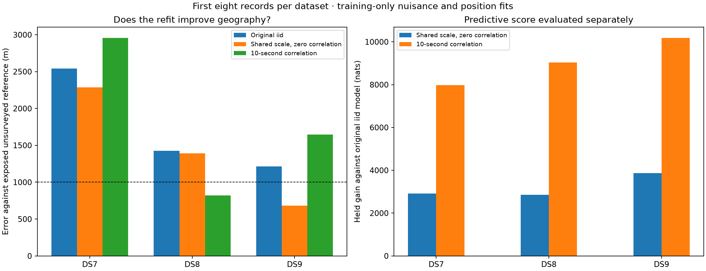

# Geographic refits with shared-scale and correlated track errors

**The shared-scale model improves nominal geographic error on all three
eight-record panels, reaching 683 m on DS9. Adding 10-second temporal
correlation reaches 819 m on DS8 but worsens DS7 and DS9.** Neither formulation
delivers sub-kilometer performance across all three datasets. Both improve
held likelihood in every record, so predictive likelihood alone does not
identify the better geographic model here.

All errors use the existing exposed, unsurveyed operator reference. The
inherited geographic origin itself is 809 m from that reference; DS8's 819 m
result does not improve upon that anchor. These are exploratory fits to the
first eight records per dataset, not a full-dataset or independent accuracy
validation. No model is promoted for deployment.

## Design and selection

The preceding [fixed-position screen](../2026_09_28_correlated_residual_shadow/README.md)
selected a 10-second correlation decay and 100 Hz Student-t scale from training
scores independently in every dataset. Here we refit both that model and its
zero-correlation shared-scale control using the same 24 records and all 1,462
eligible tracks. The [protocol](PROTOCOL.md) was frozen before execution.

Each track has a multivariate Student-t4 likelihood. The correlated scale
matrix is `100² × [0.8 exp(-|dt|/10) + 0.2 I]`; the control uses `100² I`.
The latter still has a shared latent track scale and therefore differs from
independent Student-t observations. Hyperparameters remain fixed.

We fit one position and eight recording timing offsets separately for each
dataset, profiling every candidate's stationary frequency offset under the
same weak quadratic penalty (variance 1e12). Candidate weights use training
only; visibility, retained banks and full-catalogue normalization are unchanged.
No observations were collected or removed, and no new propagation or waveform
reads were needed.

Every model uses two starts: the original polished iid panel fit, and the
inherited coordinate origin with zero timings. Selection uses the highest
training likelihood among numerically qualified fits. Neither held scores
nor reference coordinates choose the start. All 12 fits completed and qualified.

## Geographic results

| Model | DS7 error (m) | DS8 error (m) | DS9 error (m) |
|---|---:|---:|---:|
| Original independent Student-t4 | 2,541.480 | 1,423.707 | 1,212.978 |
| Shared track scale, zero temporal correlation | 2,287.191 | 1,390.877 | **682.987** |
| Shared track scale, 10-second correlation | 2,954.800 | **819.173** | 1,646.969 |

The zero-correlation model improves all three original errors, but only DS9
crosses 1 km. Correlation improves DS8 substantially while worsening the other
two. Selecting a different formulation for each dataset after seeing these
reference errors would be a post-hoc geographic choice, not a validated model
selection rule.

## Predictive ablations

All entries are held likelihood changes in nats. The three incremental columns
sum to the final gain against the original independent Student-t model.
“Frozen covariance” uses the new covariance with original positions, timings
and stationary offsets, as in the preceding screen. “Offset refit” changes
stationary offsets at the original point. “Position/timing refit” then moves
the geographic and recording timing parameters, with offsets reprofiled.

| Dataset | Decay | Frozen covariance gain | Offset-refit increment | Position/timing-refit increment | Final gain vs original |
|---|---:|---:|---:|---:|---:|
| DS7 | 0 s | +2,674.107 | +177.135 | +65.955 | +2,917.197 |
| DS7 | 10 s | +7,890.495 | +87.555 | −7.240 | +7,970.811 |
| DS8 | 0 s | +2,606.603 | +205.279 | +38.639 | +2,850.520 |
| DS8 | 10 s | +8,941.352 | +80.845 | +17.496 | +9,039.693 |
| DS9 | 0 s | +3,570.735 | +215.623 | +75.418 | +3,861.775 |
| DS9 | 10 s | +10,051.510 | +127.618 | −4.093 | +10,175.035 |

Every final model improves held likelihood in 8/8 records of its dataset.
Most of the gain comes from modeling the residual distribution at a fixed
location. In the correlated model, moving the position/timings actually loses
held score on DS7 and DS9. Full per-track and per-record accounting is retained
in the diagnostic results and [scores.json](scores.json).

## Start sensitivity and local information

| Dataset | Decay | Selected start | Separation between qualified solutions (m) |
|---|---:|---|---:|
| DS7 | 0 s | Original iid fit | 0.018 |
| DS7 | 10 s | Coordinate origin | 0.027 |
| DS8 | 0 s | Original iid fit | 715.480 |
| DS8 | 10 s | Coordinate origin | 0.003 |
| DS9 | 0 s | Original iid fit | 290.508 |
| DS9 | 10 s | Original iid fit | 186.997 |

Multiple optima matter. For DS8's zero-correlation control, the origin-start
fit has 678.715 m reference error but **114.069 nats lower training likelihood**
than the selected 1,390.877 m solution. It was not substituted because its
geographic error is smaller. DS9's two zero-correlation solutions both fall
below 1 km (682.987 and 858.084 m); the selected one wins training likelihood
by 31.526 nats. These are two starts, not a proof of global optimality.

Finite differences of the full training gradient give a local information
matrix. After eliminating the eight timing coordinates by a Schur complement,
both positional eigenvalues are positive at all six selected fits:

| Dataset | Zero-correlation position eigenvalues (nats/km²) | 10-second position eigenvalues (nats/km²) |
|---|---|---|
| DS7 | 46.287, 131.011 | 16.092, 44.198 |
| DS8 | 128.168, 242.681 | 43.560, 67.094 |
| DS9 | 46.106, 116.747 | 11.311, 46.355 |

Correlation lowers local positional information relative to the control at
their respective fitted points. This is consistent with a model that explains
temporal Doppler residual structure while weakening localization constraints.
These local curvatures are not calibrated confidence intervals, and positivity
does not resolve the observed multiple optima or reference uncertainty.

## Numerical checks and resources

- Offset profiles include the original prior. Their stationary equation is a
  cubic: we certify a unique root when its derivative is positive everywhere;
  otherwise we compare all admissible real stationary roots. Newton polishing
  and a derivative threshold of 1e−8 verify each offset during evaluation.
- Four component tests pass, covering global offset profiling (including
  large-offset multiple-root cases), envelope gradients, invariance to held
  values, univariate reduction and conditional multivariate-t identities.
- Six real-data preflights compare analytic/envelope gradients with complete
  objective finite differences. Maximum discrepancy is 6.89e−6 nats per
  coordinate unit. Reprofiling offsets increases training likelihood in all
  six models, as required.
- All 12 fits finish within the fixed bounds and meet the 0.01 gradient
  infinity-norm qualification threshold. All six selected-point checks cover
  every position/timing coordinate; maximum discrepancy is 3.34e−5.
- All nuisance Hessian blocks and profiled positional matrices have positive
  eigenvalues. Maximum full-Hessian asymmetry is 0.001613; raw matrices are
  retained rather than treated as exact uncertainty estimates.
- The scorer verifies 213 execution bindings, all track identities and paired
  score totals. It verifies 24 pose companions against their three manifests
  and checks geographic distances with an independent spherical-vector formula.
- All **24 jobs** exited zero: six preflights, 12 fits and six diagnostics.
  Sum of individual wall times is **202.32 seconds**, with at most two jobs
  concurrent; this sum is not elapsed campaign time. Longest job: 12.93 seconds.
  Peak RSS: 654,336 KiB. Each job was capped at 180 seconds / 4 GiB, one BLAS
  thread. No retries or omitted failures.

Evidence includes [runner](run.py), [launcher](launch.py),
[scorer and plots](score_plot.py), [test log](tests.log),
[resource summary](resource-summary.json), [runtime versions](scientific-environment.json),
[scoring log](scoring.log), [SVG figure](covariance-position.svg) and
[SHA-256 inventory](evidence-sha256.json). Dataset folders [DS7](DS7/),
[DS8](DS8/) and [DS9](DS9/) contain both starts, training-only selections,
per-track held results, gradient/curvature checks, commands, resource logs and
execution seals. New implementation and tests are
`tools/ds789_covariance_position.py` and
`tests/research/test_ds789_covariance_position.py`.

## Next step

Test both fixed formulations in shared-position fits across the 24 records
and in leave-one-dataset-out geographic transfer. The shared-scale control
deserves continued testing because it improves all three separate-panel
errors; correlation remains a prespecified comparison because its predictive
and geographic effects differ. Do not choose the formulation or a local mode
using the exposed reference, and do not interpret the large residual-score
gain as equivalent to improved localization.

DS7 remains above 2 km on this panel. The requested sub-kilometer performance
across DS7/DS8/DS9 is therefore **not established**. Validation on further
records and stronger location truth remain necessary before an accuracy claim.
