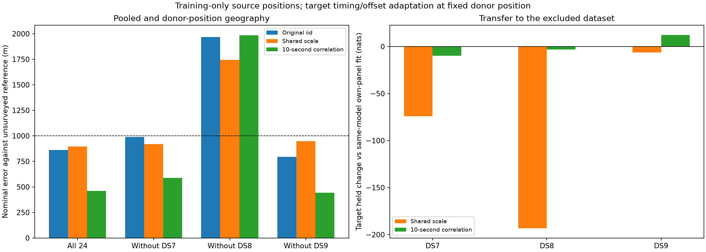

# Covariance refinement and the next temporal-coverage panel

**The previously unqualified higher-likelihood correlated all24 mode now
qualifies, with 460.312 m nominal geographic error.** The other seven source
positions remain effectively unchanged. Leaving DS8 out still gives
1,983.838 m error under correlation and 1,743.412 m under shared scale.
Reliable sub-kilometer performance across DS7/DS8/DS9 remains unproven.

The improvement from the previously reported 713.523 m pooled point is a
change of selected local mode, not a 253 m movement caused by polishing:
the higher-scoring seed moves only **0.0096 m**. Its position is **266.799 m**
from the earlier qualified selection. All seed selection used training scores
alone, before geographic scoring; the unsurveyed reference remains exposed.

## What was refined

The [preceding experiment](../2026_09_28_covariance_transfer/README.md) returned
18 successful interior source fits, but four missed its gradient threshold.
For each of the eight model/source units, this follow-up selects the highest
returned training likelihood among successful interior fits, whether or not
that seed previously met the gradient threshold. It refines that one seed
under the **unchanged covariance likelihood and unchanged data**.

The [protocol](PROTOCOL.md) specifies tighter L-BFGS-B stopping criteria:
`ftol=1e-14`, `gtol=1e-8`, at most 60 iterations/100 evaluations for source
refinement. Qualification still requires optimizer success, interior bounds
and gradient infinity norm at most 0.01. All eight refinements qualify, with
maximum gradient norm **0.000962**. This does not retrospectively qualify
every original start or prove global optimality.

At every refined donor position, target timings and candidate frequency
offsets are refitted using target training observations and starts 0, −2, +2
seconds. Target geography stays fixed. All 18 nuisance fits qualify. All source
and target held scores are recomputed, even where the geographic movement is
negligible. No new waveform reads, catalogue propagation, observations or RF.

## Geographic results

All errors are meters against the same unsurveyed operator reference, using
the original first eight records per dataset. Donor units use 16 records;
all24 uses 24. The inherited origin has 809 m nominal error.

| Source unit | Shared-scale error before → after | Correlated error before → after |
|---|---:|---:|
| All24 | 894.994 → 894.993 | 713.523 → **460.312** |
| Exclude DS7 | 918.267 → 918.267 | 589.165 → **589.164** |
| Exclude DS8 | 1,743.412 → 1,743.412 | 1,983.838 → **1,983.838** |
| Exclude DS9 | 947.470 → 947.473 | 443.077 → **443.076** |

The correlated all24 seed already exceeded the old qualified selection by
4.520360 training nats. Polishing adds only 1.49e−7 nats to that seed and
reduces its gradient norm from 0.010272 to 0.000370. For all other units,
refinement moves the old selected point by at most 0.0036 m. The leave-one-
dataset-out failure is therefore not explained by these stopping tolerances.

One seed per unit was refined. The prior multistart evidence, including donor
modes separated by about 300 m and all prior unqualified runs, remains in the
preceding report; it is not replaced by a misleading claim of zero dispersion
from a singleton refinement.

## Held prediction remains a separate result

All changes below compare the refined shared/donor position with that
dataset's own eight-record fit under the same covariance model, in nats.

| Comparison | Shared scale: DS7 | DS8 | DS9 | Correlated: DS7 | DS8 | DS9 |
|---|---:|---:|---:|---:|---:|---:|
| All24 source held | −4.288 | −48.773 | −4.889 | −3.154 | −2.165 | +11.598 |
| Excluded-target held | −74.071 | −193.271 | −6.330 | −9.828 | −3.271 | +12.306 |

The refined correlated all24 model gains **6.279 nats** against its separate
panels, compared with 26.751 nats for the earlier qualified mode. Selecting
the higher training-likelihood mode therefore improves the nominal reference
error but **reduces held likelihood by 20.472 nats** relative to that earlier
mode. No held-based substitution was made.

Target transfer changes by less than 0.0002 nats relative to the preceding
report. In particular, DS8's almost 2 km donor error still costs only 3.271
held nats. A small residual-prediction penalty does not establish geographic
accuracy or calibrated localization confidence. All source/target dataset,
record and track comparisons, including original iid comparisons, are in
[scores.json](scores.json) and the worker result files.

## An equal-budget temporal-coverage proposal

These current panels cover only the beginning of each dataset. As the next
data experiment, choose eight capture starts nearest eight equally spaced
timestamps across each complete dataset, including both endpoints, with ties
broken by session ID. Selection uses timestamps only—neither model outcomes
nor cache availability—and preserves the eight-record budget per dataset.
The exact sessions and manifest hashes are frozen in
[temporal-coverage-proposal.json](temporal-coverage-proposal.json).

| Dataset | Full records | First-eight start span (h) | Proposed eight start span (h) | Proposed chronological ordinals | Records with existing bank matches |
|---|---:|---:|---:|---|---:|
| DS7 | 88 | 0.825 | 10.249 | 1,13,26,38,51,63,76,88 | 8/8 |
| DS8 | 65 | 0.943 | 8.014 | 1,10,19,29,38,46,55,65 | 1/8 |
| DS9 | 105 | 0.824 | 12.608 | 1,16,32,46,61,76,92,105 | 1/8 |

Spans are last minus first **capture start**, not total recording duration.
The inventory searched `banks.npz` beneath workspace `.leo` and `reports`,
matching bank-manifest schema and session only. It is a presence audit,
**not validation that a bank is reusable with the proposed inputs**. Matching
manifest bytes are archived in [coverage-manifests](coverage-manifests/);
bank contents were not read or validated by this inventory. The proposal is
not a new dataset release and has not been fitted.

Next validate the eight DS7 cache matches and locate/export observations for
the 14 DS8/DS9 sessions without bank matches. Prepare any missing banks in
explicitly bounded batches using existing recordings, then compare the fixed
iid, shared-scale and correlated formulations at equal record budget. Broader
temporal coverage is a hypothesis to test, not an assumed accuracy gain.

## Checks, resources and evidence

- Six existing component/source-exclusion tests pass; no research model helper
  was changed for this numerical follow-up.
- All eight source refinements and 18 target fits qualify. All 40 jobs exit 0:
  eight source refinements, 18 target fits, eight source held/audits and six
  target held evaluations. No retry or threshold relaxation.
- 32 full-objective source position checks at 1 m and 0.5 m agree with envelope
  gradients within 1.88e−5 nats/km maximum, below the 0.002 tolerance.
- The scorer verifies 314 execution bindings and 27 reference-file bindings,
  all selected points/qualification rules, fixed target positions, track
  identities, held counts and paired score sums. Geographic distances agree
  with an independent spherical-vector computation.
- Individual job wall times sum to 294.14 seconds with at most two concurrent
  jobs; the sum is not elapsed campaign time. Longest job 12.13 s; maximum RSS
  1,717,504 KiB. Every job was capped 90 s/4 GiB with one BLAS thread.

See [plan preparation](prepare.py), [plan](plan.json), [runner](run.py),
[launcher](launch.py), [scorer/plots](score_plot.py),
[coverage selection and inventory](coverage.py), [coverage log](coverage.log),
[test log](tests.log), [resource summary](resource-summary.json),
[scoring log](scoring.log), [SVG figure](covariance-transfer.svg),
[input seal](input-seal.json) and [complete evidence inventory](evidence-sha256.json).
The [t0](t0/) and [t10](t10/) folders contain every command, binding, resource
log, result, selection and execution seal. Original published results remain
unchanged. Current evidence supports continued modeling and broader coverage
tests, not completion of the requested cross-dataset accuracy goal.
