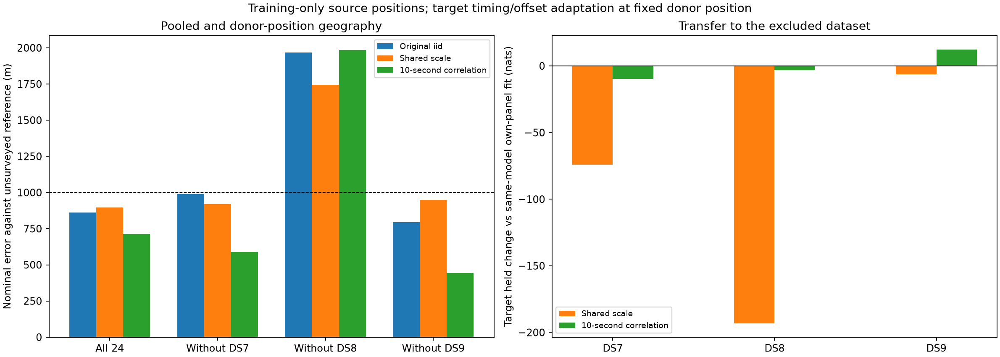

# Pooled covariance positions and transfer across DS7 / DS8 / DS9

**The qualified correlated all24 fit has 713.5 m nominal error, but leaving DS8
out still produces 1,983.8 m error.** Shared-scale errors show the same failure
pattern: 895.0 m pooled and 1,743.4 m without DS8. Thus neither formulation
establishes reliable sub-kilometer geographic transfer across all three datasets.

The correlation model's DS8 transfer held loss is only **3.27 nats** despite
the nearly 2 km geographic error. Small predictive loss is therefore not a
sufficient localization-confidence test. All errors use the previously exposed,
unsurveyed operator reference; these are exploratory first-eight-record panels.

There is also a numerical qualification caveat: one correlated all24 start
has 4.52 nats higher training likelihood than the selected fit but narrowly
misses the predeclared gradient threshold. It is preserved, not promoted or
silently substituted. A refinement is needed before claiming the selected
pooled point is the best fitted solution.

## Design

This follows the [separate-panel geographic refits](../2026_09_28_covariance_position/README.md).
Both fixed models use multivariate Student-t4 residuals, scale 100 Hz, and one
shared latent scale per track. The control has a diagonal scale matrix; the
correlated model uses `100² × [0.8 exp(-|dt|/10 seconds) + 0.2 I]`.
Neither covariance hyperparameters nor model identity are chosen by geographic
error. The [protocol](PROTOCOL.md) was frozen before execution.

For each model, fit one shared position and per-record timing offsets on all
24 records, then on each 16-record pair of datasets. Stationary frequency
offsets are globally profiled on training observations with the unchanged
weak penalty, and candidate weights, visibility and catalogue normalization
follow the published implementation. Source starts use each included
dataset's same-model fitted position and the concatenated included timings.
The excluded dataset never supplies source observations, positions or timings.

For transfer, freeze the donor position and fit only the excluded dataset's
eight timing offsets and per-candidate frequency offsets on its training
observations, using timing starts 0, −2, +2 seconds. Held scores are exact mixture
joint-minus-training densities. This target nuisance adaptation is explicit;
no target position fitting occurs. All 1,462 original eligible tracks remain.
There are no new waveform reads, RF collections or catalogue propagation.

## Geographic comparison

The iid comparison is the previously published
[cross-dataset baseline](../2026_09_28_cross_dataset_position/README.md).
All entries are nominal horizontal error in meters. Donor rows use 16 records;
all24 uses 24 records. The coordinate origin itself has 809 m reference error.

| Source data | Original iid | Shared scale, no correlation | Shared scale, 10-second correlation |
|---|---:|---:|---:|
| DS7 + DS8 + DS9 | 862.319 | 894.994 | **713.523** |
| DS8 + DS9; exclude DS7 | 988.676 | 918.267 | **589.165** |
| DS7 + DS9; exclude DS8 | 1,968.429 | 1,743.412 | **1,983.838** |
| DS7 + DS8; exclude DS9 | 795.599 | 947.470 | **443.077** |

Correlation improves three nominal rows relative to the iid baseline but does
not fix the DS8-excluded failure. The shared-scale model improves that failure
by about 225 m, remaining well above 1 km. Comparisons involve the same record
budgets, but selected local modes and numerical qualifications differ; the
earlier iid all24 run had only one completed start.

## Held transfer to excluded datasets

Each same-model comparison uses that dataset's own eight-record fit with the
identical covariance formulation. The iid comparison uses its original
eight-record independent Student-t fit. Positive nats mean better prediction.

| Model | Target | Held change vs same-model own-panel fit | Positive records vs same-model | Held change vs original iid panel |
|---|---|---:|---:|---:|
| Shared scale | DS7 | −74.071 | 3/8 | +2,843.127 |
| Shared scale | DS8 | −193.271 | 3/8 | +2,657.249 |
| Shared scale | DS9 | −6.330 | 2/8 | +3,855.445 |
| 10-second correlation | DS7 | −9.828 | 3/8 | +7,960.982 |
| 10-second correlation | DS8 | −3.271 | 2/8 | +9,036.422 |
| 10-second correlation | DS9 | +12.306 | 4/8 | +10,187.340 |

Large gains against iid mostly reflect the different residual distribution,
as shown by the preceding fixed-position and nuisance-refit ablations. They
do not imply improved localization. The nearly 2 km DS8-excluded correlated
fit can predict held residuals almost as well as its own-panel fit; this is
consistent with the weaker positional curvature measured in the preceding
experiment, but does not identify the physical source of the geographic bias.

## All24 held changes and source evidence

| All24 model | DS7 vs own same-model fit | DS8 vs own same-model fit | DS9 vs own same-model fit | Total |
|---|---:|---:|---:|---:|
| Shared scale | −4.288 | −48.773 | −4.889 | −57.950 |
| 10-second correlation | −2.478 | +19.748 | +9.482 | +26.751 |

All values are nats. Every donor unit's source-side record/track comparison,
as well as target-side comparisons, is retained in [scores.json](scores.json).
The all24 correlated held gain is modest relative to the large gain from
changing the residual distribution itself. It is not an independent geographic
validation or a reason to overlook the excluded-DS8 failure.

## Numerical qualifications and local modes

All 18 source starts returned with optimizer success and interior parameters;
14 met the stricter gradient infinity-norm threshold of 0.01. All 18 target
nuisance starts qualified. Selection follows maximum training likelihood among
qualified fits exactly as preregistered.

| Model | Unit | Qualified source starts | Separation of qualified solutions (m) |
|---|---|---:|---:|
| Shared scale | all24 | 2/3 | 0.0024 |
| Shared scale | exclude DS7 | 2/2 | 0.0013 |
| Shared scale | exclude DS8 | 1/2 | Not measurable from one qualified start |
| Shared scale | exclude DS9 | 2/2 | 0.0072 |
| 10-second correlation | all24 | 2/3 | 0.0012 |
| 10-second correlation | exclude DS7 | 2/2 | 308.396 |
| 10-second correlation | exclude DS8 | 1/2 | Not measurable from one qualified start |
| 10-second correlation | exclude DS9 | 2/2 | 297.241 |

Machine-readable separation is 0 for singleton qualified sets; it must not be
interpreted as robustness. Distinct correlated donor solutions remain for
DS7 and DS9 exclusion, selected using training likelihood only.

The four unqualified source starts stopped on relative objective reduction:

| Model | Unit | Start | Gradient infinity norm |
|---|---|---|---:|
| Shared scale | all24 | DS8 | 0.023174 |
| Shared scale | exclude DS8 | DS9 | 0.013355 |
| 10-second correlation | all24 | DS8 | 0.010272 |
| 10-second correlation | exclude DS8 | DS9 | 0.013687 |

Only the correlated all24 DS8 start has a higher training score than the
selected qualified fit, by **4.520360 nats**. This is an unresolved candidate
mode, not a result to discard because its gradient narrowly misses. Raw
outputs and every selection remain available. No automatic retry or post-hoc
threshold relaxation was used.

## Validation, resources and artifacts

- Six tests pass for source exclusion, invalid memberships, covariance
  profiling/gradients, invariance to held values and conditional densities.
  The production research helpers are reused without modification.
- All source selections, target selections, bounds and qualifications are
  independently reconciled by the scorer. Target geographic coordinates are
  checked equal to their source coordinates.
- 14 post-selection evaluations retain 11,696 track rows (repeated comparisons
  of 1,462 distinct eligible tracks). Training sums reproduce selected fits;
  held sums, track memberships and observation counts match the paired panels.
- 32 selected source position-gradient checks cover east/north at 1 m and 0.5 m
  differences. Maximum discrepancy is 1.90e−5 nats/km, below the 0.002 tolerance.
  Largest selected offset derivative is 7.71e−12, below 1e−8.
- 357 execution bindings and 27 published reference-file bindings are checked.
  Geographic distances agree with an independent spherical-vector calculation.
- All **50 jobs exited zero**: 18 source fits, 18 target fits, 8 source held/audits,
  and 6 target held evaluations. Sum of job wall times is 485.23 seconds, not
  elapsed campaign time; at most two jobs run concurrently. Longest job 23.23 s;
  maximum RSS 1,717,584 KiB. Each job was capped 180 s/4 GiB with one BLAS thread.

See [plan](plan.json), [plan preparation](prepare.py), [runner](run.py),
[launcher](launch.py), [scorer/figure generator](score_plot.py),
[test log](tests.log), [resource summary](resource-summary.json),
[scoring log](scoring.log), [SVG figure](covariance-transfer.svg),
[input seal](input-seal.json) and [complete SHA-256 inventory](evidence-sha256.json).
Folders [t0](t0/) and [t10](t10/) preserve every worker's command, input/source
bindings, terminal/resource logs, exit code, result and seal, plus source and
target selections. The exact installed Python executable is recorded in each
launch file; its version record is in the preceding geographic-refit report.

## Next action

First perform a separately specified numerical refinement of the highest
returned training-score source candidate for every unit, keeping the original
stops and qualifications intact. In particular resolve the higher-score
correlated all24 mode before promotion. Repeat affected target nuisance
adaptation and held checks at any changed donor positions.

Then test temporal coverage across the existing datasets rather than assuming
these first-eight panels represent the full DS7/DS8/DS9 corpus. Covariance
improves predictive modeling, but the recurring DS8-exclusion failure and
local-mode dependence remain substantive. The requested sub-kilometer accuracy
across datasets is **not yet established**, and neither small held loss nor a
single pooled sub-kilometer point is sufficient evidence of completion.
