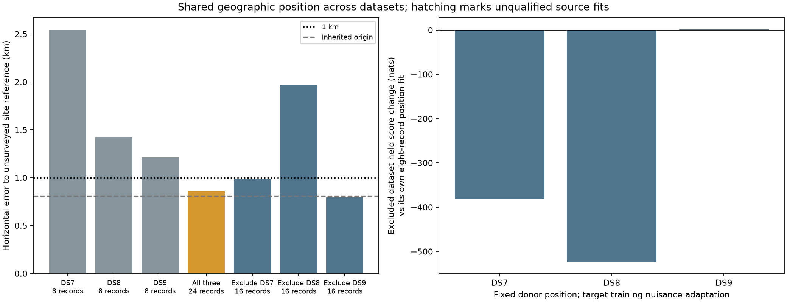

# Cross-dataset position pooling: 862 m pooled, inconsistent transfer

**The shared position fitted to 24 recordings is 862.319 m from the recorded
site reference.** This is a nominal sub-kilometre result for a larger pooled
observation budget. It does **not** establish reliable sub-kilometre resolution
across DS7/DS8/DS9: the DS8 exclusion test is 1,968.429 m away, held predictions
worsen overall, and the inherited coordinate origin is already 809.029 m from
the same unsurveyed reference.

All four geographic units have qualified returned solutions. Seven of nine
source starts returned and qualified; two all24 starts timed out. All nine
target timing starts returned and qualified. Failures and all start receipts
remain in the evidence. No failed recording or start was replaced.

## Geographic results and observation budgets

| Position fit | Records used to fit position | Dataset excluded from position fit | Horizontal error (m) | Qualified source starts / planned |
|---|---:|---|---:|---:|
| Original DS7 panel | 8 | — | 2,541.480 | Historical qualified selected point |
| Original DS8 panel | 8 | — | 1,423.707 | Historical qualified selected point |
| Original DS9 panel | 8 | — | 1,212.978 | Historical qualified selected point |
| DS7 + DS8 + DS9 | 24 | None | **862.319** | 1/3 |
| DS8 + DS9 | 16 | DS7 | **988.676** | 2/2 |
| DS7 + DS9 | 16 | DS8 | 1,968.429 | 2/2 |
| DS7 + DS8 | 16 | DS9 | **795.599** | 2/2 |
| Inherited coordinate origin | No observation update | — | 809.029 | Not an optimized estimate |

Each dataset contributes its existing first eight chronological recordings,
as frozen in [plan.json](plan.json). The 24-record fit is **one shared position**,
not three independent 862 m estimates. Two of three donor positions fall below
1 km nominally, but the DS7 exclusion result clears the threshold by only 11.324 m.
Reference uncertainty is unknown. The best donor result is only 13.430 m closer
than the inherited origin; neither difference establishes calibrated accuracy.

All 24 pose companions have the same operator-entered reference:
37.849056280893684, −122.48575489722863. They are already exposed, unsurveyed
same-site data, with unknown altitude/reference uncertainty. The coordinate
origin (37.85625, −122.484375) is inherited from DS6 and defines coordinates and
candidate anchors; it is not a new spatial penalty. Its closeness to this site
is not evidence of a deployable estimator or new-site generalization.

The earlier [DS7 full88 result](../2026_09_27_ds7_full88/REPORT.md), nominally
677 m using 88 recordings, remains a separate observation budget. This report
does not supersede or relabel that result.

## Predictive evidence

The all24 solution contains 1,462 tracks and 26,065 held observations. Against
the three separate eight-record position fits, its total held score changes
by **−313.459 nats**:

| Dataset scored at the all24 position | Held observations | Held score change (nats) | Records with held gain |
|---|---:|---:|---:|
| DS7 | 8,622 | −135.098 | 3/8 |
| DS8 | 8,959 | −179.577 | 3/8 |
| DS9 | 8,484 | +1.217 | 4/8 |

More pooled observations improve nominal geographic error here, but the model
predicts the held frequencies less well on DS7 and DS8. A smaller geographic
error therefore cannot be taken as evidence that the shared likelihood explains
the recordings better.

For transfer, fit position using two datasets only. Freeze that position, then
fit the excluded dataset's eight timing offsets on its **training** observations.
Its per-track stationary frequency offsets and candidate weights also adapt on
training observations. Held observations never optimize position or nuisances.
This is transfer with local nuisance adaptation, not a zero-shot prediction of
a wholly unseen recording.

| Excluded dataset | Donor datasets | Donor position error (m) | Target held change vs its own eight-record fit (nats) | Positive target records | Qualified target timing starts |
|---|---|---:|---:|---:|---:|
| DS7 | DS8 + DS9 | 988.676 | **−381.478** | 3/8 | 3/3 |
| DS8 | DS7 + DS9 | 1,968.429 | **−523.498** | 2/8 | 3/3 |
| DS9 | DS7 + DS8 | 795.599 | +1.144 | 4/8 | 3/3 |

The DS8 exclusion test fails the geographic threshold and loses predictive
score substantially. DS7's donor position is closer to the reference than its
own eight-record estimate, while its predictive score gets substantially worse.
DS9 has both a nominal geographic improvement and a very small aggregate held
gain, split 4/8 positive records. This is mixed transfer evidence, not consistent
cross-dataset success.

Source-record held changes for the donor fits are also retained:

| Donor fit | DS7 held change | DS8 held change | DS9 held change |
|---|---:|---:|---:|
| DS8 + DS9 | Not in source fit | −12.994 | −29.528 |
| DS7 + DS9 | −14.550 | Not in source fit | +6.504 |
| DS7 + DS8 | −129.654 | −182.006 | Not in source fit |

These are paired full-mixture scores on identical observations, not comparisons
of raw scores from different-sized datasets. Every record's difference is
available in [scores.json](scores.json). No record is dropped for losing score.

## Frozen model and selection

The [protocol](PROTOCOL.md) reuses the exact baseline Student-t(4,100 Hz)
likelihood, weakly penalized stationary frequency-offset profiling, full
candidate mixture, causal catalogue normalization, visibility, whole-visit
train/held masks and existing candidate banks. It adds no pilot-frequency
correction or receiver-tilt calibration. Position bounds remain ±12 km, recording
timing bounds ±5 s, and assumed site altitude zero.

Source units fit one position plus one timing offset per included recording.
Timings start from the included datasets' qualified polished zero-slope panel
fits. Each included dataset supplies a position start: three starts for all24,
two for each donor fit. Excluded dataset locations and timings do not contribute
to donor starts or the optimization objective. This is a local multi-start
search, not a global-optimum guarantee. All included historical training scores
replay within absolute 1e−7 before fitting.

Select the highest training score among successful returned starts. Strict
qualification additionally requires an interior point and maximum absolute
coordinate score gradient ≤0.01. Do not substitute another start merely because
it has better geographic/held performance or qualification. Target timing starts
are fixed at 0, −2 and +2 s; the −2 start wins by training score in all three
target cases. Their position coordinates remain exactly equal to the donor's.

| Source unit | Selected start | Maximum gradient | Separation between returned source positions (m) |
|---|---|---:|---:|
| All24 | DS9 position | 0.003789 | Not assessable: only one returned start |
| Exclude DS7 | DS8 position | 0.002319 | 0.00862 |
| Exclude DS8 | DS7 position | 0.000786 | 0.00355 |
| Exclude DS9 | DS8 position | 0.002155 | 0.00262 |

The machine score ledger's all24 maximum separation is zero for a singleton;
it must not be interpreted as multi-start agreement. The two failed starts
leave its basin sensitivity unresolved. Small donor-start separation concerns
these declared nearby starts only.

## Limits, numerical checks and resources

The all24 starts at the DS7 and DS8 positions hit their independent 180-second
caps (180.16 and 180.14 measured wall seconds); no fit result was produced by
either. The DS9-position start returned in 157.79 seconds and qualified.
All six donor source starts completed in 103.76–136.92 seconds. No retries,
deadline extensions, additional source starts or numerical polishing occurred.

Every source start used a 180-second cap; every target timing start used a
120-second cap; held scoring used 90 seconds per unit. All had 4-GiB address-space
limits, one numerical thread and nice19, with at most two numerical jobs at once.
L-BFGS-B source options were maxiter140/maxfun200/ftol1e−12/gtol1e−6/maxls30;
target timing fits used maxiter100/maxfun180 with the same tolerances.

A separately declared [fixed-point gradient audit](GRADIENT-AUDIT.md), frozen
after the all24 fit and before geographic scoring, checks its two position
coordinates by central differences at 1 m and 0.5 m perturbations. The maximum
disagreement with the reported gradient is **0.00003296 nats/km**, below the
0.001 audit tolerance. The central training score replays exactly. This verifies
position stationarity locally, not the timing Hessian, global uniqueness or
calibrated confidence intervals. The audit completed in 74.78 seconds without
changing the fitted point or its qualification.

There were 26 bounded numerical jobs in total: 24 exited zero and the two
all24 starts timed out. Summed job wall time was 1,755.56 seconds (29.26 minutes);
jobs overlapped, so this is not elapsed campaign duration. Peak RSS was
1,713,876 KiB. Per-stage receipts are in [resource-summary.json](resource-summary.json).
No RF collection, new IQ reads or candidate propagation was performed.

Two new component tests verify exclusion isolation and reject ambiguous or
malformed source membership. The unchanged baseline supplies the numerical
model; source-score replay, strict gradient checks and the additional finite
differences validate its use here. The scorer verifies 239 launch/output
bindings, all 24 pose companions and three manifests, source/target memberships,
training-only selection, held observation counts and sums, and eight geographic
distances against an independent 3D-vector formula. Ruff lint and formatting
checks pass for the new source. No test or check proves calibrated geographic
uncertainty.

## Evidence and replay

- [Plan](plan.json), [input seal](input-seal.json), [preparation](prepare.py),
  [runner](run.py), [bounded launcher](launch.py), [scorer](score.py), [plotter](plot.py).
- Each unit preserves all source starts, source selection and held scores. Donor
  units also preserve all target timing starts, target selection and held scores.
- Each job has command/source hashes, terminal/resources/exit receipts and an
  output seal created before geographic scoring. Timeouts remain explicit.
- [Gradient audit](gradient-audit/result.json), [tests](tests.log),
  [scores](scores.json), [hash inventory](evidence-sha256.json), [SVG](cross-dataset.svg).

DS7 inputs originally under `.leo` were resolved to their already-published
byte-identical archives during preparation. All fit inputs now point to report
artifacts; no bank bytes were duplicated. Source fitting uses the installed
release's Python/NumPy/SciPy environment, pinned in each command. Scores and
plots use the workspace environment. Replay in a separate output checkout and
rebase the plan's absolute repository paths as needed; exclusive outputs protect
the published record. Original datasets, candidate banks, reference fixtures
and unrelated workspace changes remain intact.

## What this changes

Pooling across datasets reaches nominal sub-kilometre error with 24 recordings,
but adding data alone has not resolved the mismatch between predictive and
geographic performance. The strongest unresolved case is DS8 transfer: a
qualified donor fit is nearly 2 km away and predicts DS8 substantially worse.
Before adding dataset-specific correction terms, decompose those losses by
track/receiver/channel and check whether a few observations dominate the shared
position. Any robust joint model should be designed from training evidence and
tested with the same coverage and geographic/held comparisons. The reliable
sub-kilometre objective remains active.
