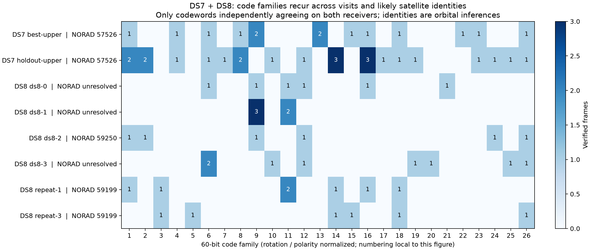

# DS7 + DS8: repeated satellites and decoded signal structure

The joint study finds **five likely satellite identities recurring across DS7
and DS8**. These are independent orbit/Doppler inferences, not decoded IDs.
Verified recurring 60-bit words are shared by different likely satellites:
**eight exact words have cross-identity collisions**, including one shared by
three likely satellites. A recurring T-code is therefore not a unique satellite
identifier under these orbital assignments. No position, UTC, ephemeris or
satellite-ID field has been parsed from the signal.

## Dataset and scope

[DS8](../2026_09_28_ds8_post_ds7/README.md) is frozen at
2026-09-28 00:22:59 UTC: 65 complete recordings, 143,988 visits and 590.3 GB
compressed IQ referenced in place. DS7 + DS8 contains 153 disjoint recordings.
All 65 DS8 pose companions and membership seals passed offline verification.
No new RF was collected, no source IQ was modified, and no data was committed.
Raw excerpts, decoded bits and numerical products remain in ignored `local/`.

This is a bounded investigation, not an exhaustive decoding of the entire
corpus. We combine all 5,142 existing DS7 track annotations with a new
245-track survey of four DS8 recordings. Of thirteen DS8 10 MS/s recordings,
four had suitable cached upper-edge detections; seven had none and two still
had incomplete analysis products. Missing/incomplete products are not negative
RF findings. Lower-rate recordings remain members of DS8.

## Same satellite across datasets

The DS8 survey has 72 tracks passing the conditional Doppler-label criteria.
Their intersection with DS7's likely labels gives the following candidates.
Times are the beginning of the earliest qualifying track, UTC on September 27;
multiple tracks can be simultaneous receivers or fragments of a single pass.

| Likely satellite | NORAD | DS7 first track | DS8 first track | DS7 / DS8 tracks |
|---|---:|---|---|---:|
| STARLINK-30757 | 58131 | 15:54:57 | 20:51:42 | 1 / 5 |
| STARLINK-31298 | 59167 | 14:24:00 | 19:21:36 | 2 / 3 |
| STARLINK-31567 | 59199 | 13:13:42 | 18:11:10 | 3 / 3 |
| STARLINK-31407 | 59250 | 15:56:36 | 20:54:32 | 1 / 1 |
| STARLINK-37484 | 69527 | 06:32:28 | 23:24:18 | 4 / 1 |

The first four candidates recur roughly five hours later, with changed viewing
geometry. For example, the STARLINK-31567 track midpoints move from azimuths
160–200 degrees in DS7 to 246–281 degrees in DS8. These are useful repeat-pass
targets, but the labels are conditional on the site, UTC, catalogue and clock
model. They are not identity ground truth.

The new labels use the known roof coordinates, causal archived TLEs and a
full-catalogue horizon screen, without restricting candidates to DS7 identities.
Each track fits one constant CFO offset on its first 60% of observations and
validates on the final 40%. Qualification requires at least 20 observations,
10 seconds of span, validation RMS <=250 Hz, >=100 Hz training and validation
runner-up gaps, and >=25 Hz advantage over an extrapolated straight-line null.
At least 95% of the predicted track must be above the horizon. CFO is already
normalized to 11.2 GHz. DS8 uses this chronological split; DS7's existing labels
used a different held-out split and extra time/height/drift sensitivity checks.
Thus the label categories are similar screens, not identical calibrations or
posterior probabilities. Receiver altitude and directed antenna geometry remain
unsurveyed. An all-catalogue horizon screen at the track midpoint may omit a
low-elevation candidate crossing the horizon during a track.

## Decoded bits and correspondence

The qualified upper-edge decoder recovered **38 new DS8 codeword observations**,
in addition to 38 prior DS7 observations: **76 observations, 26 code families**.
Each accepted word agrees on all 60 bits across independently fitted receivers
and passes the existing held-out correlation and 1,000 wrong-code controls.
No even-parity constraint or satellite label enters the decoder. Of the 38 DS8
observations, 28 belong to families already observed in DS7. Families normalize
cyclic rotation and global polarity; the eight exact-word collisions require
neither normalization.

One exact shared word is:

```text
111111010101101101111111011111011111010101110101100111111111
```

It appears under likely NORAD IDs **57526, 59199 and 59250**. Across all accepted
words there are ten cross-identity family collisions. This rejects a simple
lookup from a T-code or its normalized family to a unique satellite. It does
not rule out information encoded in a longer sequence, another header region,
or a combination of fields not yet decoded.

For STARLINK-31567, DS8 visits **1246 and 1389**, 19.2756 seconds apart, yield
7/8 and 6/8 accepted frames. Their 13 codewords span nine families, with three
families shared between visits. Thus one likely satellite changes codes within
a pass while reusing some code families. A third planned visit (1074) lacked a
qualified epoch-matched second-receiver detection and was excluded explicitly.

The cross-dataset STARLINK-31567 pair was actually extracted and attempted:
DS7 visit 786 is a lower-edge recording, while DS8 visit 1246 is upper-edge.
The DS7 excerpt produced **no validated codewords**. Experimental lower-edge
mapping also failed its clean UT control, so lower-edge estimates are excluded
from the decoded-bit CSV and every identity conclusion. We therefore do **not**
yet have validated bit-to-bit repeat-pass evidence for this satellite across
DS7 and DS8. The other repeated identities have narrower DS7 recordings that
were not decoded in this bounded pass.

The 24 observed signs of header symbol 4 can repeat across receivers and split
time windows in some excerpts. Other excerpts, including the two repeated
STARLINK-31567 visits, fail strict split-window stability. This is insufficient
to identify a satellite-specific header field. Geographic-position encoding
cannot be established from a corpus with one receiver site. Changing azimuth
and elevation provides viewing-geometry variation, not independent geographic
ground truth. No time/orbit fields were interpreted.



## Evidence and reproducibility

- `local/joint-results.json`: counts, exact collisions, per-excerpt header checks
  and complete independent labels.
- `local/decoded-bits.csv`: all 76 validated raw words, frame/visit provenance,
  conditional identity and receiver validation. No rejected lower-edge bits.
- `local/repeat-candidates.json`: all five repeat candidates, timestamps,
  geometry, validation residuals and recording IDs.
- `local/*-tracks.json`: the 245 new track annotations and acquisition bindings.
- `local/selection.json`, `repeat-selection.json`, `repeat-extra-selection.json`:
  pilot/geometry selections recorded before decoding the corresponding excerpts.
- Each excerpt directory contains its inventory/hash, IQ arrays, decoder logs,
  soft evidence and numerical results. `repeat-2/unavailable.json` records the
  missing peer instead of silently dropping it.

`collect.py` reads cached public tracking inputs and public read-only IQ;
`repeat_survey.py` labels persistent tracks; `export_repeats.py` selects repeated
satellites before reading their IQ; `decode.py` runs the DS7 decoder;
`summarize.py` joins results and `plot.py` renders the figure. Acquisition
solutions sometimes have duplicate candidate ranks: joins ignore rank only
when the complete probe and every other numerical acquisition field are exactly
equal. They never join on time, CFO, or a matching code alone.

The installed reader/propagator release is pinned in DS8's manifest. Source
reader commands require that runtime and storage access; summaries/tests run
locally with NumPy and decoder tests also need SciPy. To regenerate numerical
summaries and the plot, run `summarize.py`, then `plot.py` (Matplotlib required).
The upper-edge mapping is unchanged by the opt-in experimental lower-edge
extension. Its tests explicitly verify this for all payload symbols. Lower-edge
model trials in `lower_control.py` remain diagnostic, not a qualified decoder.

Validation: **19 decoder tests + 4 joint-analysis tests passed**, Ruff checks
passed, and the DS8 offline verifier passed. Initial survey outputs from a
track-configuration identifier mismatch are retained as `.invalid-config.json`
for audit and excluded from every summary; the corrected code asserts that
reconstructed and numerical track identifiers agree.

The next useful experiment is to qualify lower-edge demodulation against UT,
then retry the already-selected cross-dataset repeat pair. It should retain
independent orbital labels and require both-receiver agreement before testing
whether a header field stays constant across passes.
