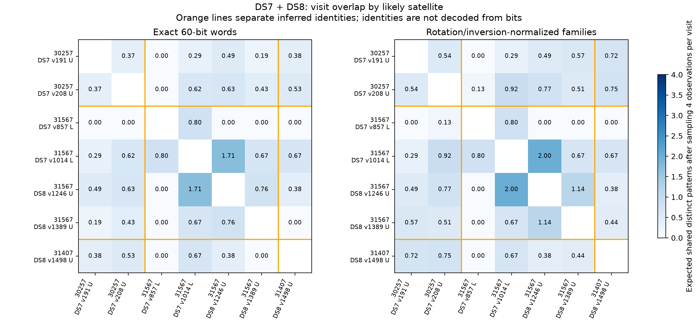

# Repeated visits: same likely satellite versus different likely satellites

The seven identified visits with qualified word recovery show more exact-word
overlap for same-identity pairs on average. They do **not** supply a reliable
satellite fingerprint: overlap varies widely, different identities share words,
and some same-identity pairs share none. Identities here come from conditional
orbit/Doppler assignments, not decoded bits.

## Included observations

| Likely satellite | NORAD | Successful visits | Accepted frame observations |
|---|---:|---|---:|
| STARLINK-30257 | 57526 | DS7 191, 208, same pass | 14, 24 |
| STARLINK-31567 | 59199 | DS7 857, 1014; DS8 1246, 1389 | 5, 4; 7, 6 |
| STARLINK-31407 | 59250 | DS8 1498 | 6 |

The 66 observations produce 21 distinct visit pairs. Three pairs are revisits
within one pass, four pair the earlier and later STARLINK-31567 passes, and
fourteen pair different inferred identities. DS8 visits 1246/1389 are about
19 seconds apart within a pass; their DS7 counterparts are about five hours
earlier. No across-pass word sequences are artificially aligned.

Unresolved identities and failed word recoveries are excluded, not counted as
evidence of dissimilar signals. Multiple decoder retries on a failed visit do
not create additional visits. The 34 native lower-rate words currently lack
verified identity bindings, so they are not assigned identities for this test.

## Comparable sample sizes

Longer decoded excerpts naturally have more chances to share a word. For each
pair, we therefore calculate the exact expected number of shared **distinct**
patterns if four frame observations were sampled without replacement from
each visit. All included visits have at least four observations. Repeated
words remain repeated observations, but a shared word is counted only once.
No random simulation or new decoding is needed.

| Pair type | Visit pairs | Expected shared exact words, four observations per visit | Expected shared families, four observations per visit | Mean exact-word Jaccard, original sample sizes |
|---|---:|---:|---:|---:|
| Same satellite, same pass | 3 | 0.643 | 0.828 | 19.0% |
| Same satellite, different passes | 4 | 0.595 | 0.667 | 12.2% |
| Different satellites | 14 | 0.329 | 0.474 | 8.1% |

Here a family allows cyclic rotation and global inversion of a 60-bit word;
an exact match permits neither. Jaccard is the number of shared distinct words
divided by the number of distinct words in their union. Table entries are
unweighted means over visit pairs, not estimates from independent trials.

The size-adjusted exact-word contrast is about 1.96 times the different-identity
mean within a pass and 1.81 times it across passes. These descriptive ratios
are not identification odds, confidence levels, or classification accuracy.

## Examples and sensitivity

- STARLINK-30257, DS7 visits 191/208: six exact words shared, Jaccard 22.2%.
- STARLINK-31567, DS7 visits 857/1014: one exact word shared, Jaccard 16.7%.
- STARLINK-31567, DS8 visits 1246/1389: two exact words shared, Jaccard 18.2%.
- STARLINK-31567 across passes, DS7 visit 1014 versus DS8 visit 1246: three
  exact words shared, Jaccard 37.5%, size-adjusted expected overlap 1.714.
- The same satellite's DS7 visit 857 shares **no exact words or families** with
  either later DS8 visit in the decoded excerpts.
- Different identities, STARLINK-30257 DS7 visit 208 versus STARLINK-31567 DS8
  visit 1246: four exact words shared, Jaccard 17.4%, adjusted overlap 0.629.

Removing the strongest cross-pass pair reduces the remaining three same-satellite
cross-pass pairs' mean adjusted overlap to **0.222**, below the different-identity
mean of 0.329. The cross-pass average therefore depends strongly on one pair.

Band-edge stratification retains the descriptive direction: among same-edge
pairs, adjusted exact overlap is 0.643 for same identities versus 0.379 for
different identities; among different-edge pairs, it is 0.595 versus 0.263.
However, every same-identity different-pass comparison also changes from lower
to upper edge, so the present sample cannot separate pass and edge effects.

Orange boundaries group visits by inferred identity. Numbers are expected
shared distinct patterns after equalizing to four observations per visit.
U/L denote upper/lower band edges; a blank diagonal excludes self-comparisons.

## Interpretation and limits

There is a descriptive same-identity overlap tendency in these selected visits,
but substantial overlap between categories prevents a reliable identity claim.
All recovered families already occur in the independent UT reference dataset.
The remaining question is whether pattern-selection frequencies carry useful
state information; this sample does not establish that they encode identity.

There are only three identified satellites, and only STARLINK-31567 has decoded
observations across passes. Pairs share visits, short frame sequences are
dependent, and successful excerpts were selected by signal/decoder quality.
Channel, edge, time, geometry, and serving configuration can confound identity.
No significance test or learned classifier is claimed. Absence from a short
excerpt does not prove a pattern was absent from the pass.

## Reproduction

`compare_visit_identity.py` binds the existing joint results and decoded CSV
by SHA-256, writes every pair and summary to ignored
`local/visit-identity/comparison.json`, and renders `overlap.png` there.
The expected-overlap calculation sums each shared word's probability of
appearing in both independent four-observation subsets; the single-visit
probability is `1 - choose(n-count, 4)/choose(n, 4)`.
Two tests compare the formula to exhaustive subset enumeration and verify
duplicate handling, disjoint words, and insufficient-sample rejection.
No new RF data was collected and no data was committed.
