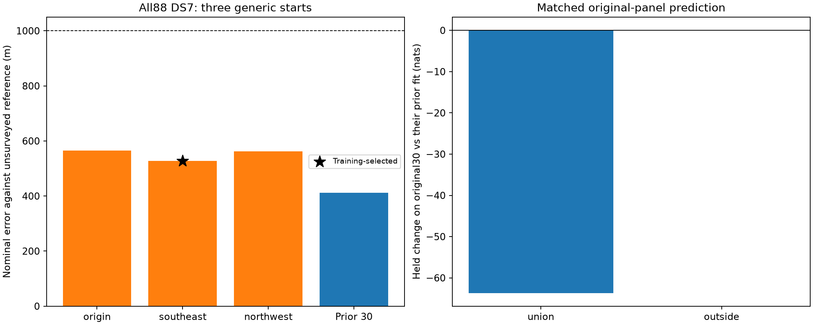

# Shared-scale localization on complete DS7

The training-selected full-DS7 fit has **526.902 m nominal error** against the
exposed unsurveyed reference. All three starts qualify and give **527–565 m**.
The sub-kilometre result therefore survives inclusion of all 88 manifest
recordings. It does not establish full-dataset performance for DS8 or DS9.

This experiment fits every one of the **88 DS7 manifest recordings** with the
unchanged shared-track-scale likelihood. It extends the
[30-record result](../2026_09_28_combined30/README.md) and
[chronological deletion audit](../2026_09_28_block_deletion/README.md) to complete
DS7 membership. Complete DS8/DS9 fitting remains separate pending input readiness.

## Results

| Fit/start | Nominal error (m) | Training gap from selected full88 fit (nats) | Qualified |
|---|---:|---:|---|
| Full88, origin | 564.834 | -139.047 | Yes |
| Full88, southeast — selected | **526.902** | 0 | Yes |
| Full88, northwest | 562.516 | -161.645 | Yes |
| Prior 30-record fit | 411.107 | Not comparable: different observations | Yes |

The new full-dataset result is 115.796 m farther from the reference than the
earlier 30-record fit. Expanding membership verifies the threshold on complete
DS7; it does not improve that panel's point error or justify a monotonic
more-data-improves-accuracy claim. The selected fit also has the lowest error
among these three starts, but selection used training score only.

| Original panel, compared with its rows in the prior 30-record fit | Tracks | Held observations | Training change (nats) | Held change (nats) | Positive held records /15 |
|---|---:|---:|---:|---:|---:|
| Union 15 | 900 | 15,687 | -109.818 | -63.679 | 5 |
| Outside 15 | 877 | 17,737 | +1.796 | +0.047 | 9 |

The outside-panel held aggregate is effectively unchanged, while the union
panel loses predictive score. These comparisons use the same tracks and held
counts against the **combined30** baseline, not their earlier independently
fitted 15-record locations. The additional 58 records contribute 3,354 tracks
and 62,470 held observations. Their absolute training/held scores are archived;
there is no previous shared-scale geographic baseline for them and no claimed
improvement statistic.

All four scientific processes exit zero: three source fits and one selected-
point held/numerical audit. Every source fit qualifies. All four E/N gradient
comparisons pass; maximum discrepancy is 5.454e-5 against tolerance 0.002.
Training replays and row sums agree within 1e-7, all 5,131 tracks and complete
observation totals reconcile, and independent spherical distance checks pass.
The scorer verifies 392 execution/input bindings, including all pose and
manifest authorities.

Six existing scientific tests pass in [tests.log](tests.log); all four report
scripts pass Ruff lint and formatting checks. Maximum job wall time is 123.57
seconds, maximum RSS 5,981,068 KiB and summed job time 386.56 seconds. There are
no process failures, optimizer failures, timeouts or retries.

## Fixed design

Use the complete validated DS7 group from
[full-input checkpoint 02](../2026_09_28_full_manifest_inputs/checkpoints/02-ds8-batch0/README.md).
All 88 recordings remain included: 5,131 eligible tracks, 143,207 training
observations and 95,894 held observations. Eleven track-level eligibility
exclusions are retained in the input ledger. No recording is filtered or
replaced based on its observed signal quality, fit or geographic outcome.

The model retains multivariate Student-t4 residuals at 100 Hz scale, a diagonal
scale matrix, shared latent track scale and the original weak offset prior.
Candidate banks, visibility, catalogue normalization and whole-visit partition
are unchanged. Source input hashes and every capture/pose authority are bound.

[PROTOCOL.md](PROTOCOL.md) freezes three generic starts: E/N (0,0), (3,-3) and
(-3,3) km, with all 88 record timings zero. No prior fitted position or timing
vector initializes a run. L-BFGS-B uses maxiter 140/maxfun 200, ftol 1e-14,
gtol 1e-8 and maxls 30; bounds ±12 km and ±5 seconds. Qualification requires
optimizer success, interior parameters and gradient infinity norm ≤0.01.
Selection maximizes training score among qualified starts. There are no retries,
relaxed gates or previous-fit fallback.

The original 30-record fit is a comparison only. Its tracks are matched exactly,
with held-score changes reported separately for the union and outside panels.
The additional 58 recordings have no earlier shared-scale location fit; their
absolute score/count accounting is retained without an invented improvement
statistic. Different fitted positions and record timings can change prediction
even under an unchanged likelihood.

## Resources and provenance

One modeling worker runs at a time, BLAS1/nice19, with a 300-second process cap
and 12 GiB address-space cap. Each launch requires at least 14 GiB of available
memory. The larger resource envelope responds to complete DS7 membership;
optimizer settings and likelihood are unchanged. Earlier 45-record fits peaked
near 3.2 GiB RSS. One independent serial DS9 input-export worker may overlap,
for at most two scientific jobs total. Neither worker modifies production services.

The inherited request config contains legacy execution-policy metadata. This
report's protocol and archived launch commands define the actual resources and
optimizer settings. No model component, golden fixture or persisted contract
changes. This modeling stage performs no export, waveform read, new propagation,
provider fetch or RF collection.

## Evidence and limits

[plan.json](plan.json) contains complete membership, artifact bindings and exact
starts. Each stage retains command, source hashes, terminal log, exit code,
result and resource receipt. [scores.json](scores.json) records all alternatives,
selection, errors, matched prediction changes and numerical gradient checks.
[resource-summary.json](resource-summary.json) preserves measured resources.
[evidence-sha256.json](evidence-sha256.json) binds this report and its dependencies,
excluding itself. Existing inputs and reader-runtime provenance are already
published in the full-manifest input report.

Run order is `prepare.py`, `launch.py source`, `launch.py transfer`, then
`score_plot.py`. The transfer phase here selects and audits the DS7 source fit;
it does not fit another dataset. Held replay requires the selected training
score within 1e-7, E/N finite-difference gradient agreement at 1 m and 0.5 m
within 0.002, exact track/count reconciliation and an independent spherical
distance check.

Errors use the same exposed, unsurveyed operator reference. The inherited origin
is already 809 m away. This is complete DS7 membership, not blind validation,
surveyed accuracy, proof of emitter identity or evidence of a new-site result.
It does not establish complete-dataset performance for DS8 or DS9. Local
qualification and multiple starts do not certify a global optimum or a
calibrated confidence radius.

## Decision

Retain shared track scale as a validated sub-kilometre nominal approach for
complete DS7 under this frozen scientific pipeline. The full objective remains
open: complete DS8/DS9 membership and model results have not yet been evaluated.
Continue their fixed input-export batches, then apply the same independent
full-dataset fitting and numerical checks. Preserve the original30/deletion
results and the prediction costs above; do not present this single-site
experiment as surveyed or cross-site validation.
