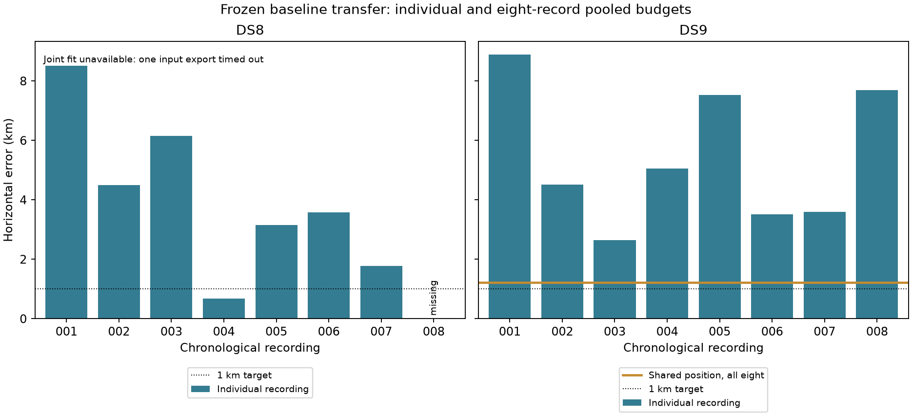

# DS8/DS9 baseline transfer: frozen first-eight panels

**The unchanged DS7 model does not achieve reliable sub-kilometer accuracy on
these later captures.** DS8 returns seven qualified individual estimates from
eight attempts, with a **3,575.663 m median** and **one sub-kilometer result**.
DS9 returns eight qualified estimates, with a **4,777.534 m median** and **none
below 1 km**. Its separate eight-record shared-position fit reaches
**1,212.955 m**, but predicts held observations worse than the independent fits
on all eight recordings.

The frozen experiment has finished with **15/16 individual estimates**. DS8-008's
candidate-bank export timed out at its 120-second limit. Its failure remains in
the ledger and denominator; the complete DS8 eight-record joint comparison is
**unavailable**, not replaced by a seven-record fit. All first-eight memberships
were fixed in the preceding [metadata-only plan](../2026_09_28_ds89_baseline_transfer/plan.json).
DS8-001 and DS9-001 reuse the sealed [preflight](../2026_09_28_ds89_baseline_transfer/README.md)
unchanged. That report's pending status is historical; this continuation records
the terminal outcomes.

## Individual and pooled observation budgets

| Measurement | DS8 first eight | DS9 first eight |
| --- | ---: | ---: |
| Selected records | 8 | 8 |
| Returned / qualified estimates | 7 / 7 | 8 / 8 |
| Qualified below 1 km / all selected | 1 / 8 | 0 / 8 |
| Median returned error | 3,575.663 m | 4,777.534 m |
| Median qualified error | 3,575.663 m | 4,777.534 m |
| Missing individual estimates | 1: bank-export timeout | 0 |
| Separate eight-record joint error | Unavailable | 1,212.955 m |
| Joint estimate qualified / below 1 km | Unavailable | Yes / No |

The DS8 median describes its seven returned values, not an imputed eight-record
distribution. A timeout is neither a zero error nor evidence of scientific
failure of the underlying model. The operational sub-kilometer count retains
all eight selected records as its denominator. These are chronological panels,
not random samples or full-dataset estimates: DS8 contains 65 admitted records
and DS9 contains 105.

| Unit | Sample rate (MS/s) | Eligible tracks | Error (m) | Qualified | Full-mixture held log score |
| --- | ---: | ---: | ---: | --- | ---: |
| DS8-001 | 7.5 | 64 | 8,517.587 | Yes | -7,710.908 |
| DS8-002 | 5 | 64 | 4,493.196 | Yes | -6,972.285 |
| DS8-003 | 2.5 | 63 | 6,148.386 | Yes | -6,531.707 |
| DS8-004 | 7.5 | 64 | 678.291 | Yes | -9,816.751 |
| DS8-005 | 10 | 59 | 3,156.542 | Yes | -8,671.047 |
| DS8-006 | 5 | 60 | 3,575.663 | Yes | -7,323.076 |
| DS8-007 | 2.5 | 55 | 1,772.607 | Yes | -5,695.874 |
| DS8-008 | 10 | — | — | No estimate: bank timeout | — |
| DS9-001 | 7.5 | 64 | 8,883.010 | Yes | -7,451.720 |
| DS9-002 | 2.5 | 61 | 4,507.477 | Yes | -6,821.431 |
| DS9-003 | 2.5 | 59 | 2,650.622 | Yes | -7,358.957 |
| DS9-004 | 10 | 64 | 5,047.590 | Yes | -7,124.695 |
| DS9-005 | 10 | 62 | 7,530.487 | Yes | -8,086.625 |
| DS9-006 | 2.5 | 60 | 3,510.530 | Yes | -6,897.975 |
| DS9-007 | 10 | 60 | 3,589.229 | Yes | -9,223.625 |
| DS9-008 | 10 | 61 | 7,690.126 | Yes | -7,206.165 |

Raw log scores have different observation counts. Their magnitudes should not
be used to rank recordings or infer a sample-rate effect. Dataset, capture time,
tracks and sample rate are confounded in this small panel. Every returned
individual fit passes the original convergence/no-boundary qualification; all
45 individual optimizer starts report success without a boundary hit. That is
an optimizer check, not a satellite-identification or accuracy certificate.

## What pooling changes on DS9

The pooled fit uses one horizontal position and eight independent timing offsets
with all eight input documents. It does not average independently fitted
positions, discard poor recordings, or add a new geographic penalty.

| DS9 paired comparison | Independent positions | One shared position |
| --- | ---: | ---: |
| Included recordings | 8 | 8 |
| Eligible tracks | 491 | 491 |
| Training / held observations | 12,587 / 8,484 | 12,587 / 8,484 |
| Geographic statistic | 4,777.534 m median | 1,212.955 m single pooled estimate |
| Summed training log score | -92,214.885 | -92,851.505 |
| Summed held log score | -60,171.193 | -60,721.137 |

The pooled error is smaller than all eight individual errors. However,
joint-minus-independent held log score is **-549.943 nats**, with **0/8 positive
recordings**; the equal-record mean difference is **-0.065482 nats per held
observation**. A shared position has fewer free parameters, so worse training
fit is expected; the held comparison measures a separate predictive tradeoff.
This result does not establish the cause of the disagreement or validate any
specific clock, contamination or receiver-geometry correction.

All three pooled starts converged without a boundary. The +2-second start was
selected by training likelihood; its score was about 23.354 nats higher than
the other two. Thus the pooled problem has start-dependent solutions under this
search. The protocol used all three original starts, with no outcome-driven
additional search. The conditional training-MAP RF RMS was 571.987 Hz; this
does not resolve catalogue ambiguity.

For historical context, [DS7 full88](../2026_09_27_ds7_full88/REPORT.md) reported
a 677.323 m estimate from 88 pooled recordings, whereas its first-eight pooled
fit was about 2.541 km and its first-eight individual median about 2.873 km.
Those observation budgets differ. Neither the DS7 full88 number nor DS8-004's
678.291 m individual result establishes reliable sub-kilometer transfer.

## Frozen methods, provenance and checks

The [continuation protocol](PROTOCOL.md) and [pooled protocol](JOINT-PROTOCOL.md)
retain the original DS7 Student-t(4,100 Hz) candidate mixture, stationary
frequency offsets, whole-visit train/held partition, causal TLE policy,
five-anchor top-eight candidate union, position/timing bounds, three timing
starts and optimizer settings. The DS6 coordinate remains the origin and bank
anchor center; no spatial penalty or free frequency slope was added.

Existing public tracking/TLE readers from installed release
`17484895464c225ebba977487aa36d3d81658bd8` produced the new frozen exports.
Worker environment receipts bind the installed source and numerical environment.
All eight DS9 exports match their mint-time GLRT metrics-manifest hashes. DS8
admission froze capture completeness, not analysis readiness; its actual analysis
hashes are recorded without claiming a mint-time version match. All validated
inputs pass bank shape/finiteness, train/held eligibility, sample-rate, causal
provider-time and artifact-hash checks. No eligible tracks were excluded in the
15 fitted records. The seven fitted DS8 records contain 429 tracks, 12,057
training observations and 7,737 held observations.

Inputs and responses were sealed before geographic scoring. Scoring verifies
dataset manifests and per-capture pose-file hashes and replays training scores
within absolute 1e-8 individually and 1e-7 for the pooled sum. Held scores use
the full candidate mixture and training-fitted offsets. Solver requests do not
contain the reference coordinate. All records nevertheless come from the same
previously exposed, unsurveyed operator-defined site; this is not a blinded or
new-site benchmark, and reference-position uncertainty is not quantified.

The [audit](audit-summary.json) checks **337 distinct launch/fit bindings**, all
16 ledger identities, unchanged preflight results, pose hashes, paired held
counts and differences, and **16 geographic distances** using a separate
three-dimensional great-circle calculation. This is an independent arithmetic
check, not a second optimizer. Two membership/controller tests and Ruff pass.
No numerical component changed. The final visualization was inspected.

## Bounded execution and retained failure

Two sequential workers ran concurrently, one per dataset, each capped at
1,200 seconds. Per-stage caps were observation export 60 s, candidate banks
120 s, validation 30 s and individual fit 180 s, shortened by any remaining
worker budget. Numerical children used one thread, nice19 and a 4 GiB address
space limit. No retry, membership replacement or cap extension occurred.

Of 54 new preparation/fit stages, 53 exited zero. DS8-008's bank stage exited
124 after 120.16 s, retaining its observation export and complete launch/resource
receipt; it produced no validated candidate bank or solver request. The DS8
joint launcher explicitly records `not_run_missing_inputs`. The DS9 joint fit
exited zero in 186.75 s under its separate 300-second cap, with maximum RSS
605,632 KiB. Maximum RSS among continuation preparation/fit stages was
905,136 KiB. Their summed stage wall times were 1,089.72 s for DS8 and 951.97 s
for DS9; because the workers overlapped, these sums are not campaign elapsed time.
Both post-fit scoring passes also exited zero under separate 180-second limits.
No new RF collection, IQ processing or source-store modification occurred.

## Evidence and next modeling priorities

The [score ledger](scores.json), [pooled ledger](joint-scores.json),
[exports](exports/), [solver artifacts](solver/), [joint attempts](joint/),
[stage receipts](receipts/) and [worker statuses](workers/) retain all selected
records and terminal outcomes. Exact candidate NPZ arrays are included; they
contain propagated positions/velocities, not IQ. The first two input sets remain
in the linked preflight report. [The evidence index](evidence-sha256.json) binds
this report, scripts, plots and dependencies. Historical requests retain
absolute artifact paths; replay in a different checkout requires a new request
binding the same bytes rather than editing a sealed request. Re-exporting
requires access to the original public tracking/TLE stores.

1. **Measurement quality and association/contamination controls:** next model
   experiments should use training-only quality information and a properly
   normalized alternative for poorly explained trajectories. Compare paired
   held prediction, geographic error, coverage and abstention on frozen panels;
   do not select parameters by roof-distance gains. This is a proposed direction,
   not a result of this benchmark.
2. **Complete the missing DS8 comparison through a separate bounded engineering
   follow-up:** inspect the bank-export cost before specifying a new run. Preserve
   this capped attempt and its failure; any later result needs its own protocol
   and receipts.
3. **Calibration-dependent receiver/clock models:** require independent tilt,
   timing or drift evidence before interpreting fitted nuisance terms as hardware
   calibration. These DS8/DS9 baseline runs do not test the nominal 20-degree
   receiver tilt or establish travel direction.

The [prior-model review](PRIOR-MODEL-REVIEW.md) records why an unconstrained shared
frequency slope, the previously tested constant-frequency null, and a generic
repeat of the first-record start sweep are not immediate promotion candidates.
Broader DS8/DS9 coverage remains available, but simply pooling more recordings
should not substitute for resolving the observed predictive disagreement.
