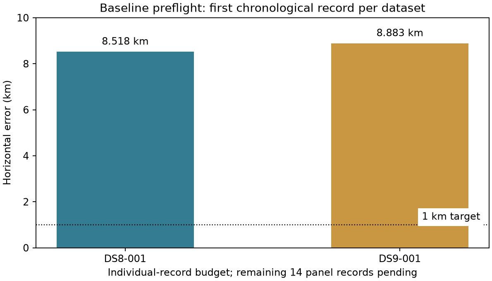

# DS8/DS9 baseline transfer: completed export and fitting preflight

**The unchanged DS7 baseline runs successfully on the first chronological
recording from each dataset, but neither result is sub-kilometer.** Errors are
**8,517.587 m for DS8-001** and **8,883.010 m for DS9-001**. Both estimates
converge without touching a parameter boundary. These are individual-record
preflight results, not whole-dataset or eight-record pooled performance.

The metadata-only [plan](plan.json) freezes eight chronological recordings from
DS8 and eight from DS9. **2/16 are scored; the other 14 remain pending** in the
[score ledger](scores.json). No failed or poor-performing recording was replaced.
The preflight completes the input/export/fit/scoring path; the planned transfer
panel and the broader sub-kilometer objective remain incomplete.

## Results and input coverage

| Measurement | DS8-001 | DS9-001 |
| --- | ---: | ---: |
| Sample rate | 7.5 MS/s | 7.5 MS/s |
| Eligible tracks / exported tracks | 64/64 | 64/64 |
| Training observations | 1,911 | 1,594 |
| Held observations | 1,182 | 1,033 |
| Causal catalogue size | 11,130 | 11,130 |
| Successful timing starts | 3/3 | 3/3 |
| Qualified selected estimate | Yes | Yes |
| Horizontal error | 8,517.587 m | 8,883.010 m |
| Training conditional MAP RMS | 218.774 Hz | 391.656 Hz |
| Full-mixture held log score | −7,710.908 | −7,451.720 |

No tracks were excluded by the frozen train/held eligibility rules in these
two exports. Raw held scores have different observation counts and must not
be compared as a dataset-level improvement statistic. Conditional RF RMS and
optimizer convergence do not establish satellite identity or location accuracy.
One recording per dataset is insufficient to characterize either error distribution.

## What stayed unchanged

The [export protocol](PROTOCOL.md) and [fit protocol](FIT-PROTOCOL.md) freeze
membership, resource limits and scientific settings. Public cached tracking
readers feed the existing [DS7 track/bank exporter](../../tools/ds7_export_baseline.py).
It retains the whole-visit partition seed, minimum 3-second span and six-observation
track support, five DS6-centered anchors, training-only top-eight union, causal
newest-per-object catalogue policy and 41 quarter-second timing values.

The unchanged [fast baseline adapter](../../tools/ds7_fast_baseline_adapter.py)
uses the original Student-t(4,100 Hz) candidate mixture, stationary frequency
offset profiling, ±12 km position bounds, ±5 s timing bounds, and starts at
0, −2 and +2 s. Its numerical configuration is copied exactly from the sealed
DS7 full88 request. The inherited execution-policy text remains historical
metadata; this report's launch receipts enforce the actual per-unit limits.
The existing numerical request/response shape is reused with actual DS8/DS9
dataset hashes and capture identities. No slope augmentation or tuned prior
was introduced. The DS6 geographic coordinate is the inherited origin and
candidate-anchor center; no new spatial penalty is applied.

Both original dataset verifiers passed: DS8 has 65 admitted captures and DS9
has 105. The installed reader release matches their recorded release,
`17484895464c225ebba977487aa36d3d81658bd8`. Each export receipt records Python,
NumPy/SciPy versions and hashes of the public reader/numerical source modules.
No reference coordinates enter exporter or solver requests. A separate scorer
reads each capture's sealed pose companion after verifying its fit-output seal.
The site was already exposed during development; this is not a blinded experiment.

## Analysis and provenance checks

The dataset manifests freeze capture membership. The new observation exports
separately freeze the analysis-manifest, numerical-evidence and TLE snapshot
hashes actually read. For DS9-001, the exported GLRT metrics-manifest hash
matches the mint-time API evidence. DS8's admission criterion was capture
completeness, so no equivalent mint-time analysis-version assertion is made.

The input validator checks observation/bank binding, every bank's shape and
finiteness, exact eligible-track coverage, timing grid, sample rate and strictly
causal provider timestamps. Training scores replay within absolute 1e-8 during
held evaluation. The [independent audit](audit_and_plot.py) verifies 30 distinct
launch/fit bindings, all 16 plan/ledger identities, pose hashes, held-score sums,
and both geographic distances using a distinct three-dimensional great-circle
formula. It is not an independent optimizer.

Two metadata-selection tests pass: chronological order ignores outcome fields,
and duplicate/insufficient membership fails explicitly. Ruff checks pass. The
unchanged numerical adapter retains its previously published tests; no numerical
component was modified in this preflight. The plotted scores were visually checked.

## Resources and evidence

| Stage | DS8-001 wall time | DS9-001 wall time |
| --- | ---: | ---: |
| Observation export | 34.64 s | 31.35 s |
| Candidate-bank export | 93.13 s | 69.75 s |
| Baseline fit | 17.43 s | 18.13 s |

All six stages exited zero. Observation exports were capped at 60 seconds,
bank exports at 120 seconds and fits at 180 seconds, each with 4 GiB, one
numerical thread and nice19. Maximum resident memory was 870,992 KiB. Some
independent stages overlapped, so summed stage times are not elapsed campaign
wall time. No retries or cap extensions occurred. Candidate propagation used
the existing causal TLE archive; no IQ processing, new RF collection or source
store mutation was performed.

The exact observation JSON, candidate manifests, shortlists and compressed
propagated numerical arrays are included under [exports](exports/). The NPZ
files contain candidate positions/velocities and identifiers, not radio IQ.
[Solver requests, responses and seals](solver/), [export receipts](receipts/),
[scores](scores.json), [audit summary](audit-summary.json), [SVG](preflight.svg)
and the [evidence index](evidence-sha256.json) are retained. Requests preserve
original absolute artifact paths; replay from a different checkout requires a
fresh request rebinding those unchanged bytes, not editing the historical seal.
Regenerating inputs additionally requires the original public tracking/TLE stores.

## Next step

Continue the remaining fourteen frozen panel members in bounded batches, keeping
these two poor results in all denominators. Report individual-record distributions
before a separate eight-record pooled comparison. This establishes whether the
DS7 pooled advantage transfers to later captures and provides controls for
subsequent measurement-quality or candidate-contamination models. Do not retune
the baseline or replace these captures based on their known roof errors.
