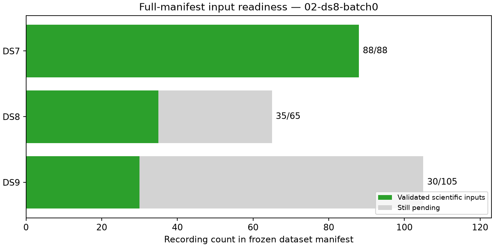

# Checkpoint 02: first missing DS8 batch complete

All five newly exported DS8 recordings pass validation. Complete-manifest
readiness is now **DS7 88/88, DS8 35/65 and DS9 30/105**. DS7 alone is ready
for a complete-dataset fit. This checkpoint reports input coverage, not a new
geographic accuracy result.

The fixed first DS8 missing-input batch contains chronological manifest
ordinals 11, 12, 14, 15 and 16. No replacement or outcome-based selection occurs.
Exports use existing cached frequency observations and causal candidate banks;
no waveform read, RF collection or external provider fetch occurs. All five
observation exports, bank exports and loader validations complete successfully.

| Dataset | Requested | Validated | Still pending | Eligible tracks in validated records | Training observations | Held observations |
|---|---:|---:|---:|---:|---:|---:|
| DS7 | 88 | 88 | 0 | 5,131 | 143,207 | 95,894 |
| DS8 | 65 | 35 | 30 | 2,079 | 57,089 | 37,859 |
| DS9 | 105 | 30 | 75 | 1,822 | 50,530 | 34,216 |

The five new records add 304 eligible tracks, 8,606 training observations and
5,967 held observations. They introduce no additional eligibility exclusions.
Cumulative track exclusions remain 11/3/2 for DS7/DS8/DS9, retained explicitly in
the ledger. All 258 frozen pose authorities carry the same operator reference
coordinate; this does not turn the unsurveyed reference into surveyed truth.

All 163 cumulative scientific stages exit zero: 148 reused-input validations
and 15 new DS8 export/validation stages. The new batch uses 488.88 summed job
seconds. Cumulative summed job time is 654.11 seconds, longest stage 87.88
seconds and maximum RSS 891,816 KiB. There are no failures, timeouts, retries,
record substitutions or headroom stops. Every stage records its measured
available-memory check before launching. Production services are unchanged.

[ledger.json](ledger.json) preserves all 258 requested records, including 105
not yet started. [panel-inputs.json](panel-inputs.json) exposes a ready full
input list only for DS7. [resource-summary.json](resource-summary.json) retains
all stage receipts. The scientific audit verifies 1,754 bindings before adding
this report and visualization; [evidence-sha256.json](evidence-sha256.json) also
binds those checkpoint artifacts. The publication inventory binds the entire
report snapshot and its external dependencies, excluding itself.

The remaining DS7 cache archive comprises 58 NPZ banks totalling
3,454,296,678 bytes, published in five bounded bank-only commits before this
checkpoint's core report. Their original/archived hash mapping and per-batch
inventories remain at the report root. These are derived scientific banks,
not newly collected raw IQ. Existing published input paths are reused.

The partition test passes and all five report scripts pass Ruff lint and
format checks. Runtime provenance and reader-source snapshots remain archived.
The [initial checkpoint](../01-reuse/README.md) is unchanged apart from its
pre-publication text binding and remains an explicit 148-input snapshot.

Next: fit complete DS7 using the unchanged shared-scale model and independent
generic starts after a memory-headroom check. Continue the remaining six DS8
and fifteen DS9 five-record export batches, preserving every failure and
incomplete input. Complete DS8/DS9 fits remain unavailable until their manifest
readiness gates pass.
