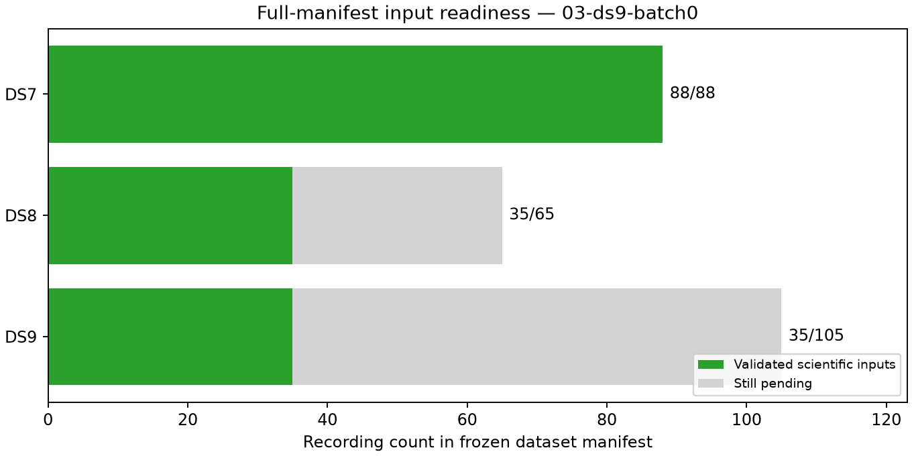

# Checkpoint 03: first missing DS9 batch complete

All five new DS9 recordings pass export, loader validation and minted GLRT
binding checks. Validated coverage is now **DS7 88/88, DS8 35/65, DS9 35/105**.
Only DS7 is ready for complete-dataset fitting. These are input-readiness
results, not new geographic errors.

The fixed batch comprises DS9 chronological manifest ordinals 10–14. No record
was substituted, retried or removed. They add 293 eligible tracks, 8,336 training
observations and 5,747 held observations. No new eligibility exclusions occur;
the DS9 validated subset retains two existing track exclusions and all 35
recording identities.

| Dataset | Validated / requested | Eligible tracks in validated records | Training observations | Held observations | Pending exports |
|---|---:|---:|---:|---:|---:|
| DS7 | 88/88 | 5,131 | 143,207 | 95,894 | 0 |
| DS8 | 35/65 | 2,079 | 57,089 | 37,859 | 30 |
| DS9 | 35/105 | 2,115 | 58,866 | 39,963 | 70 |

All 15 new stages exit zero, for 178 successful stages cumulatively. This batch
uses 409.06 summed job seconds; cumulative job time is 1,063.17 seconds, longest
stage 87.88 seconds and maximum RSS 891,816 KiB. There are no failures, timeouts,
retries or headroom stops. The serial input worker overlaps at most one separate
DS7 modeling worker, as allowed by that model experiment's protocol. Production
services are unchanged. No waveform reads, RF collection or provider fetch occurs.

The scientific audit verifies 1,860 bindings before adding this report and its
plot. [ledger.json](ledger.json) accounts for every one of the 258 manifest
records, including 100 not yet started. [panel-inputs.json](panel-inputs.json)
exposes a complete ready group only for DS7. [resource-summary.json](resource-summary.json)
retains every stage receipt; [evidence-sha256.json](evidence-sha256.json) binds
the scientific audit and checkpoint artifacts. `publication-sha256.json` binds
the complete report snapshot and external dependencies, excluding itself.

The existing partition test and five report-script lint/format checks pass.
Runtime provenance and exact reader sources remain archived. Previous
[reuse](../01-reuse/README.md) and [DS8](../02-ds8-batch0/README.md) checkpoints
remain unchanged. Continue DS8 missing-input batch 1 and DS9 batch 1 next;
the complete populations must pass readiness before full DS8/DS9 fits.
